#### 1.认识AJAX
ajax是异步的javascript和xml(数据传输格式)

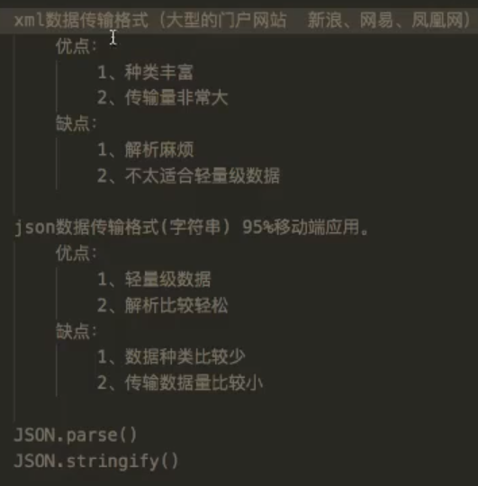

#### 2.同步和异步
- 同步：阻塞状态，当前程序必须等前面一个程序运行完成后才能运行
- 异步：非阻塞状态，当前程序是否运行与前面一个程序是否运行完毕没有关系
#### 3.ajax基础语法
- 请求步骤：
```javascript
//创建ajax对象
var xhr = new XMLHttpRequest();
/*调用open
第一个参数：请求方式 get post
第二个参数：url
第三个参数：是否异步 true 异步 false 同步
*/
xhr.open("get","1.txt",true);
//调用send
xhr.send();
//响应
xhr.onreadystatechange = function(){
    if(xhr.readyState == 4){
        //判断本次下载的状态码是多少
        if(xhr.status == 200){
            alert(xhr.responseText);
        }else{
            alert("Error:" + xhr.status);
        }
    }
}
```
- readyState 请求状态
1.0：初始化：还没调用open()方法
2.1：载入：已调用send()方法，正在发送请求
3.2：载入完成：send()方法完成，已收到全部响应内容
4.3：解析：正在解析响应内容
5.4：完成：响应内容解析完成，可以在客户端调用了
- status 状态码
1.200：请求成功；
2.404：url错误；
3.400：语法错误；

#### 4.try_catch()

- 语法格式：

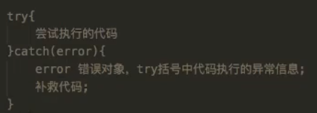

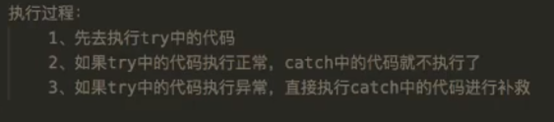

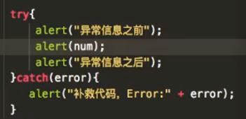

- 手动抛出异常：

  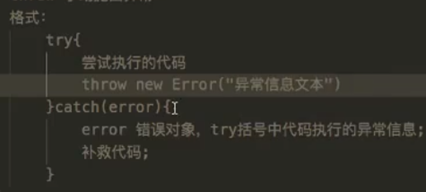

  在try中加入throw，会直接执行catch中的代码

  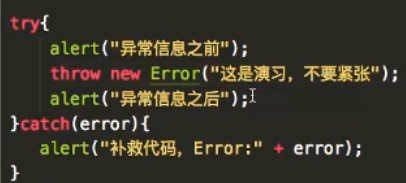

#### 5.get提交和post提交
1.get提交：

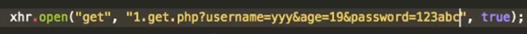

2.post提交：

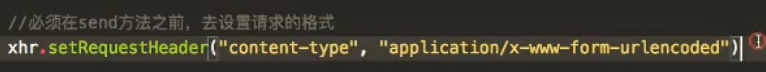

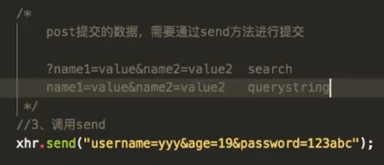

#### 6.JQuery实现AJAX

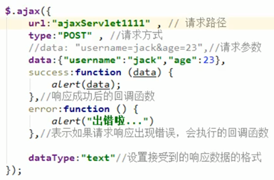

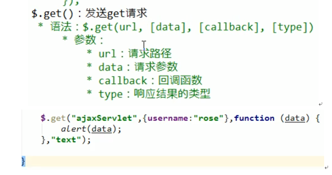

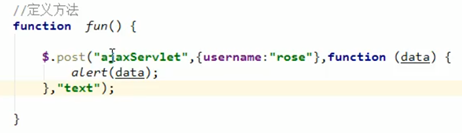

#### 7.ajax方法的简单封装

```html
<!DOCTYPE html>
<html lang="en">
<head>
  <meta charset="UTF-8">
  <meta name="viewport" content="width=device-width, initial-scale=1.0">
  <title>Document</title>
  <script>
    /* 处理数据 */
    function data_json(data) {
      let data_str = '';
      Object.keys(data).forEach(item => {
        data_str += `${item}=${data[item]}&`;
      })
      return data_str.substring(0,data_str.length - 1);
    }

    /* ajax封装 */
    function ajax({ method, url, data }) {
      return new Promise((resolve, reject) => {
        const xhr = new XMLHttpRequest();
        /* open */
        method === "GET" ||  method === 'get'? xhr.open(method, `${url}?${data_json(data)}`) : xhr.open(method,url, true);

        /* 若是post方法，则设置响应头 */
        method === "POST" || method === 'post' && xhr.setRequestHeader('Content-Type','application/x-www-form-urlencoded');
        /* 返回数据处理 */
        xhr.onreadystatechange = () => {
          try {
            xhr.readyState === 4 && xhr.status === 200 && resolve(xhr.responseText);
          } catch (error) {
            reject(error);
          }
        }

        /* send */
        method === 'POST' || method === 'post'? xhr.send(data_json(data)) : xhr.send();
      })
    }

    // 测试
    async function API() {
      const result_post = await ajax({
        method: "get",
        url: 'http://localhost:3000/pro',
        data: {
          username: "Join",
          password: "123456"
        }
      });
      console.log(result_post);
    }
    API();

  </script>
</head>
<body>

</body>
</html>
```

