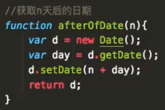

#### 1.概念
Cookie全称为会话跟踪技术
#### 2.功能
1.可以设置过期时间
2.最大可以存储4KB
3.每一个域名下最多可以存储50条数据(不同浏览器，有偏差)
【注】cookie只能存储字符串，所以一般只存储一些重要信息，例如登录，购物车信息，是否点赞，视频播放进度等；
【注】火狐浏览器支持本地加载的文件缓存cookie，谷歌浏览器只支持服务器加载的文件缓存cookie

#### 3.语法
##### 1.设置和获取cookie
```javascript
//设置cookie
document.cookie = "username=xxx";
//编码方式设置cookie
document.cookie = "username="+encodeURICompoent("小明");
//获取cookie
alert(document.cookie);
//解码方式获取cookie
alert(decodeURIComponent(document.cookie));
```
##### 2.过期时间
expires：必须填写日期对象，系统会自动清除超时的cookie；
```javascript
//若不设置expires，其默认的过期时间为"会话"，即整个会话结束后自动清除
document.cookie = "username=xxx";
//设置过期时间,afterOfDate()为获取n填后的函数
document.cookie = "username=xxx;expires="+afterOfDate(7);
```


##### 3.删除cookie
```javascript
//利用浏览器会自动删除超时cookie的特点，将要删除的cookie的过期时间重新设置为过去的时间即可删除
document.cookie = "username=;expires=" + afterOfDate(-1);
//快速获取过去时间的方法
new Date(0);
```
#### 4.Cookie可选参数
##### 1.path
限制访问路径
```javascript
//若不设置，默认是当前html页面的路径
document.cookie = "username=xxx;";
//若设置了path，那么只有在path下的页面才能访问得到cookie
document.cookie = "username=xxx;path="+"/code14/cookie/demo"
```
##### 2.domain
限制访问域名/IP
```javascript
//默认的限制域名是当前页面服务器的域名/ip
document.cookie = "username=xxx;";
//如果当前页面的域名和设置的域名不一致，那么设置cookie将会失败
document.cookie = "username=xxx;domain="+"localhostx";
```
##### 3.secure
安全，如果不设置该字段，在设置cookie时，可以通过http协议加载页面，也可以通过https协议加载页面；如果设置了该字段，那么页面就只能通过https协议加载；
```javascript
//设置secure
document.cookie = "username=xxx;secure";
```
