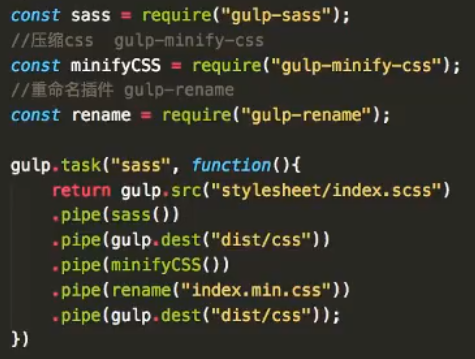
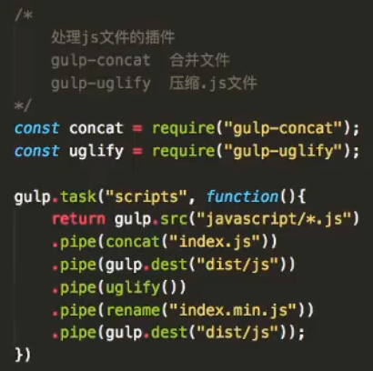
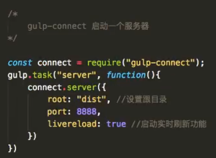
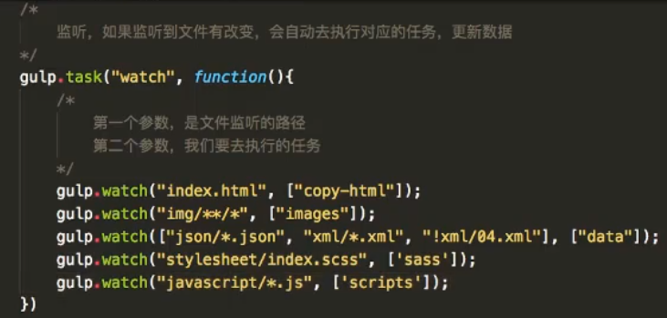
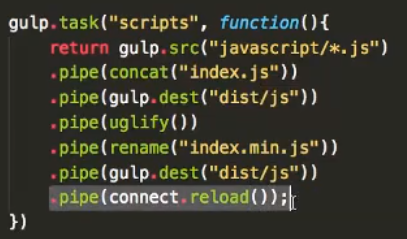
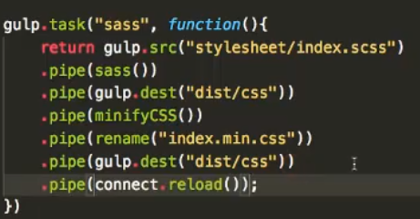
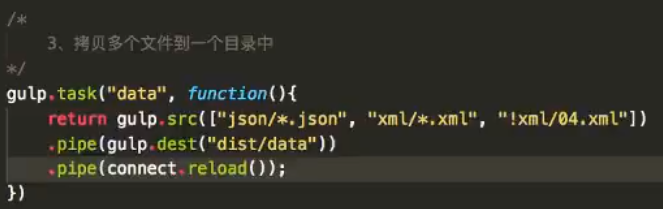
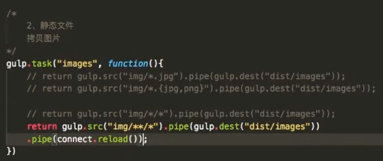
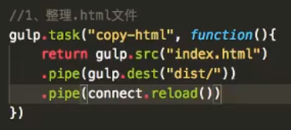
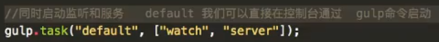

#### 1.Gulp
Gulp是一个可以整理你的项目目录的工具
#### 2.全局安装Gulp
```
cnpm install gulp -g
```
#### 3.Gulp使用
1.进入到项目目录
2.在当前项目中安装Gulp
- 初始化当前项目,最终生成一个叫package.json的文件，存放你当前项目的一些配置信息
```
cnpm init
```
- 在当前项目里面安装gulp到本地,最终生成一个node_modules的文件夹
--save 将这个文件，安装到本地的当前文件夹;-dev 将安装gulp的信息保存在package.json里面，这两个组合命令可以使用-D来取代
```
cnpm install gulp --save-dev
```
- 可以指定要安装gulp的版本
```
cnpm install gulp@版本号 --save-dev
```
#### 4.Gulp的使用
1.在当前项目下创建一个gulpfile.js的文件(文件名是固定的)
2.编写要执行的功能
```javascript
/*
commonJS规范
1.require() 将这个变量模块引入
2.使用这个模块上的函数
*/
//1.引入gulp模块
const gulp = require("gulp");
/*2.编写第一个任务
    第一个参数：任务的名字(自定义)
    第二个参数：回调函数，任务执行的功能
*/
gulp.task("hello",function(){
    console.log("hellw gulp");
})

/*执行该任务*/
在控制台输入">gulp hello"即可
```
#### 5.Gulp的基本函数
1.gulp.src()找到源文件路径
2.gulp.dest() 找到目的文件路径 【注】如果设置的这个目的文件路径不存在，会自动创建
3.pipe() 程序运行管道
```javascript
//拷贝html文件
gulp.task("copy-html",function(){
    return gulp.src("index.html").pipe(gulp.dest("dist/"));
})

//拷贝图片
gulp.task("images",function(){
    //拷贝后缀名为jpg和png的图片
    return gulp.src("img/*.{jpg,png}").pipe(gulp.dest("dist/images"));
    //拷贝所有图片
    return gulp.src("img/**/*").pipe(gulp.dest("dist/images"));
})

//拷贝数据源
gulp.task("data",function(){
    return gulp.src(["json/*.json","xml/*.xml","!xml/04.xml"])
    .pipe(gulp.dest("dist/data"))
})
//一次性执行多个任务的操作(异步并行)
gulp.task("bulid",["copy-html","images","data"],function(){
    cosole.log("任务执行完毕");
})
```
#### 6.Gulp进阶使用
##### 1.监听文件
```javascript
gulp.task("watch",function(){
    /*第一个参数：监听文件的路径，第二个参数：我们要去执行的任务*/
    gulp.watch("index.html",["copy-html"]);
    gulp.watch("img/**/*",["images"]);
    gulp.watch(["json/*.json","xml/*.xml","!xml/04.xml"],["data"]);
})
```
启动监听
```javascript
"> gulp watch"
```
##### 2.Gulp插件的使用
1.下载插件到本地
```javascript
npm i 插件名 -D
```
2.通过require()导入插件
```javascript
const 插件名 = require("插件名");
```
3.查阅插件的用法
```
https://gulpjs.com/plugins/
```
##### 3.举例
- 将.scss文件转为.css文件的插件
```javascript
gulp-sass：将sass文件转为css文件,
gulp-min-css：压缩css文件,
gulp-rename：重命名插件
```


- 处理js文件的插件
```javascript
gulp-concat 合并文件插件
gulp-uglify 压缩.js文件
```


- 服务器插件
```javascript
gulp-connect 服务器插件
```
启动服务器



启动监听



在每个任务执行完成后再添加一个自动刷新功能

- script

  

- sass(css)

  

- data



- images

  

- copy-html

  

同时启动监听和服务



启动服务器

```javascript
"> gulp"
```