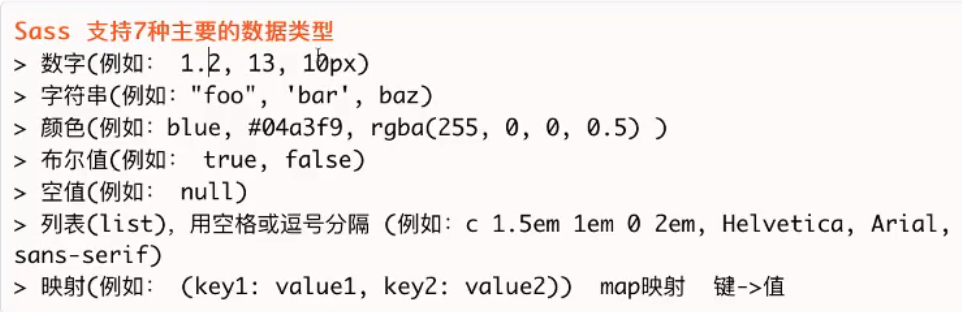
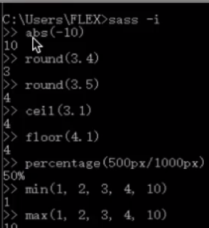
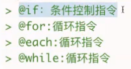

## 1.SCSS概念
1.scss是css预处理器

## 2.sass的安装
### 1.环境的配置
```javascript
//1.全局安装gulp
">cnpm install gulp -g"
//2.初始化
">cnpm init"
//3.下载gulp
">cnpm i gulp@3.9.1 -D"
//4.安装gulp中的sass插件
">cnpm i gulp-sass -D"
```
### 2.引入模块
```javascript
//在.scss文件夹中新建gulpfile.js文件，并引入模块
const gulp = require('gulp');
const sass = require('gulp-sass');
```
### 3.编写任务
```javascript
gulp.task("scss",function(){
    return gulp.src("*.{sass,scss}")
    .pipe(scss())
    .pipe(gulp.dest("dist/css"));
});
```
### 4.启动监听
```html
/* 启动监听 */
gulp.task("watch",function(){
    gulp.watch("*.{sass,scss}",["scss"]);
})
```
## 3.sass语法
### 1.声明变量
```javascript
//普通变量
$w1: 100px;
//默认变量,默认值为200，新值为100，则最后会显示新值
$w2 : 100px;
$w2: 200px !default;
#div1{
    width: $w1;
    height: $w2;
}

$color: red; //全局变量
#div2{
    $color: orange !global; //局部变量,可以通过!global转为全局变量
    background-color: $color;
}
#div3{
    background-color: $color;
}

/* 特殊变量 
   通过#{表达式/变量}的方式进行拼接
   类似于ECMA6中的 ${}
*/

$top: top;
#div4{
    border-#{$top}:solid 1px black;
}
```
### 2.嵌套
```javascript
//选择器嵌套
#div1{
    width: 100px;
    .box{
        height: 100px;
    }
    a{
        background-color: red;
        &:hover{
            background-color: blue;
        }
    }
}
//属性嵌套(一般不用)
#div2{
    border:{
        left:{
            style:solid;
            width: 1px;
            color: black;
        }
    }
    //最简便的方式
    border-top: solid 1px black;
}
```
### 3.混合
```javascript
/*
   类似于C语言中的宏定义
   @mixin 混合名字{};
   @include 混合名字;
   调用时可以选择有参或者无参
*/
//无参数的混合
@mixin margin {
    margin-left: auto;
    margin-right: auto;
}

#div1{
    @include margin;
}

//清除浮动
@mixin clear {
    &::after{display: block; content: ""; clear: both;}
}

#div2{
    @include clear;
}

//带参数的混合
//给参数设置默认值
@mixin xxx($padding:30px,$border:solid 1px black) {
    border-left: $border;
    border-right: $border;
    padding: $padding;
}

#div3{
    //调用时，可以不传参数，直接使用默认值
    @include xxx;
    .box1{
        //可以传一个参数
        @include xxx(10px);
    }
    .box2{
        //可以传两个参数
        @include xxx(10px,dashed 1px red);
    }
    .box3{
        //可以指定传参
        @include xxx($border: 1px red dotted)
    }
}
```
### 4.继承
```javascript
//继承 @extend

.btn{
    width: 100px;
    height: 100px;
    a{
        text-decoration: none;
    }
}
.btn2{
    @extend .btn;
    border: solid 1px black;
}
.btn3{
    @extend .btn;
    margin: auto;
}
```
### 5.引入公共样式
```javascript
/*
   声明公共样式:_base.scss
   引入公共样式:@import "base"
*/
```
### 6.注释
```javascript
//普通注释,不会出现在.css文件中
/*多行注释,会出现在.css文件中，但不会出现在压缩版本文件中
*/
/*!
   强制注释，在任何版本中都会出现
*/
```
### 7.数据类型



- 函数



### 8.控制指令



```javascript
//@if语句
$theme: drak;
#div1{
    @if $theme == drak{
        background-color: black;
    }@else if $theme == light{
        background-color: white;
    }@else{
        background-color: gray;
    }
}

//@for语句
$count: 12;
//throgugh 包含 12
@for $i from 1 through $count{
    .col-lg-#{$i}{
        width: 100px / 12 * $i;
    }
}
//to 不包含 12
@for $i from 1 to $count{
    .col-rg-#{$i}{
        width: 100px / 12 * $i;
    }
}

//@while语句
$num: 5;
@while $num >0 {
    .box#{$num}{
        width: 1em * $num;
    }
    $num: $num - 1;
}
```
### 9.函数
```javascript
$colors:(light: white,drak: black);

//函数声明
@function color($key){

    @if not map-get($colors, $key){
        //@warn不会中断scss监听
        @warn "在这个映射中没有#{$key}这个键";

        //@error会中断scss监听
        // @error "在这个映射中没有#{$key}这个键";
    }
    @return map-get($colors , $key);
}

#div{
    background-color: color(xxx);
}
```