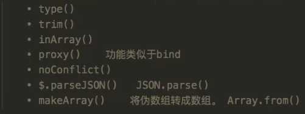

### 1.JQuery下的工具方法



#### 1.type()

输出变量的数据类型

```javascript
$.type(arr);
$.type(str);
$.type(date);
```

#### 2.trim()

删除字符串的首位空格

```javascript
$.trim(str);
```


#### 3.inArray()

在数组中查找某一个元素的下标

```javascript
var arr = [10,20,30,40];
$.inArray(30,arr);
```

#### 4.proxy()

功能类似于bind() ，预设函数的this指向    $.proxy()

#### 5.$.parseJSON()

类似于 JSON.parse()，解析JSON格式的字符串

#### 6.noConflict()

给$函数起个别名

```javascript
var xxx = $.noConflict();

xxx("node").click(function(){
    
})
```

#### 7.makeArray()

将伪数组转为字符串，类似于原生JS中的Array.form()

```javascript
$(function(){
    var node = document.getElementsByTagName("div");
    var nodes = $.markArray(node);
    //转化后可以使用数组的方法
    nodes.push("hello");
})
```


