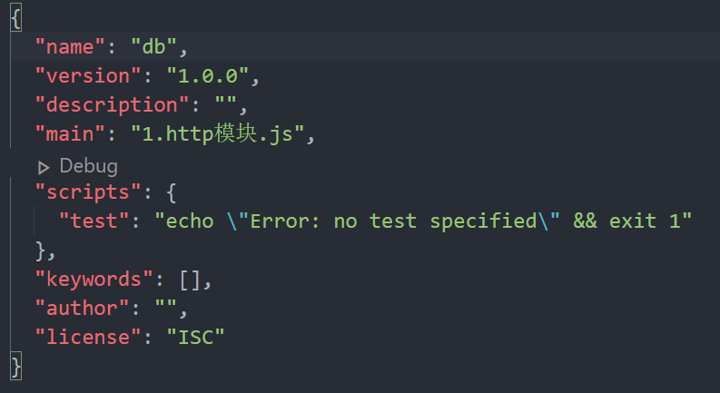
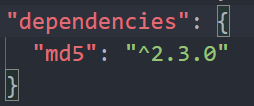

## 1.文件结构

- name：文件名
- version：版本号
- description：描述

## 2.关于第三方模块版本的说明

- "^2.3.0"：代表更新时，第一位版本号不变，后面两位更新到最新版本
- "~2.3.0"：代表更新时，前两位版本号不变，最后一位更新到最新版本
- "*2.3.0"：代表更新时，全部更新到最新版本
- "2.3.0"：代表更新时，全部不更新，指定该版本号进行安装

**【注】使用npm命令进行模块安装时，最后不加'-g'，则默认为本地安装**

