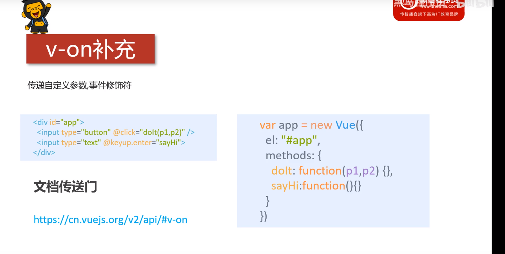
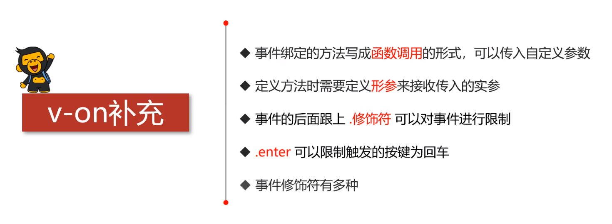

## 1.事件修饰符



***

demo

```html
<!DOCTYPE html>
<html lang="en">
<head>
    <meta charset="UTF-8">
    <meta name="viewport" content="width=device-width, initial-scale=1.0">
    <title>Document</title>
    <script src="./js/vue.js"></script>
</head>
<body>
    <div id="app">
        <!--通过函数调用的方式将实参传回-->
        <button @click="conso(666,123)">点击</button>
        <!--定义一个keyup事件，并且规定按下enter时触发-->
        <input type="text" @keyup.enter="isMth">
    </div>
</body>
<script>
    let app = new Vue({
        el:"#app",
        methods:{
            conso:function(a,b){
                console.log("输出控制台");
                console.log(a+","+b);
            },
            isMth:function(){
                alert("123");
            }
        }
    })
</script>
</html>
```

## 2.总结

