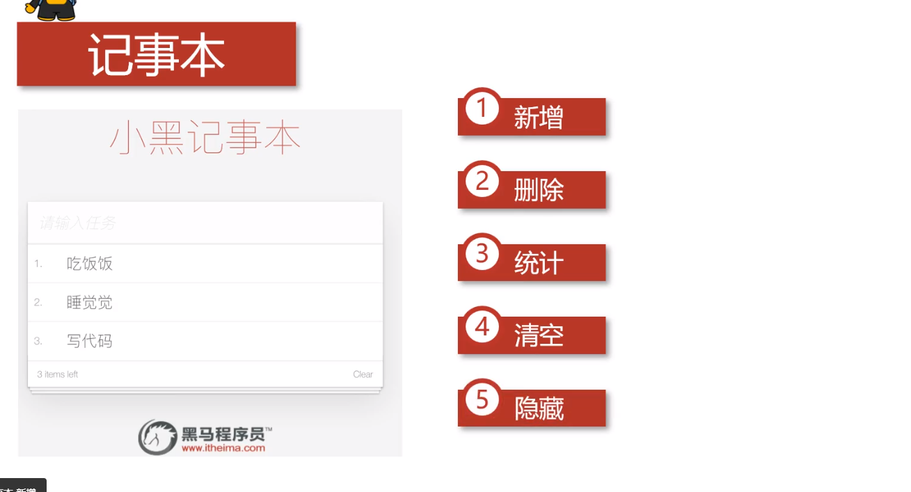
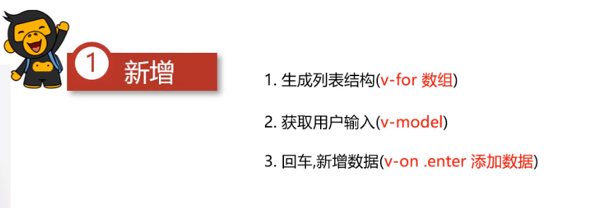
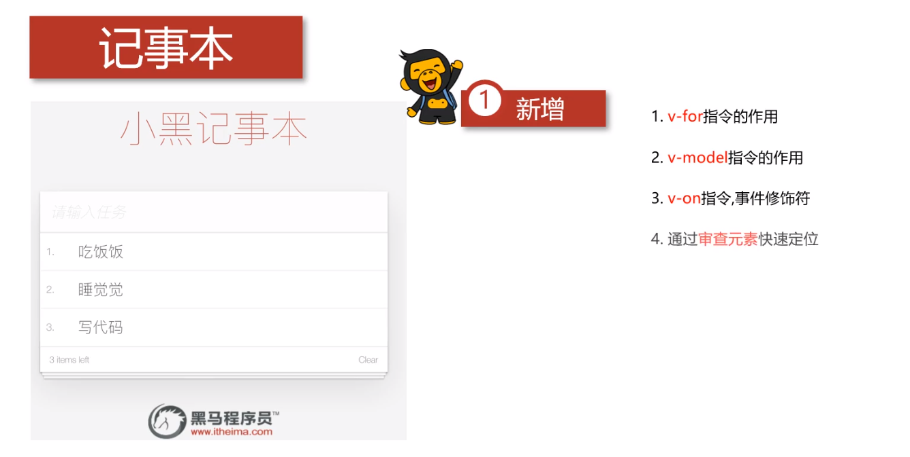
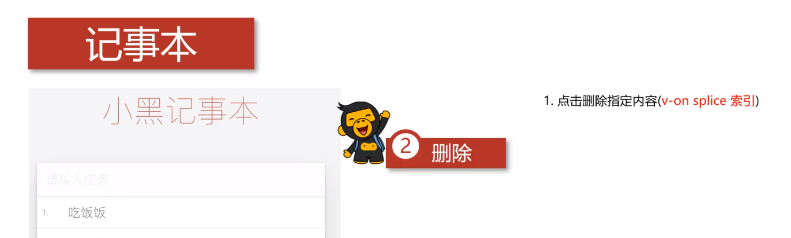
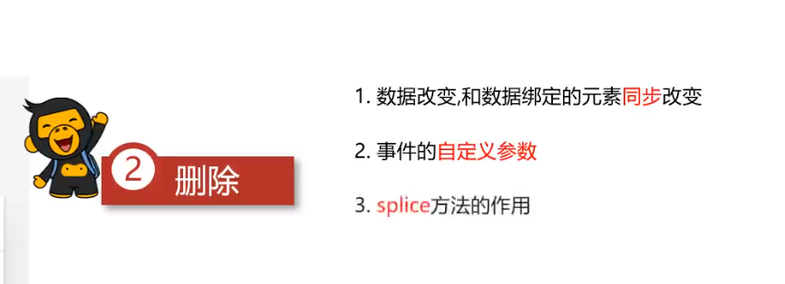
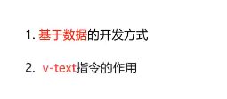
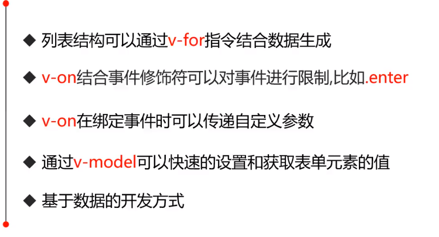

## 1.功能介绍



## 2.新增功能





```html
<!DOCTYPE html>
<html lang="en">
<head>
    <meta charset="UTF-8">
    <meta name="viewport" content="width=device-width, initial-scale=1.0">
    <title>Document</title>
    <script src="./js/vue.js"></script>
    <style>
        *{margin: 0; padding: 0;}
        ul{list-style: none;}
        #todoapp{width: 490px; height: 378px; margin: 0 auto;text-align: center; }
        #todoapp h2{line-height: 50px; height: 50px;}
        #todoapp input{ width: 400px; height: 45px; border: solid 1px silver; outline: none; text-indent: 10px; font-style: italic;}

        #todoapp ul{width: 400px; margin: 0 auto; border: solid 1px silver; border-bottom: none; border-top: none;}
        #todoapp ul li{height: 30px; border-bottom: solid 1px silver; line-height: 30px; color: #57585D;}
        #todoapp ul li span,label{float: left; text-indent: 10px;}
        #todoapp ul li label{margin-left: 10px;}
        #todoapp ul li button{display: none; float: right; border: none; line-height: 30px; background-color: white; outline: none; cursor: pointer; margin-right: 5px;}
        #todoapp ul li:hover button{display: block;}

        #todoapp footer{border: solid 1px silver; border-top: none; width: 400px; margin: 0 auto; overflow: hidden; color: #919092; font-size: 10px; height: 30px; line-height: 30px;}
        #todoapp footer span:first-child{float: left; margin-left: 10px;}
        #todoapp footer span:last-child{float: right; margin-right: 10px;}
    </style>
</head>
<body>
    <section id="todoapp">
        <h2>记事本</h2>
        <input type="text" v-model="addInfo" @keyup.enter="add" placeholder="请输入任务" autocomplete="off">
        <ul>
            <li v-for="(item,index) in arr">
                <span> {{index+1}}.</span>
                <label>{{item}}</label>
                <button class="clear">x</button>
            </li>
        </ul>
        <footer>
            <span>1 items left</span>
            <span>Clear</span>
        </footer>
    </section>
</body>
<script>
    let app = new Vue({
        el:"#todoapp",
        data:{
            arr:["事件1","事件2","事件3"],
            addInfo:""
        },
        methods:{
            add:function(){
                this.arr.push(this.addInfo);
            }
        }
    })
</script>
</html>
```

## 3.删除功能





```html
<!DOCTYPE html>
<html lang="en">
<head>
    <meta charset="UTF-8">
    <meta name="viewport" content="width=device-width, initial-scale=1.0">
    <title>Document</title>
    <script src="./js/vue.js"></script>
    <style>
        *{margin: 0; padding: 0;}
        ul{list-style: none;}
        #todoapp{width: 490px; height: 378px; margin: 0 auto;text-align: center; }
        #todoapp h2{line-height: 50px; height: 50px;}
        #todoapp input{ width: 400px; height: 45px; border: solid 1px silver; outline: none; text-indent: 10px; font-style: italic;}

        #todoapp ul{width: 400px; margin: 0 auto; border: solid 1px silver; border-bottom: none; border-top: none;}
        #todoapp ul li{height: 30px; border-bottom: solid 1px silver; line-height: 30px; color: #57585D;}
        #todoapp ul li span,label{float: left; text-indent: 10px;}
        #todoapp ul li label{margin-left: 10px;}
        #todoapp ul li button{display: none; float: right; border: none; line-height: 30px; background-color: white; outline: none; cursor: pointer; margin-right: 5px;}
        #todoapp ul li:hover button{display: block;}

        #todoapp footer{border: solid 1px silver; border-top: none; width: 400px; margin: 0 auto; overflow: hidden; color: #919092; font-size: 10px; height: 30px; line-height: 30px;}
        #todoapp footer span:first-child{float: left; margin-left: 10px;}
        #todoapp footer span:last-child{float: right; margin-right: 10px;}
    </style>
</head>
<body>
    <section id="todoapp">
        <h2>记事本</h2>
        <input type="text" v-model="addInfo" @keyup.enter="add" placeholder="请输入任务" autocomplete="off">
        <ul>
            <li v-for="(item,index) in arr">
                <span> {{index+1}}.</span>
                <label>{{item}}</label>
                <button class="clear" @click="remove(index)">x</button>
            </li>
        </ul>
        <footer>
            <span>1 items left</span>
            <span>Clear</span>
        </footer>
    </section>
</body>
<script>
    let app = new Vue({
        el:"#todoapp",
        data:{
            arr:["事件1","事件2","事件3"],
            addInfo:""
        },
        methods:{
            // 添加方法
            add:function(){
                this.arr.push(this.addInfo);
            },
            // 删除方法
            remove:function(index){
                this.arr.splice(index,1);
            }
        }
    })
</script>
</html>
```

## 4.统计功能



```html
<!DOCTYPE html>
<html lang="en">
<head>
    <meta charset="UTF-8">
    <meta name="viewport" content="width=device-width, initial-scale=1.0">
    <title>Document</title>
    <script src="./js/vue.js"></script>
    <style>
        *{margin: 0; padding: 0;}
        ul{list-style: none;}
        #todoapp{width: 490px; height: 378px; margin: 0 auto;text-align: center; }
        #todoapp h2{line-height: 50px; height: 50px;}
        #todoapp input{ width: 400px; height: 45px; border: solid 1px silver; outline: none; text-indent: 10px; font-style: italic;}

        #todoapp ul{width: 400px; margin: 0 auto; border: solid 1px silver; border-bottom: none; border-top: none;}
        #todoapp ul li{height: 30px; border-bottom: solid 1px silver; line-height: 30px; color: #57585D;}
        #todoapp ul li span,label{float: left; text-indent: 10px;}
        #todoapp ul li label{margin-left: 10px;}
        #todoapp ul li button{display: none; float: right; border: none; line-height: 30px; background-color: white; outline: none; cursor: pointer; margin-right: 5px;}
        #todoapp ul li:hover button{display: block;}

        #todoapp footer{border: solid 1px silver; border-top: none; width: 400px; margin: 0 auto; overflow: hidden; color: #919092; font-size: 10px; height: 30px; line-height: 30px;}
        #todoapp footer span:first-child{float: left; margin-left: 10px;}
        #todoapp footer span:last-child{float: right; margin-right: 10px;}
    </style>
</head>
<body>
    <section id="todoapp">
        <h2>记事本</h2>
        <input type="text" v-model="addInfo" @keyup.enter="add" placeholder="请输入任务" autocomplete="off">
        <ul>
            <li v-for="(item,index) in arr">
                <span> {{index+1}}.</span>
                <label>{{item}}</label>
                <button class="clear" @click="remove(index)">x</button>
            </li>
        </ul>
        <footer>
            <span>{{arr.length}} items left</span>
            <span>Clear</span>
        </footer>
    </section>
</body>
<script>
    let app = new Vue({
        el:"#todoapp",
        data:{
            arr:["事件1","事件2","事件3"],
            addInfo:""
        },
        methods:{
            // 添加方法
            add:function(){
                this.arr.push(this.addInfo);
            },
            // 删除方法
            remove:function(index){
                this.arr.splice(index,1);
            }
        }
    })
</script>
</html>
```

## 5.清空功能

```html
<!DOCTYPE html>
<html lang="en">
<head>
    <meta charset="UTF-8">
    <meta name="viewport" content="width=device-width, initial-scale=1.0">
    <title>Document</title>
    <script src="./js/vue.js"></script>
    <style>
        *{margin: 0; padding: 0;}
        ul{list-style: none;}
        #todoapp{width: 490px; height: 378px; margin: 0 auto;text-align: center; }
        #todoapp h2{line-height: 50px; height: 50px;}
        #todoapp input{ width: 400px; height: 45px; border: solid 1px silver; outline: none; text-indent: 10px; font-style: italic;}

        #todoapp ul{width: 400px; margin: 0 auto; border: solid 1px silver; border-bottom: none; border-top: none;}
        #todoapp ul li{height: 30px; border-bottom: solid 1px silver; line-height: 30px; color: #57585D;}
        #todoapp ul li span,label{float: left; text-indent: 10px;}
        #todoapp ul li label{margin-left: 10px;}
        #todoapp ul li button{display: none; float: right; border: none; line-height: 30px; background-color: white; outline: none; cursor: pointer; margin-right: 5px;}
        #todoapp ul li:hover button{display: block;}

        #todoapp footer{border: solid 1px silver; border-top: none; width: 400px; margin: 0 auto; overflow: hidden; color: #919092; font-size: 10px; height: 30px; line-height: 30px;}
        #todoapp footer span:first-child{float: left; margin-left: 10px;}
        #todoapp footer span:last-child{float: right; margin-right: 10px;}
    </style>
</head>
<body>
    <section id="todoapp">
        <h2>记事本</h2>
        <input type="text" v-model="addInfo" @keyup.enter="add" placeholder="请输入任务" autocomplete="off">
        <ul>
            <li v-for="(item,index) in arr">
                <span> {{index+1}}.</span>
                <label>{{item}}</label>
                <button class="clear" @click="remove(index)">x</button>
            </li>
        </ul>
        <footer>
            <span>{{arr.length}} items left</span>
            <span style="cursor: pointer;" @click="clear">Clear</span>
        </footer>
    </section>
</body>
<script>
    let app = new Vue({
        el:"#todoapp",
        data:{
            arr:["事件1","事件2","事件3"],
            addInfo:""
        },
        methods:{
            // 添加方法
            add:function(){
                this.arr.push(this.addInfo);
            },
            // 删除方法
            remove:function(index){
                this.arr.splice(index,1);
            },
            // 清空方法
            clear:function(){
                this.arr = [];
                addInfo = "";
            }
        }
    })
</script>
</html>
```

## 6.隐藏

```html
<!DOCTYPE html>
<html lang="en">
<head>
    <meta charset="UTF-8">
    <meta name="viewport" content="width=device-width, initial-scale=1.0">
    <title>Document</title>
    <script src="./js/vue.js"></script>
    <style>
        *{margin: 0; padding: 0;}
        ul{list-style: none;}
        #todoapp{width: 490px; height: 378px; margin: 0 auto;text-align: center; }
        #todoapp h2{line-height: 50px; height: 50px;}
        #todoapp input{ width: 400px; height: 45px; border: solid 1px silver; outline: none; text-indent: 10px; font-style: italic;}

        #todoapp ul{width: 400px; margin: 0 auto; border: solid 1px silver; border-bottom: none; border-top: none;}
        #todoapp ul li{height: 30px; border-bottom: solid 1px silver; line-height: 30px; color: #57585D;}
        #todoapp ul li span,label{float: left; text-indent: 10px;}
        #todoapp ul li label{margin-left: 10px;}
        #todoapp ul li button{display: none; float: right; border: none; line-height: 30px; background-color: white; outline: none; cursor: pointer; margin-right: 5px;}
        #todoapp ul li:hover button{display: block;}

        #todoapp footer{border: solid 1px silver; border-top: none; width: 400px; margin: 0 auto; overflow: hidden; color: #919092; font-size: 10px; height: 30px; line-height: 30px;}
        #todoapp footer span:first-child{float: left; margin-left: 10px;}
        #todoapp footer span:last-child{float: right; margin-right: 10px;}
    </style>
</head>
<body>
    <section id="todoapp">
        <h2>记事本</h2>
        <input type="text" v-model="addInfo" @keyup.enter="add" placeholder="请输入任务" autocomplete="off">
        <ul>
            <li v-for="(item,index) in arr">
                <span> {{index+1}}.</span>
                <label>{{item}}</label>
                <button class="clear" @click="remove(index)">x</button>
            </li>
        </ul>
        <footer>
            <span v-if="arr.length != 0">{{arr.length}} items left</span>
            <span v-if="arr.length != 0" style="cursor: pointer;" @click="clear">Clear</span>
        </footer>
    </section>
</body>
<script>
    let app = new Vue({
        el:"#todoapp",
        data:{
            arr:["事件1","事件2","事件3"],
            addInfo:""
        },
        methods:{
            // 添加方法
            add:function(){
                this.arr.push(this.addInfo);
            },
            // 删除方法
            remove:function(index){
                this.arr.splice(index,1);
            },
            // 清空方法
            clear:function(){
                this.arr = [];
                addInfo = "";
            }
        }
    })
</script>
</html>
```

## 7.总结



