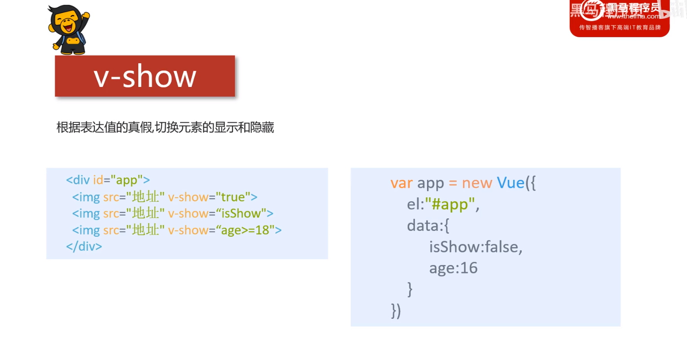
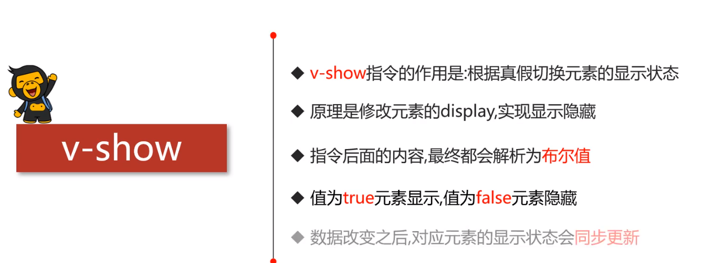

通过布尔值来显示或隐藏标签元素





```vue
<!DOCTYPE html>
<html lang="en">
<head>
    <meta charset="UTF-8">
    <meta name="viewport" content="width=device-width, initial-scale=1.0">
    <title>Document</title>
    <script src="./js/vue.js"></script>
</head>
<body>
    <div id="app">
        <button @click="show">切换show</button>
        <div class="box" v-show="isShow" style="width: 100px; height: 100px; background-color: red;"></div>
    </div>
</body>
<script>
    let app = new Vue({
        el:"#app",
        data:{
            isShow:false
        },
        methods:{
            show: function(){
                this.isShow = !this.isShow;
            }
        }
    })
</script>
</html>
```

