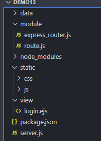

## 1.route模块

```javascript
const url = require('url');
const path = require('path');
const fs = require('fs');

// 扩展res
let changeRes = (res)=>{
    res.send = (data)=>{
        res.writeHead(200,{'Content-Type':'text/html;charset="utf-8"'});
        res.end(data);
    }
}

// 根据后缀名获取文件类型
let getMime = (extName) => {
    let data = fs.readFileSync('./data/mime.json');
    let mimeObj = JSON.parse(data.toString());
    return mimeObj[extName];
}
//静态web服务方法
let static = (req, res, staticPath) => {
    /* /
       /favicon.ico 
    */
    //获取url中的路径(pathname)    
    let pathname = url.parse(req.url).pathname;
    // 获取路径中的后缀名
    let extName = path.extname(pathname);
    // pathname = pathname == '/' ? '/index.html' : pathname;

    // 获得正确的路径
    try {
        // 读取对应文件夹下的文件并传给浏览器
        let data = fs.readFileSync('./' + staticPath + pathname);
        if (data) {
            // 获取对应后缀名的响应头
            let mimeName = getMime(extName);
            res.writeHead(200, {'Content-Type':''+mimeName+';charset=utf-8'});
            res.end(data);
        }
    } catch (error) {
    }
}

let server = ()=>{
    // 全局对象G
    let G = {
        _get: {},
        _post: {},
        staticPath: 'static'
    };

    let app = (req,res)=>{
        // 扩展res
        changeRes(res);
        // 配置静态web服务
        static(req,res,G.staticPath);

        let pahtname = url.parse(req.url).pathname;
        //获得请求方式
        let method = req.method.toLowerCase();
        if(G['_'+method][pahtname]){
            if(method == "get"){
                G['_'+method][pahtname](req,res);  //执行方法
            }else{
                let postData = '';
                req.on('data',(chunk)=>{
                    postData += chunk;
                })
                req.on('end',()=>{
                    req.body = postData;
                    G['_'+method][pahtname](req,res); //执行方法
                })             
            }

        }else{
            res.writeHead(404,{'Content-Type':'text/html;charset="utf-8"'});
            res.end("页面不存在");
        }
    }
    // get方法
    app.get = function(str,cb){
        // 注册方法
        G._get[str] = cb;
    }
    // post方法
    app.post = function(str,cb){
        // 注册方法
        G._post[str] = cb;
    }
    // 配置静态web服务目录
    app.static = function(staticPath){
        G.staticPath = staticPath;
    }
    return app;
}

module.exports = server();
```

## 2.server模块

```javascript
const http = require('http');
const app = require('./module/route');
const ejs = require('ejs');

http.createServer(app).listen(3000);
console.log("http://127.0.0.1:3000");

// 配置静态web目录
app.static('static');

// 配置路由
app.get('/',(req,res)=>{
    res.send("首页");
})
app.get('/login',(req,res)=>{
    ejs.renderFile('./view/login.ejs',{},(err,data)=>{
        res.send(data);
    })
})

app.post('/doLogin',(req,res)=>{
    console.log(req.body);
    res.send(req.body);
})


app.get('/news',(req,res)=>{
    res.send("新闻页面");
})
```

## 3.ejs页面

```ejs
<!DOCTYPE html>
<html lang="en">
<head>
    <meta charset="UTF-8">
    <meta name="viewport" content="width=device-width, initial-scale=1.0">
    <title>Document</title>
    <link rel="stylesheet" href="./css/commit.css">
</head>
<body>
    <h2>登录页面</h2>
    <form action="/doLogin" method="POST">
        <input type="text" name="uername" value="admin">
        <br>
        <br>
        <input type="password" name="password" value="123456">
        <br>
        <br>
        <input type="submit" value="提交">
    </form>
</body>
</html>
```

## 4.目录结构



