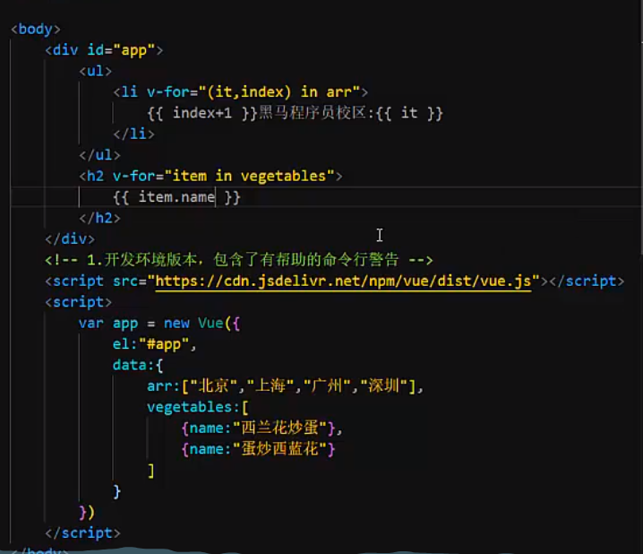
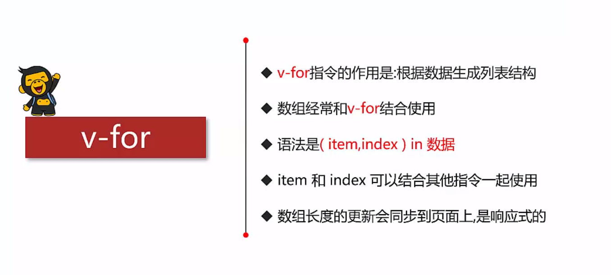

```html
<!DOCTYPE html>
<html lang="en">
<head>
    <meta charset="UTF-8">
    <meta name="viewport" content="width=device-width, initial-scale=1.0">
    <title>Document</title>
    <script src="./js/vue.js"></script>
</head>
<body>
    <div id="app">
        <button v-on:click="add">添加</button>
        <button v-on:click="remove">移除</button>
        <ul>
            <li v-for="item in arr">{{item}}</li>
        </ul>
        <h2 v-for="(item,index) in tank"> {{index+1}}:{{item.name}} </h2>
    </div>
</body>
<script>
    let app = new Vue({
        el:"#app",
        data:{
            arr:["北京","上海","广州","深圳"],
            tank:[
                {name:"M1"},
                {name:"99G"},
                {name:"L2A5"}
            ]
        },
        methods:{
            add:function(){
                this.tank.push({name:"T90A"});
            },
            remove:function(){
                this.tank.pop();
            }
        }
    })
</script>
</html>
```

