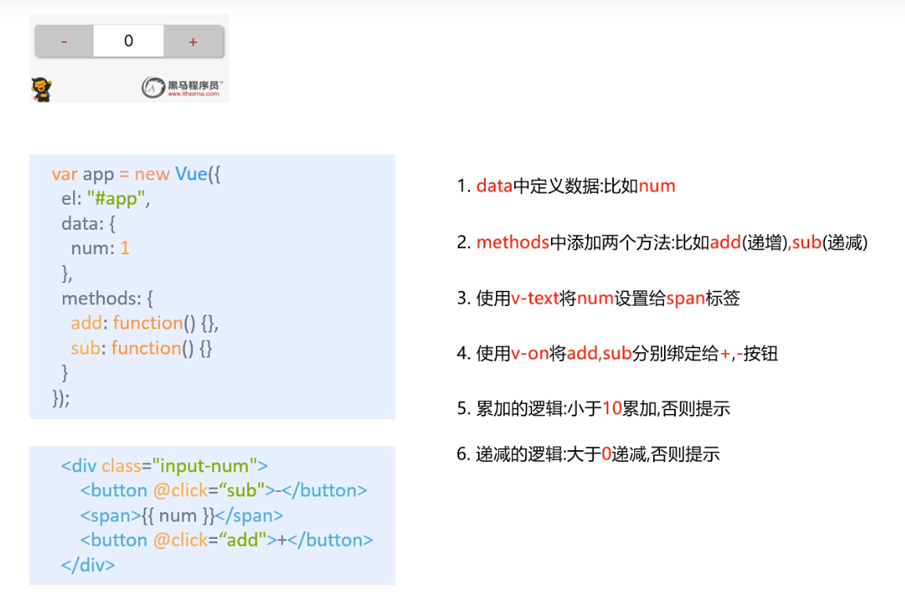
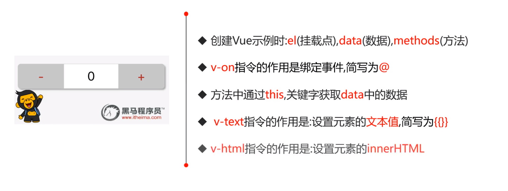

```html
<!DOCTYPE html>
<html lang="en">
<head>
    <meta charset="UTF-8">
    <meta name="viewport" content="width=device-width, initial-scale=1.0">
    <title>Document</title>
    <script src="./js/vue.js"></script>
    <style>
        body{background-color: #F5F4F6;}
        #app .input-num{ width: 422px; height: 75px; margin: 0 auto;}
        #app .input-num button{background-color: #C8C7C8; color: red; width: 130px; height: 70px; border: none; font-size: 20px; outline: none; cursor: pointer;}
        #app .input-num button:first-child{position: relative; left: 5px; top: 1px; border-radius: 5px 0 0 5px; box-shadow: 0 0px 3px black;}
        #app .input-num button:last-child{position: relative; right: 5px; top: 1px; border-radius: 0 5px 5px 0;box-shadow: 0 0px 3px black;}
        #app .input-num span{background-color: #FFFFFF; display: inline-block; width: 152px; height: 70px;box-shadow: 0 0px 3px black; text-align: center; line-height: 70px;}
    </style>
</head>
<body>
    <div id="app">
        <div class="input-num">
            <button @click="sub">-</button>
            <span>{{num}}</span>
            <button @click="add">+</button>
        </div>
    </div>
    <script>
        let app = new Vue({
            el:"#app",
            data:{
                num: 0
            },
            methods:{
                add: function(){
                    if(this.num >= 10){
                        alert("到头啦!");
                        return;
                    }
                    this.num++;
                },
                sub: function(){
                    if(this.num <= 0){
                        alert("不能再少啦!");
                        return;
                    }
                    this.num--;
                }
            }
        })
    </script>
</body>
</html>
```

