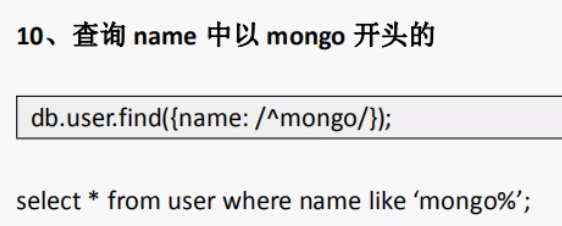
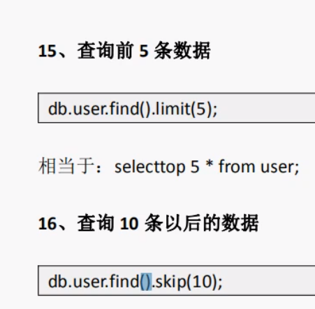
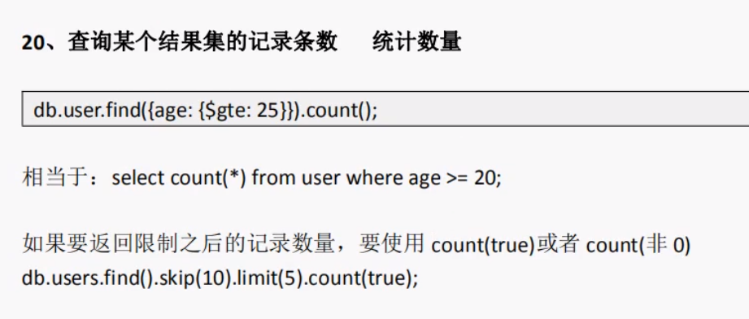
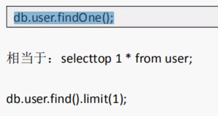
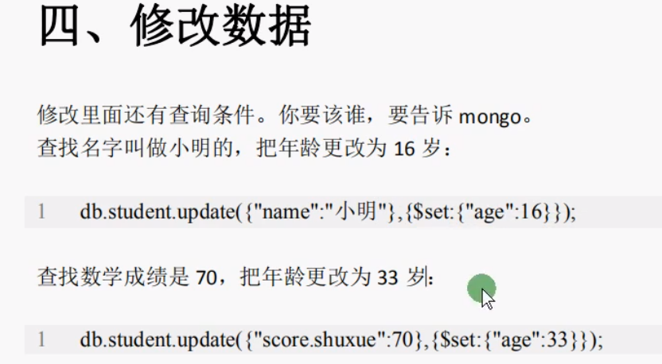

## 1.在控制台输入mongo进入数据库


## 2.查看有哪些数据库


## 3.创建数据库

切换数据库并新建一个表才能创建成功数据库


## 4.查询该数据库中有哪些集合


## 5.删除数据库

切换到对应的数据库并执行db.dropDatabase()命令


## 6.删除集合


## 7.CRUD

### 1.插入数据


- 批量插入数据

  


### 2.查询数据

- 查找全部


- 查找指定


- 大于

  

- 大于等于

  ```sql
  db.admin.find({"age":{$gte:18}})
  ```

- 小于


- 小于等于

  ```sql
  db.admin.find({"age":{$lte:19}})
  ```

- 区间查询

  

- 模糊查询

  

  

- 查询时显示指定哪些字段

  


- 升序，降序查找

  

- 多条件查询(相当于与查询)

  

- 查询指定的数据(用于分页查询)

  

  分页查询：db.admin.find().skip(page-1 * pageSize).limit(pageSize)

- or查询

  

- 统计



- 查找第一条数据



### 3.修改数据




**【注】如果更新数据时$set不写，会直接替换数据**


**更新多条数据**


### 4.删除数据


- 删除全部数据

```
db.admin.remove({})
```

- 删除指定条件的数据

```
db.admin.remove({"age":{$gte:30}})
```

- 只删除一条数据

  