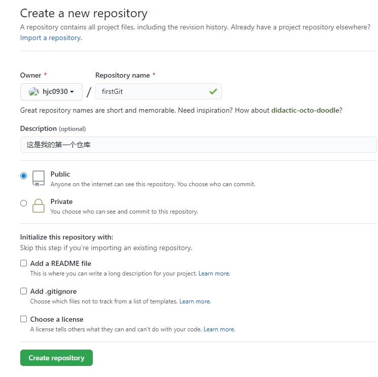
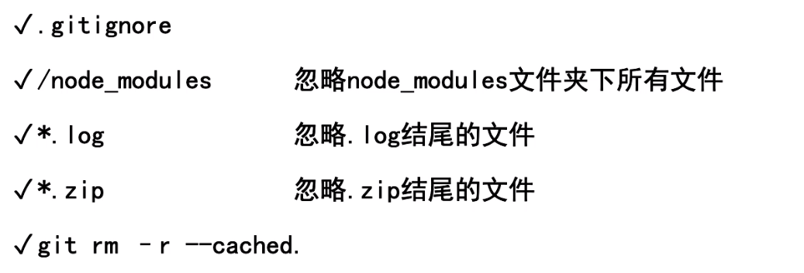
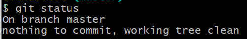
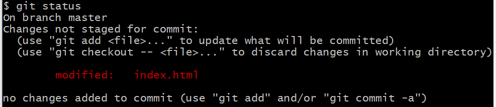
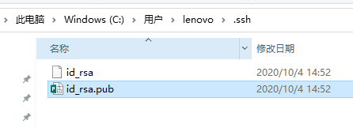
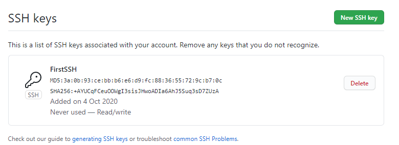
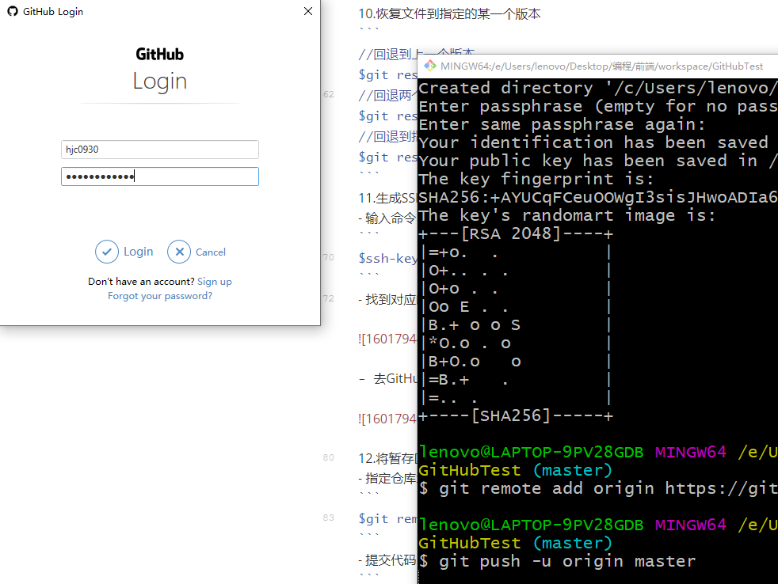

## 1.进入项目目录

```
$ cd /e/Users/lenovo/Desktop/编程/前端/workspace/TestDemo
```
## 2.添加用户名和邮箱

```
$ git config --global user.name "hjc0930"
$ git config --global user.email "hjc_0827@163.com"
```
## 3.创建远程仓库



## 4.在本地工作区建立暂存区

```
$git init
```
## 5.文件忽略



- 在项目目录下创建`.gitignore`文件，可以在里面配置在追踪要忽略的文件夹或者文件

```
//touch .gitignore
# 追踪时忽略node_modules文件夹
/node_modules
# 追踪时忽略.txt文件
*.txt
# 追踪时忽略特指的文件
jq.js
```

<<<<<<< HEAD
## 6.将工作区的文件提交到暂存区
=======
- 单独取消某个文件的跟踪

```bash
git update-index --assume-unchanged "a1-browser-server-service-isv-front/config/index.js"
```

- 将忽略跟踪的文件恢复跟踪

```bash
git update-index --no-assume-unchanged "a1-browser-server-service-isv-front/config/index.js"
```

- 查看被忽略跟踪的文件

```bash
git ls-files -v | grep '^h\ '
```

- 提交时取消一个文件的提交

```bash
# 先提交所有文件
git add .
# 再将单独某个文件取消提交
git reset -- index.txt 
```

##### 6.将工作区的文件提交到暂存区
>>>>>>> d94cecc84b965ab0365cd1f58f539d3769db9193

```
//追踪指定文件
$git add 文件名
//追踪所有文件
$git add . 
//提交文件
$git commit -m "提交描述"
```
## 7.查看当前工作区的状态

```
$git status
```
- nothing to commit, working tree clean

  代表文件已经全部提交到暂存区



- Changes not staged for commit

  代表有文件未提交到暂存区



## 8.从暂存区将文件恢复到工作区

```
$git checkout 文件名.后缀
```
## 9.查看工作区和暂存区版本的区别

```
$git diff
```


## 10.查看已经提交到暂存区的历史版本

```
$git log
```
## 11.恢复文件到指定的某一个版本

```
//回退到上一个版本
$git reset --hard HEAD^
//回退两个版本
$git reset --hard HEAD^^
//回退到指定的版本
$git reset --hard 版本号
```
## 12.生成SSH公钥

- 输入命令
```
$ssh-keygen -t rsa -C "hjc_0827@163.com"
```
- 找到对应的目录，复制密钥



- 去GitHub账户配置密匙



## 13.将暂存区的代码上传到远程仓库

- 指定仓库地址
```
$git remote add origin 仓库地址
```
```
git remote add github git@github.com:tianqixin/runoob-git-test.git
git remote add gitee git@gitee.com:imnoob/runoob-test.git
```

- 提交代码
```bash
//第一次提交
$git push -u github master
$git push -u gitee master
//后面提交
$git push github master
$git push gitee master
```
【注】如果是第一次提交，要输入用户名和密码



- 查看已绑定的远程仓库地址

```
git remote -v
```

- 删除远程仓库地址

```
git remote rm gitee
```

## 14.基本环境搭建完成后，后面要提交代码只需通过以下几步：

```
$git add .
$git commit -m "提交描述"
$git push
```

## 15.在另一台电脑中将远程仓库的项目克隆到本地

- 第一次连接时要先指定远程仓库地址
```
$ cd "要存放项目的地址"
$ git clone 远程仓库地址
```
- 之后更新时，只需在项目目录下执行以下命令即可
```
$ git pull 
```

## 16.合并远程仓库

```
$ git pull 自定义远程仓库名 master --allow-unrelated-histories
```