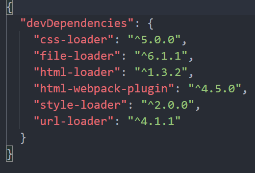

## 1.步骤

### 1.要安装的依赖



### 2.配置

```javascript
// 处理图片
            {
                // 匹配图片文件
                test:/\.(jpg|png|gif)$/,
                loader:"url-loader",
                // 图片小于8kb，则进行base64处理，减少请求数量
                options:{
                    limit:8*1024,
                    // 关闭url-loader模块化解析
                    esModule:false,
                    // 取图片前10位哈希值，并设置后缀名为ext
                    name:"[hash:10].[ext]"
                }
            },
            // 处理html
            {
                test:/\.html$/,
                loader:"html-loader"
            }
```

**在output中加入以下配置**

```javascript
// 如果报出Automatic publicPath is not supported in this browser的错误则加上这一条
publicPath: './'
```

### 3.下载依赖

```
cnpm install html-loader url-loader file-loader --save-dev
```

### 4.运行

```
webpack
```

