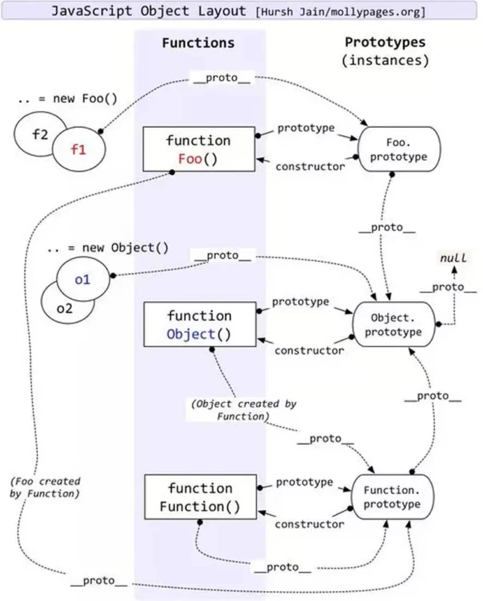

## 1.深拷贝和浅拷贝

- 浅拷贝：创建一个对象，这个对象有着原始对象的一份精确拷贝。如果属性是基本数据类型，拷贝的就是基本类型的值，如果是引用类型，拷贝的就是内存地址，所以如果其中一个对象改变了这个地址，就会影响到另一个对象

- 深拷贝：将一个对象从一个内存中完整地拷贝出来，从堆内存中开辟一个新的区域存放这个新对象，新对象的修改不会影响原对象

### 浅拷贝实现

- Object.assign()
- 扩展运算符(...)
- Array.prototype.slice()

### 深拷贝实现

- JSON.parase(JSON.stringify(obj))
  - 会忽略undefined Symbol
  - 不能序列化函数
  - 不能解决循环引用的对象
  - 不能正确处理 new Date()
  - 不能处理正则

- 手写

  ```js
  function deepClone(obj) {
      let res;
      if(Object.prototype.toString.call(obj).slice(8,-1) === 'Object') {
          res = {}
      } else if(Array.isArray(obj)) {
          res = []
      } else {
          return obj
      }
  
      for(const key in obj) {
          res[key] = deepClone(obj[key])
      }
      return res;
  }
  ```
## 2.跨域
### 1.同源策略
跨越的本质其实就是指两个地址不同源，同源指的是：两个URL的协议，域名和端口号都相同，则就是两个同源的URL
```js
// 非同源
http://www.baidu.com
https://www.baidu.com

// 同源
http://www.baidu.com
http://www.baidu.com?query=1
```
同源策略是一个重要的安全策略，它用于限制一个origin的文档或者它加载的脚本如何能与另一个源的资源进行交互。其主要目的是为了保护用户信息的安全，防止恶意网站窃取数据，是浏览器在Web页面层面做的安全保护

### 2.同源策略的表现
同源策略主要的限制有三个层面：DOM层面，数据层面和网络层面

- DOM层面
  同源策略限制了来自不同源的JavaScript脚本对当前源的DOM对象进行读和写的操作
- 数据层面
  同源策略限制了不同源站点读取当前站点的Cookie，IndexDB，LocalStorage等数据
- 网络层面
  同源策略限制了通过XMLHttpRequest等方式将站点的数据发送给不同源的站点

### 3.跨域分类
同源策略虽然保证了浏览器的安全，但有时候我们需要访问不同源的数据等，因此有时我们需要进行跨越操作

#### 1.DOM层面

**片段标识符**

片段标识符的核心原理就是通过监听url中hash的改变来实现数据的传递

```html
// 父页面parentHtml.html
<!DOCTYPE html>
<html lang="zh">
    <head>
        <title></title>
    </head>
    <body>
        我是父页面
        <button id='btn'>父传给子</button>
        <iframe src="./childHtml.html" id="childHtmlId"></iframe>
    </body>
    <script>
        window.onhashchange = function() {
            console.log(decodeURIComponent(window.location.hash));
        };
        document.getElementById('btn').addEventListener('click', () => {
            const iframeDom = document.getElementById('childHtmlId');
            iframeDom.src += '#父传给子';
        });
    </script>
</html>
```

```html
// 子页面childHtml.html
<!DOCTYPE html>
<html lang="zh">
    <head>
        <title></title>
    </head>
    <body>
        我是子页面
        <button id='btn'>子传给父</button>
    </body>
    <script>
        window.onhashchange = function() {
            console.log(decodeURIComponent(window.location.hash));
        };

        document.getElementById('btn').addEventListener('click', () => {
            parent.location.href += '#子传给父';
        });
    </script>
</html>
```

**window.name**

> 浏览器窗口有window.name属性，这个属性最大的特点就是，无论是否同源，只要在同一个窗口里面，前一个网页设置的属性后一个网页就可以读取它。如果需要实现父页面和跨域的子页面之间的通信，需要一个和父页面同源的子页面作为中介，将跨域的子页面中的信息传递过来。

**document.domain**

> document.domain是存放文档的服务器主机名，可通过手动设置将其设置成当前域名或者上级域名，当具有同document.domain的页面就相当于处于同域名的服务器上，如果其域名和端口号相同，就可以实现跨越访问资源

**postMessage**

> postMessage是HTML5新增的跨文档通信API

- 通过监听message事件来接受数据
- 通过contentWindow.postMessage()函数来发生数据

```html
// 父页面
<!DOCTYPE html>
<html lang="zh">
    <head>
        <title></title>
    </head>
    <body>
        我是父页面
        <button id='btn'>父传给子</button>
        <iframe src="http://127.0.0.1:5500/024/childHtml.html" id="childHtmlId"></iframe>
    </body>
    <script>
        window.addEventListener('message', function(event) {
            console.log('父页面接收到信息', event.data);
        });
        document.getElementById('btn').addEventListener('click', () => {
            const iframeDom = document.getElementById('childHtmlId');
            iframeDom.contentWindow.postMessage('我是执鸢者1', 'http://127.0.0.1:5500/024/childHtml1.html');
        });
    </script>
</html>
```

```html
// 子页面
<!DOCTYPE html>
<html lang="zh">
    <head>
        <title></title>
    </head>
    <body>
        我是子页面
        <button id='btn'>子传给父</button>
    </body>
    <script>
        window.addEventListener('message', function(event) {
            console.log('子页面接收到信息', event.data);
        });

        document.getElementById('btn').addEventListener('click', () => {
            parent.postMessage('我是执鸢者2', 'http://127.0.0.1:5500/024/parentHtml1.html');
        });
    </script>
</html>
```

#### 2.网络层面

同源策略对网络层面的限制主要在于不允许通过XMLHttpRequest等方式访问非同源站点的资源，目前主要的解决方法有三种

**通过代理实现**

> 同源策略主要是浏览器为了安全而制定的策略，而服务端之间不存在这样的限制，因此可以先将请求发送到同源的服务器上，然后通过同源服务器代理至最终服务器，从而实现跨域访问资源，比如Node中间件代理，Nginx方向代理等

- NodeJS代理

  ```js
  // server1.js 代理服务器(http://localhost:3000)
  const http = require('http')
  // 第一步：接受客户端请求
  const server = http.createServer((request, response) => {
    // 代理服务器，直接和浏览器直接交互，需要设置CORS 的首部字段
    response.writeHead(200, {
      'Access-Control-Allow-Origin': '*',
      'Access-Control-Allow-Methods': '*',
      'Access-Control-Allow-Headers': 'Content-Type'
    })
    // 第二步：将请求转发给服务器
    http.request(
      {
        host: '127.0.0.1',
        port: 4000,
        url: '/',
        method: request.method,
        headers: request.headers
      },
      serverResponse => {
        // 第三步：收到服务器的响应
        var body = ''
        serverResponse.on('data', chunk => {
          body += chunk
        })
        serverResponse.on('end', () => {
          console.log('The data is ' + body)
          // 第四步：将响应结果转发给浏览器
          response.end(body)
        })
      }
    ).end()
  })
  server.listen(3000, () => {
    console.log('The proxyServer is running at http://localhost:3000')
  })
  ```

**JSONP**

> JSONP的原理其实就是利用script标签不会被同源策略限制的特点，通过监听一个回调函数，将这个回调函数的函数名作为参数发送给服务端，服务端直接运行这个函数并将数据通过形参的方式传回即可

**script标签特点：**src属性能够访问任何URL资源，不会受到同源策略的限制。如果访问的资源包含JavaScript代码，其会在下载后自动执行

**CORS**

跨域共享资源，主要的原理是服务端设置`Access-Control-Allow-Origin`等响应头，携带这个响应头的http请求，并不会被浏览器拦截

- 简单请求
  - 请求方式仅限于`GET POST HEAD`
  - `Content-Type`仅限于`text/plain mutipart/form-data application/x-www-form-urlencoded`

- 非简单请求
  - PUT DELETE方法
  - 发送json格式
  - 携带自定义请求头

## 3.原型和原型链

- 原型

在JavaScript中每个函数都有一个`prototype`属性(注意是函数，普通对象是没有的)，指向一个实例原型对象，每个对象在创建的时候，都会有一个`__proto__`属性关联它们构造函数的实例原型对象，这个就是该**对象的原型**

实例原型没有指向实例的属性，但有指向构造函数的属性，每个实例原型通过`constructor`属性指向对应的构造函数

- 原型链

当我们要读取对象上的一个属性时，JavaScript引擎会先在该对象上寻找，如果找不到，就会沿着`__proto__`属性到它构造函数的实例原型上寻找，若实例原型上找不到，就会沿着**实例原型的原型(实例原型本质上是一个对象)**去`Object()`这个构造函数对应的实例原型上寻找，而对象的构造函数的实例原型的`__proto__`属性指向`null`，**原型链就是`__proto__`的检索路径**



## 3.声明变量关键字

### var

- 使用var关键字声明的变量会被直接绑定到window对象上

  ```js
  var a = 2;
  console.log(window.a); // 2
  ```

- 使用var关键字声明的变量存在变量提升，也就是说即使在声明之前输出该变量也不会报错

  ```js
  console.log(a) // undefined
  var a = 2;
  ```

- 可以重复声明变量

  ```js
  var a = 1;
  var a = 2;
  console.log(a); // 2
  ```

### let和const

- 使用let/const关键字声明的变量不存在变量提升

  ```js
  console.log(a); // Error
  let a;
  ```

- 使用let/const关键字声明的变量存在暂时性死区

  ```js
  let a = 2;
  {
      console.log(a); // Error
      let a = 3;
  }
  ```

- 使用let/const关键字声明的变量无法重复声明

  ```js
  let a = 1;
  let a = 2;
  console.log(a); // Error
  ```

- 使用let/const关键字声明的变量，存在块级作用域

  ```js
  let a = 1;
  {
      let a = 2;
      console.log(a); // 2
  }
  console.log(a); // 1
  ```

- 使用const关键字声明变量时，必须指定初始值

  ```js
  const a;
  console.log(a); // Error
  ```

## 4.作用域

作用域，指的是变量存在的范围。在JavaScript中，一共有三种作用域，分别是全局作用域，函数作用域和块级作用域

### 全局作用域

在全局声明的变量存在于全局作用域中

```js
var a = 1;

function fn() {
    console.log(a); // 1
}
```

### 函数作用域

在函数内声明的变量，无法在函数外获取

```js
function fn() {
    var a = 1;
    console.log(a); // 1
}
fn();
console.log(a); // Error
```

对于`var`关键字来说，局部变量只能在函数内部声明，在其它区块中声明，一律都是全局变量

```js
if (true) {
  var x = 5;
}
console.log(x);  // 5
```

### 函数内部的变量提升

与全局作用域一样，函数作用域内部也会产生变量提升现象

```js
function fn() {
    console.log(x); // undefined
    if (false) {
        var x;
    }
}
fn();

// 等同于
function fn() {
    var x;
    console.log(x); // undefined
}
```

### 函数本身的作用域

函数本身也是一个值，也有自己的作用域，它的作用域和其它变量一样，就是声明时所在的作用域，与其运行时所在的作用域无关

```js 
var a = 1;

function x() {
  console.log(a);
}

function f() {
  var a = 2;
  x();
}

f() // 1
```

即使传入一个回调函数，其作用域也是绑定在其定义时所在的作用域

```js
var a = 1;

function x() {
    console.log(a);
}

function f(fn) {
    var a = 2;
    fn();
}

f(x) // 1
```

同样的，如果在函数内部定义的函数，其作用域就是绑定在函数内部

```js
var a = 1;

function fn() {
    var a = 2;

    return function () {
        console.log(a);
    }
}

var x = fn();

x(); // 2
```

## 5.Promise

Promise是异步编程的一种解决方案，提供统一的API用来处理各种异步操作。简单来说，Promise就是一个容器，里面保存着某个未来才会结束的事件(通常是异步操作)的结果；从语法上来讲，Promise是一个对象，从它可以获取异步操作的消息。

Promise对象有两个特点：

- 一是对象的状态不受外界的影响。它有三种状态，pending(进行中)，fulfilled(已完成)和rejected(已失败)，只有异步操作的结果，才能决定当前是哪一种状态
- 二是一旦状态改变，就不会再变，Promise对象状态的改变只有两种可能：从pending变为fulfilled和从pending变为rejected

Promise对象的缺点：

- 无法取消，一旦新建它就会立即执行。
- 如果不设置回调函数，Promise内部抛出的错误，不会反应到外部
- 当处于`pending`状态时，无法得知目前进展到哪一个阶段（刚刚开始还是即将完成)

### 构造函数上的方法

- Promise.all()：接受一个数组，数组中的每个成员都是一个Promise实例，返回一个新的Promise实例

  - 只有成员中所有状态都变成resolve，新实例的状态才会变成resolve，只要有一个成员的状态变成reject，新实例的状态就会变成reject

  - 如果成员有自己的catch方法，那么当该成员状态变成reject时，新实例的状态并不会变为reject

- Promise.allSettled()

  - 只有所有成员的状态发生了改变，包装实例才会结束
  - 返回一个Promise对象，对象包裹着一个对象数组，每个对象有status和value字段，如果status的值为`rejected`，则返回`reason`字段
  - 如果成员有自己的catch方法，则不会触发allSettled()的reject状态

- Promise.race()

  - race意为赛跑，只要有一个成员的状态率先改变，那么race的状态就直接发生改变并接受那个成员的返回值
  - 如果成员有自己的catch方法，则不会触发race状态的改变

- Promise.any()

  - 与race类似，只要有一个参数实例变成resolve状态，包装器就会变为fulfilled状态，如果所有参数实例都变成rejected状态，包装器实例就会变成rejected状态

- Promise.resolve()：将一个对象转为Promise对象

  参数分为四种情况，分别如下：

  - 参数是一个Promise实例，则原封不动地返回这个实例
  - 参数是一个`thenable`对象，则会将这个对象转为Promise对象，并立即执行该对象的`then`方法
  - 参数不是具有`then`方法的对象，或根本不是对象，`Promise.resolve()`会返回一个新的Promise对象，并且状态为`resolve`
  - 没有参数时，直接返回一个`resolve`状态的Promise对象

- Promise.reject()：返回一个状态为`rejected`的Promise对象

### 实例上的方法

- then()：是Promise实例状态发生改变时的回调，第一个参数是resolve状态的回调函数，第二个参数是rejected状态的回调函数，`then`方法返回值是一个Promise实例，这也是Promise可以进行链式书写的原因

- catch()：catch方法是then方法第二个回调函数的别名，用于指定发生错误时的回调函数
- finally()：用于指定不管Promise对象最后状态如何，都会执行的操作

## 6.继承

- 原型链继承

  直接将父类的实例赋值给子类的原型对象，缺点是所有继承的属性和方法都会在子类实例对象之间共享，无法做到属性私有化

  ```js
  function Parent() {
      this.name = 'Parent';
  }
  
  Parent.prototype.getName = function() {
      return this.name;
  }
  
  function Child() {}
  Child.prototype = new Parent();
  
  const c = new Child();
  const c2 = new Child2();
  ```

- 盗用构造函数继承

  在子类构造函数中使用call(或apply)方法调用父类构造函数，缺点是子类无法使用父类原型对象上的属性和方法

  ```js
  function Parent() {
      this.name = 'Parent';
  }
  
  Parent.prototype.getName = function() {
      return this.name;
  }
  
  function Child() {
      Parent.call(this)
  }
  
  const c = new Child();
  const c2 = new Child2();
  ```

- 组合式继承

  结合原型链继承和盗用构造函数继承，缺点是父类的构造函数会被实例化两次，造成性能浪费

  ```js
  function Parent() {
      this.name = 'Parent';
  }
  Parent.prototype.getName = function() {
      return this.name;
  }
  
  function Child() {
      // 第二次调用父类
      Parent.call(this)
  }
  Child.prototype = new Parent();// 第一次调用父类
  Child.prototype.constructor = Child;
  
  const c = new Child();
  const c2 = new Child2();
  ```

- 原型式继承

  原型式继承可以无需明确定义构造函数而实现继承。使用Object.create()方法，对现有的普通对象进行一份浅拷贝，优点是无需调用构造函数，缺点是对象中的引用值共享同一内存，很可能造成值的篡改

  ```js
  const parent = {
      name: 'parent',
      age: 18,
      getName: function() {
          return this.name;
      }
  }
  
  const child1 = Object.create(parent);
  const child2 = Object.create(parent);
  ```

- 寄生式继承

  和原型式继承类型，多了一个用于继承的函数，在函数中会先基于原对象创建一个新的对象，然后再增强这个新对象，最后返回新对象

  ```js
  function _extend(parent) {
      const object = Object.create(object);
      object.prototype.getAge = function() {
          return this.age;
      }
      return object;
  }
  
  const parent = {
      name: 'parent',
      age: 18,
      getName: function() {
          return this.name;
      }
  }
  
  const child = _extend(parent);
  ```

- 寄生组合式继承

  在组合继承的基础上加入寄生式继承，减少一次父类的调用

  ```js
  function _extend(parent, child) {
      const object = Object.create(parent.prototype);
      object.constructor = child; // 手动指定原型对象上的constructor指向子类
      child.prototype = object;
  }
  
  function Parent() {
      this.name = 'Parent';
  }
  Parent.prototype.getName = function() {
      return this.name;
  }
  
  function Child() {
      Parent.call(this);
  }
  _extend(Parent, Child);
  
  const c = new Child();
  ```

## 7.手写new

- 创建一个新对象
- 将该对象的原型指向构造函数的原型对象
- 调用call(或apply)方法，将构造函数的this指向该对象
- 判断构造函数的返回值是否是对象，若是则直接返回该对象，否则就返回这个创建的临时对象

```js
function _new(tarent, ...rest) {
    const object = {};
    Object.setPrototypeOf(object, target.prototype);
    const result = tarent.apply(object, rest);
    return (result instanceOf Object) ? result : object;
}
```

## 8.闭包

一个函数和其周围状态的引用捆绑在一起，这样的组合就是闭包，闭包让你可以在一个内层函数中，访问到外层函数的作用域。

在JavaScript中，任何闭包的使用场景基本上包含两点：创建私有变量，延长变量的生命周期

- 柯里化函数：柯里化的目的在于避免频繁调用具有相同参数函数的同时，又能轻松的复用。
- 函数的防抖和节流

## 9.函数防抖和节流

- 防抖：一个事件在n秒后执行一次，若在n秒内被重复触发，则重新计时

  ```ts
  function debounce(fn: Function,wait: number) {
      let timer = 0;
      return function(...args) {
          if(timer) {
              window.clearTimeout(timer);
          }
          timer = window.setTimeout(() => {
              fn.apply(this, args);
          }, wait)
      }
  }
  
  // 立即执行版本
  function debounce(fn: Function, wait: number, immdiately = false) {
    let timer = 0;
  
    return function (...args: unknown[]) {
      if (timer) {
        window.clearTimeout(timer);
      }
  
      if (immdiately) {
        let callNow = !timer;
        timer = window.setTimeout(() => {
          timer = 0;
        }, wait);
  
        if (callNow) {
          fn.apply(this, args);
        }
      } else {
        timer = window.setTimeout(() => {
          fn.apply(this, args);
        }, wait);
      }
    };
  }
  ```

- 节流：一个事件在n秒内只执行一次，若在n秒内重复触发，只有一次生效

  ```ts
  function throttled(fn: Function, delay: number) {
      let timer = 0;
      return function(...args) {
          if(timer) return;
          timer = window.setTimeout(() => {
              fn.apply(this, args);
              timer = 0;
          }, delay)
      }
  }
  ```


## 10.async await

async函数是generator和Promise的语法糖，它可以让我们以同步的形式去处理异步问题，async函数返回的一定是一个Promise对象，内部可以使用await关键字，返回异步信息的结果，await关键字后面通常也是跟着一个Promise对象，也可以跟一个基本值

- 手写实现async awiat函数的效果

  ```js
  function asyncGenerator(generatorFunc) {
      return function () {
          const gen = generatorFunc.apply(this, arguments);
  
          return new Promise((resolve, reject) => {
              function step(key, arg) {
                  let generatorResult;
                  try {
                      generatorResult = gen[key](arg);
                  } catch (error) {
                      reject(error)
                  }
  
                  const { value, done } = generatorResult;
  
                  if (done) {
                      return resolve(value)
                  } else {
                      return Promise.resolve(value).then(
                          (val) => step('next', val),
                          (err) => step('throw', err)
                      )
                  }
              }
              step('next');
          })
      }
  }
  ```

## 11.异步编程的实现方案

- 回调函数：最常见的异步编程解决方式，缺点是多个回调函数嵌套会造成回调地狱，不利于维护
- Promise：使用Promise可以将嵌套的回调函数作为链式调用，但多个then的链式调用，可能会造成代码语义不够明确
- generator：generator函数可以在函数执行过程中，将函数的执行权转移出去，在函数外部我们还可以将执行权转移回来，当我们遇到异步函数执行的时候，将函数执行权转移出去，当异步函数执行完毕的时候我们再将执行权转移回来。因此我们在generator内部对于异步操作的方式，可以以同步的顺序来写。只需要我们考虑何时将函数执行权转移回来。所以我们需要一个自动执行generator的机制，比如co模块等方式来实现generator的自动执行
- async函数：async函数其实就是generator和promise实现的一个自动执行的语法糖，它内部自带执行器，当函数内部执行到一个await语句时，如果语句返回一个promise对象，那么函数将会等待promise对象的状态变为resolve后再继续向下执行。因此我们可以将异步逻辑转换为同步的顺序来书写。

## 12.co模块的原理

Generator函数在处理异步操作时，需要一种自动执行的机制，当异步操作有了结果，能够自动交回执行权，两种方法可以做到这一点：

- 回调函数：将异步操作包装成Thunk函数，在回调函数里面交回执行权
- Promise对象，将异步操作包装成Promise对象，用`then`方法交回执行权

> co模块其实就是将这两种自动执行权器包转成的一个模块，所以使用co的前提条件是，Generator函数的`yield`命令后面，只能是Thunk函数或Promise对象

## 13.观察者模式和发布订阅模式

- 观察者模式：一个对象(观察者)订阅另一个对象(主题)，当主题被激活的时候，触发观察者里面的事件
- 发布订阅模式：订阅者把自己想要的事件注册到调度中心，当发布者触发事件时，由调度中心统一调度订阅者注册到调度中心的代码

## 14.判断数据类型的方法

- typeof：可以判断除`null`之外的基本数据类型和函数，其余的引用数据类型全部返回`object`

- instanceof：判断某个引用数据类型是否是对应构造函数的实例

  ```js
  // 手写instanceof
  function _instanceof(left, right) {
      // 如果是基本数据类型，则直接返回false
      if (typeof left !== 'object' || left === null) {
          return false;
      }
      // 取右侧的实例原型
      let rightProto = right.prototype;
      // 取左侧的原型
      let leftProto = Object.getPrototypeOf(left);
  
      while (true) {
          if (leftProto === null) {
              return false;
          }
  
          if (leftProto === rightProto) {
              return true;
          }
  
          leftProto = Object.getPrototypeOf(leftProto)
      }
  }
  ```

- Object.prototype.toString.call()：因为toString()是Object实例原型上的方法，而Array，Function等类型作为Object的实例，都重写了toString方法，不同的对象类型调用toString方法，返回的值是不相同的，Array返回元素组成的字符串，Function返回函数体等，因此想要返回具体的类型，必须直接调用Object实例原型上的方法

- constructor：每个对象的原型都指向其构造函数的实例原型，而实例原型上的`constructor`属性又直接指向对应的构造函数，因此直接调用`constructor`可以判断该对象是否是某个构造函数的实例
