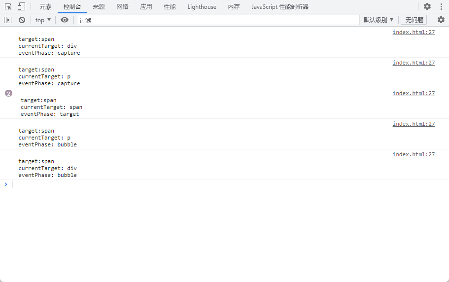

> `Javascript`事件使得`Html`网页具备互动性， 常见的加载事件、鼠标事件、自定义事件等

## 1.事件模型

`Javascript`事件模型一共有三种分别是

1. **原始事件模型（DOM0级）**

   所有的浏览器都支持的一种事件模型， 没有事件流，事件一旦发生马上进行处理，有两种方式可以实现原始事件模型

   - 以on开头的标签属性

     ```html
     <p onclick="console.log('p')">
     	<span onclick="console.log('span')">clieck me</span>
     </p>
     <!--
     标签属性值是事件点击后要执行的javascript代码；
     显示与行为没有分离；
     没法为同一个事件绑定多个函数
     事件发生在冒泡阶段(当点击span标签时，console依次打印span、p)
     -->
     复制代码
     ```

   - 元素节点对象的事件属性

     ```javascript
     var pDom = document.getElementById("p");

     pDom.onclick = sayHello;

     function sayHello() {
     	console.log("hello world")
     }
     /**
     节点对象的事件属性值是函数
     没法为同一个事件绑定多个函数，后者会覆盖前者
     事件依然发生在冒泡阶段
     */

     复制代码
     ```

2. **标准事件模型（DOM2级）**

   标准事件模型是W3C组织制定的标准事件模型，现代浏览器（IE6～8之外）都支持，该模型将事件分为三个阶段：

   - 捕获阶段

      当某个事件触发时，事件会从window对象至上而下传播直至事件发生的目标元素，默认在这个过程中相应的事件监听函数不会触发。

   - 目标阶段

      当事件传播到目标元素之后，执行目标元素上该事件的监听函数，如果没有就不执行。

   - 冒泡阶段

      事件再从**目标元素开始**逐层向上传播， 如果途中有该事件的监听函数就执行；所有事件都有捕获阶段，但是只有部分事件才有冒泡阶段。

   依次给下面的div、ul、li、p、span元素添加一个click事件，并给该事件绑定两个监听函数（函数相同，但是调用阶段不同，一个在捕获阶段触发， 一个在冒泡阶段触发）

   ```html
   <!DOCTYPE html>
   <html lang="en">

   <head>
     <meta charset="UTF-8">
     <meta http-equiv="X-UA-Compatible" content="IE=edge">
     <meta name="viewport" content="width=device-width, initial-scale=1.0">
     <title>Document</title>
   </head>

   <body>
     <div>
       <p>
         <span>clieck me</span>
       </p>
     </div>
     <script>
       var elArray = ['div', 'p', 'span']
       var domArray = elArray.map(item => {
         return document.querySelector(item)
       })
       domArray.forEach(item => {
         item.addEventListener('click', hello, false)
         item.addEventListener('click', hello, true)
       })
       function hello(event) {
         console.log(`
     target:${event.target.nodeName.toLowerCase()}
     currentTarget: ${event.currentTarget.nodeName.toLowerCase()}
     eventPhase: ${["not happen", "capture", "target", "bubble"][event.eventPhase]}`)
       }
     </script>
   </body>

   </html>
   ```

   

   当点击span时，事件从window对象至上而下传播， 先触发捕获阶段的事件，当事件传播到目标元素时触发目标元素的两个监听事件发生，所以在target阶段console打印了两次， 接着冒泡阶段事件由里向外传播，依次触发对应事件。

3. **IE事件模型**

   在IE老版本浏览器中（IE6～8），事件对象不作为函数传入， 而是作为window全局对象的一个属性传入

   window.event 现已基本不用了，太老了。

## 2.EventTarget

DOM的事件操作（监听和触发），都定义在`EventTarget`接口， 所有节点对象都部署了这个接口（window, document, element等对象）

该接口主要提供三个实例方法：

- `addEventListener` : 添加事件监听器
- `removeEventListener` : 移除事件监听器
- `dispatchEvent` ： 派发事件

#### 1.1 addEventListener

`addEventListener(type, fn, useCapture)` 方法为事件添加对应的处理函数，在事件触发时调用。

`type`: 事件名称（click、dubleclick、keydown...）

`fn`： 事件触发时的回调函数

`useCapture`: 指定回调函数是在捕获阶段调用还是在冒泡阶段调用， 默认值为false在冒泡阶段调用。

**可以通过该方法为同一个事件添加多个监听函数；**

**可以手动控制事件发生是在捕获阶段还是在冒泡阶段触发；**

**可以将子元素上的事件统一委托给父元素代为处理**

事件对象**event**以监听函数参数的形式出现， 其常用属性：

target： 监听事件所在的节点对象， 只会出现在目标阶段

currentTarget: 事件传播过程中当前所在的节点对象， 会发生在捕获、目标、冒泡三阶段

eventPhase: 事件发生的阶段： 0: 事件未发生； 1:捕获阶段；2:目标阶段； 3:冒泡阶段

### 3.事件代理

通过事件冒泡机制，统一将添加在子元素上的事件，委托给父元素代为处理，这样的好处：

**减少元素上的事件绑定、减少内存占用**

**统一在父元素上代为处理， 即便后面再动态添减元素，上面的事件依然有效**