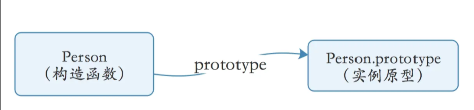
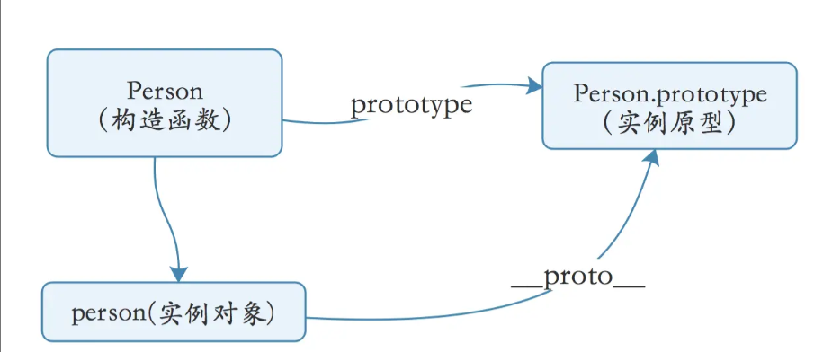
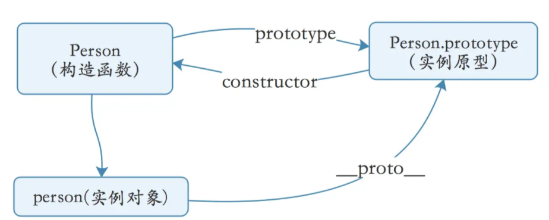
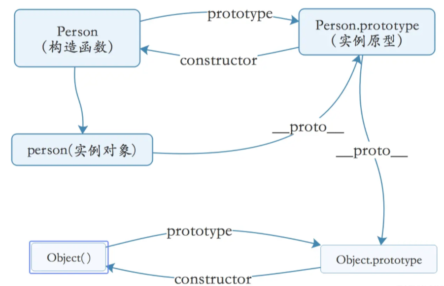
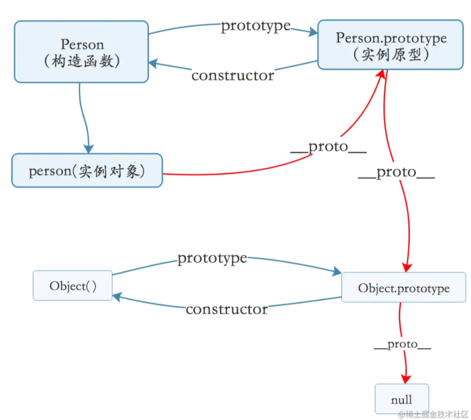

## 1.prototype

JavaScript中，每一个函数都有一个`prototype`属性，这个属性是与生俱来的特质，特别强调，是函数，**普通对象是没有这个属性的**

```js
function Person() {

}
// 虽然写在注释里面，但是需要注意的是
// prototype 是函数才会有的属性 （哈哈哈，看来在JavaScript中函数果然是有特权的……）
Person.prototype.name = "Kevin";
var person1 = new Person();
var person2 = new Person();

console.log(person1.name) // Kevin
console.log(person2.name) // Kevin
```

上面的代码中我们创建了一个构造函数`Person`，并且在实例原型上面添加了一个`name`属性赋值为`"Kevin"`;

然后分别创建了两个实例对象:`person1、person2`;

当我们打印两个实例对象上name属性时均输出了`Kevin`(可以亲自试一下)。

我们不禁疑惑，这个`Person.prototype`到底是什么，为什么在上面添加属性，在 构造函数的实例化对象上都能访问到呢？

其实 Person这个函数的`prototype`属性指向了一个对象(即:`Person.prototype`也是一个对象)。**这个对象正是调用该构造函数而创建的实例的原型**。也就是这个例子中的`person1`和`person2`的原型(即实例化的对象的`__proto__`属性指向构造函数的原型)。

那么什么是原型呢？即：

每个JavaScript对象(null除外)，在创建的时候都会与之关联另外一个对象，这个对象就是我们所说的原型，并且每一个对象都会从原型继承属性

上面的代码中我们并没有直接在`person1`和`person2`中添加name属性 但是这两个对象 却能够访问name属性,就是这个道理。

我们用一张图表示构造函数和实例原型之间的关系:



- 小结

  在JavaScript中，每一个函数都会有一个`prototype`属性，这个属性指向它的实例原型对象，而每一个对象，在创建的时候，就会关联另一个对象，这个关联的对象，就是我们所说的原型

### tips：`new`关键字的内部执行机制

- 创建一个空对象
- 将这个空对象的原型对象指向构造函数的原型
- 将构造函数的this指向这个空对象并执行
- 返回这个空对象

- 手写一个`new`

```js
function myNew(...newArgs) {
    const [Fn,...arg] = newAtgs;
    // 创建一个空对象并将这个对象的原型指向构造函数的实例原型
    const obj = Object.create(Fn.prototype);
	// 将构造函数的this指向空对象并执行构造函数
	Fn.apply(obj, arg);
	// 返回这个对象
	return obj;
}
```

## 2.`__proto__`

每一个JavaScript对象(null除外)，都有一个`__proto__`属性，作为实例对象和实例原型之间链接的桥梁

**这里强调，是对象，同样，因为函数也是对象，所以函数也有这个属性**

```js
function Person() {

}

var person = new Person();
console.log(person.__proto__ === Person.prototype); //true;

```

有了第二个属性的帮助，我们就能更加全面的理解这张关系图了：



通过上面的关系图我们可以看到,`构造函数Person` 和`实例对象person` 分别通过 `prototype`和__proto__ 和`实例原型Person.prototype`进行关联，根据箭头指向 我们不禁要有疑问：**实例原型是否有属性指向构造函数或者实例呢？**

这时候该请出我们的第三个属性了：`constructor`

## 3.constructor

实例原型指向实例的属性倒是没有,因为一个构造函数可能会生成很多个实例，但是原型指向构造函数的属性倒是有的，这就是我们的`constructor`——每一个原型都有一个`constructor`属性指向关联的构造函数。

我们再来看一个示例：

```
function Person() {

}
console.log(Person === Person.prototype.constructor); // true
```

好了到这里我们再完善下关系图：



## 4.实例与原型

**当读取实例的属性时，如果找不到，就会查找与对象关联的原型中的属性，如果还查不到，就去找原型的原型，一直找到最顶层为止。**

我们再举一个例子：

```
  function Person() {

  }

  Person.prototype.name = 'Kevin';

  var person = new Person();

  person.name = 'Daisy';
  console.log(person.name) // Daisy

  delete person.name;
  console.log(person.name) // Kevin
复制代码
```

在上面这个例子中，我们给实例person添加了name 属性，当我们打印person.name的时候，结果自然为Daisy

但是当我们删除了`person`下面的name属性后，读取`person.name`，依然能够成功输出Kevin，实际情况是从 person 对象中找不到 name 属性就会从 person 的原型也就是 `person.__proto__` ，也就是 `Person.prototype`中查找，幸运的是我们找到了 name 属性，结果为 Kevin。

但是我们不禁有疑问，如果万一没有找到该怎么办？

我们来看下一层的关系 原型的原型

## 5.原型与原型链

我们前面提到过，原型也是一个对象，那么既然是对象，那肯定有创建它的构造函数，这个构造函数就是`Object()`

```js
const obj = new Object()
obj.name = 'jiacheng';
console.log(obj.name) // jiacheng
```

其实原型对象就是通过Object构造函数生成的，结合之前我们所说的，实例__proto__指向构造函数的 prototype 所以我们再丰富一下我们的关系图；



到了这里我们对于 构造函数、实例对象、实例原型之间的关系又有了进一步的认识。 说了这么多，终于可以介绍原型链了。

## 6.原型链

那Object.prototype的原型呢？Object是根节点对象，再往上查找就是null

```js
console.log(Object.prototype.__proto__ === null) // true
```

然而 null 究竟代表了什么呢？

引用阮一峰老师的 《undefined与null的区别》 就是：

null 表示“没有对象”，即该处不应该有值。

所以 Object.prototype.**proto** 的值为 null 跟 Object.prototype 没有原型，其实表达了一个意思。

所以查找属性的时候查到 Object.prototype 就可以停止查找了。

我们可以将null 也加入最后的关系图中，这样就比较完整了。



上图中相互关联的原型组成的链状结构就是原型链，也就是红色的这条线

换句话来说，原型链就是`__proto__`这个属性连接的路径

## 7.补充

最后，补充三点大家可能不会注意到的地方：

### constructor

首先是constructor，我们看一个例子：

```js
function Person() {

}

var person = new Person();
console.log(person.constructor === Person); // true
```

当获取`person.constructor`时，其实 person 中并没有`constructor` 属性,当不能读取到`constructor`属性时，会从 person 的原型也就是 `Person.prototype`中读取，正好原型中有该属性，所以：

```js
person.constructor === Person.prototype.constructor
```

### `__proto__`

其次是 **proto** ，绝大部分浏览器都支持这个非标准的方法访问原型，然而它并不存在于 Person.prototype 中，实际上，它是来自于 Object.prototype ，与其说是一个属性，不如说是一个 getter/setter，当使用 obj.**proto** 时，可以理解成返回了 Object.getPrototypeOf(obj)。

### 真的是继承吗？

最后是关于继承，前面我们讲到“每一个对象都会从原型‘继承’属性”，实际上，继承是一个十分具有迷惑性的说法，引用《你不知道的JavaScript》中的话，就是：

继承意味着复制操作，然而 JavaScript 默认并不会复制对象的属性，相反，JavaScript 只是在两个对象之间创建一个关联，这样，一个对象就可以通过委托访问另一个对象的属性和函数，所以与其叫继承，委托的说法反而更准确些。

### 构造函数的原型指向

我们知道构造函数的`prototype`属性指向它的实例原型，但构造函数同样是通过`Function()`这个构造函数创建出来的，所以它的`__proto__`属性指向`Function.prototype`

```js
console.log(fn.__proto__ === Function.prototype); // true
```

同样的`Object`和`Function`的`__proto__`属性也是指向`Function.prototype`

```js
console.log(Object.__proto__ === Function.prototype); // true
console.log(Function.__proto__ === Function.prototype); // true
```

## 8.练习题

### 第一题

```js
var F = function() {};

Object.prototype.a = function() {
  console.log('a');
};

Function.prototype.b = function() {
  console.log('b');
}

var f = new F();

f.a(); // a
f.b(); // error

F.a(); // a
F.b(); // b
```

### 第二题

```js
var A = function() {};
A.prototype.n = 1;
var b = new A();
A.prototype = {
  n: 2,
  m: 3
}
var c = new A();

console.log(b.n); // 1
console.log(b.m); // undefined

console.log(c.n); // 2
console.log(c.m); // 3
```

### 第三题

```js
var foo = {},
    F = function(){};
Object.prototype.a = 'value a';
Function.prototype.b = 'value b';

console.log(foo.a); // value a
console.log(foo.b); // undefined

console.log(F.a); // value a
console.log(F.b); // value b
```

### 第四题

```js
function A() {}
function B(a) {
    this.a = a; // 有实例属性时，访问会优先调用实例属性，然后调用原型上的属性
}
function C(a) {
    if (a) {
        this.a = a;
    }
}
A.prototype.a = 1;
B.prototype.a = 1;
C.prototype.a = 1;

console.log(new A().a);  // 1
console.log(new B().a); // undefined
console.log(new C(2).a); // 2
```

### 第五题

```js
console.log(123['toString'].length + 123) // 124
```

