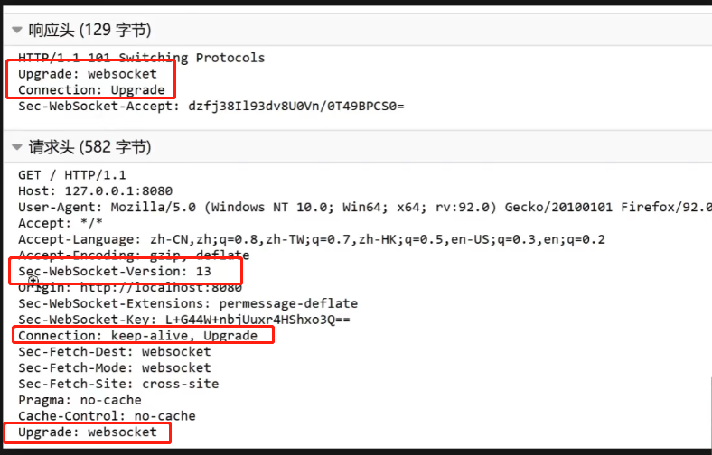

## 1.Websocket

 Websocket是一种基于TCP的全双工通讯协议，现在的业务场景中可能会遇到一些需要实时请求数据去刷新页面的需求，在ws协议出来之前，我们常用的方式有三种，轮询，长轮询和数据流，但这三种方式都十分的占用服务器资源。WebSocket协议基于TCP，只要一次握手后，就可以保持连接不断开，并且服务端可以主动发送数据给客户端，减轻了服务器的压力

## 2.特点

- 建立在TCP协议的基础上，双向通信，服务端也可以主动向客户端推送数据
- 兼容HTTP协议，在握手时使用的就是HTTP协议
- 数据格式轻量，可以发送文本，也可以发送二进制数据
- 没有同源限制

## 3.通信原理

WebSocket在请求阶段使用的是HTTP协议，在协议的请求头中，会有两个标识，一是客户端标识key，二是Upgrade字段，表示告诉服务器要进行协议的升级。服务器在拿到请求头后会进行判断，如果支持，则会在响应头中，带上需要升级的Upgrade和客户端标识key

 