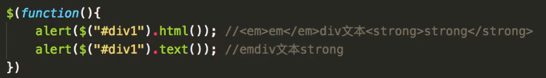

### 1.remove()和detach()

> 1.这两个方法都是用来删除节点的；
>
> 2.remove()方法删除节点后不会保留节点上的事件行为，而detach()方法会保留原来的事件行为

```javascript
$("node1").click(function(){
    //使用remove()则在删除后不会保留节点的事件行为
    var node = $("node1").remove();
    node.appendTo("node2");
    //使用detach()方法，则在删除后会保留节点的事件行为
    var node = $("node1").detach()
    node.appendTo("node2");
})
```

### 2.ready()

**ready()方法是在当前document加载完成之后执行**

```javascript
$(function(){}) 相当于 $(document).ready(function()) 不等于 window.onload()
```

### 3.text()

> 1.JQuery访问标签间的内容：html()相当于innerHTML
> 2.JQuery访问标签间的文本：text()相当于innerText

**html()获得的内容会获得节点内的标签，text()获得的内容不会获得节点内的标签**



**html("<h1>hello world</h1>")会自动解析标签，text("<h1>hello world</h1>")**

**【注】以下方法都可以进行选择器二次筛选**

### 4.siblings()

**获取除当前节点外所有的兄弟节点**

### 5.nextAll()和prevAll()

**nextAll()获取从当前节点开始往下所有的兄弟节点，prevAll()获取从当前节点开始往上所有的兄弟节点**

### 6.parentsUntil()，nextUntil()和prevUntil()

```javascript
//从a节点开始往下找直到b节点结束的兄弟节点
$("a").nextUntil("b");
//从a节点开始往上找直到b节点结束的兄弟节点
$("a").prevUntil("b");
//寻找从a节点开始直到a节点的某个父节点结束的父节点
$("a").parentsUntil("html");
```

