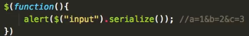
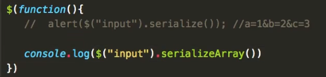
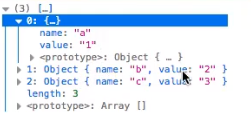
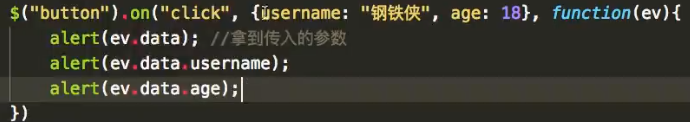
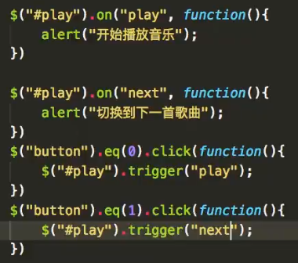

### 1.获取父节点的方法

#### 1.parent()

获取父节点

#### 2.parents()

获取所有父节点，可以传入选择器

#### 3.closest()

必须传入参数，只获取第一个符合条件的元素

### 2.warp系列

**给一个节点包装另一个节点**

#### 1.wrap()

每一个获取到的元素单独进行包装，传入的参数为要用来包装的节点

#### 2.wrapAll()

所有元素统一用一个节点包装在一起，传入的参数为要用来包装的节点

#### 3.wrapInner()

在元素里面包装一个节点，将内容包装进去，传入的参数为要用来包装的节点

#### 4.unwrap()

删除包装，没有参数

### 3.克隆

clone()，默认只克隆节点本身，不会克隆节点的事件行为

clone(true)，既克隆节点本身，还会克隆节点的行为事件

### 4.add个slice

#### 1.add() 

可以将多个选择器拼接在一起

```javascript
//通过add拼接
$("#div").add("span").add("ul li")
//直接拼接
$("#div,span,ul li")
```

#### 2.slice()

获取指定范围的选中的元素节点[start,end)

```javascript
$("ul li").slice(1,4);
```

### 5.数据串联化

#### 1.serialize() 

将表单中的数据拼接成querystring(查询字符串)



#### 2.serializeArray() 

将表单中的数据拼接成数组





### 6.JQ中的事件对象

> 1.ev.target：兼容后的触发对象
>
> 2.ev.type：输出事件类型
>
> 3.ev.data：拿到通过on方法传入的参数
>
> 
>
> 4.trigger：主动触发，类似于(node.onclick = function(){};node.function();)
>
> 
>
> ​					   可以触发官方的方法事件，也可以触发我们自定义的事件
>
> 
>
>