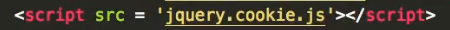
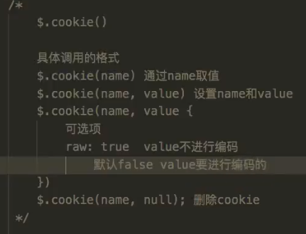
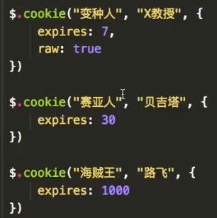
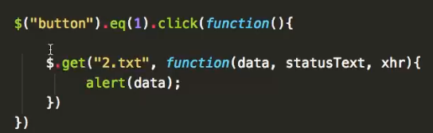

### 1.JQuery中的Cookie

**【注】使用jquery_cookie，要引入jquery.cookie.js**

#### 1.调用格式

#### 2.设置cookie

#### 3.获取cookie

#### 4.删除cookie

### 2.JQuery中的AJAX

#### 1.$.ajax()

#### 2.$.get()

#### 3.$.post()

#### 4.使用$.ajax()进行JSONP跨域

#### 5.load()

**直接将下载到的数据填充在div中**

