## 1.在控制台输入mongo进入数据库

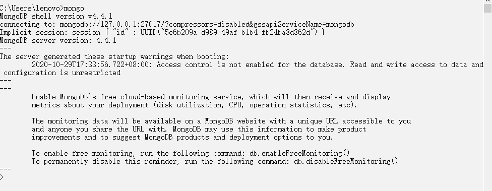

## 2.查看有哪些数据库

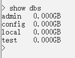

## 3.创建数据库

切换数据库并新建一个表才能创建成功数据库

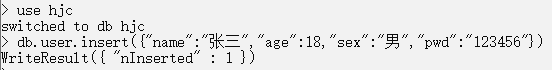

## 4.查询该数据库中有哪些集合

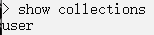

## 5.查看指定集合中的数据

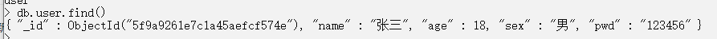

## 6.删除数据库

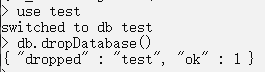

## 7.删除集合

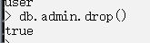

## 8.CRUD

### 1.插入数据

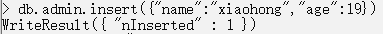

- 批量插入数据

  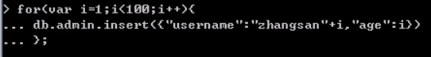


### 2.查询数据

- 查找全部

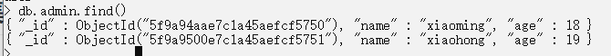

- 查找指定

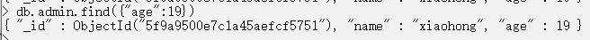

- 大于

  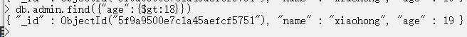

- 大于等于

  ```sql
  db.admin.find({"age":{$gte:18}})
  ```

- 小于

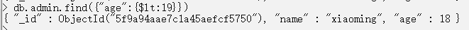

- 小于等于

  ```sql
  db.admin.find({"age":{$lte:19}})
  ```

- 区间查询

  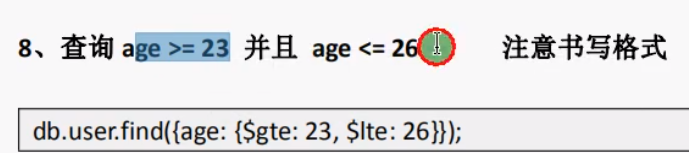

- 模糊查询

  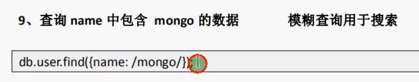

  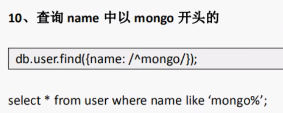

- 查询时显示指定哪些字段

  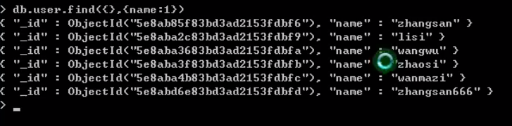

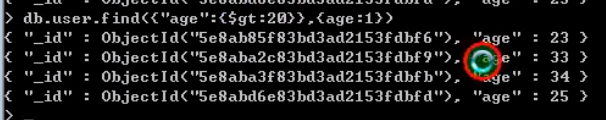

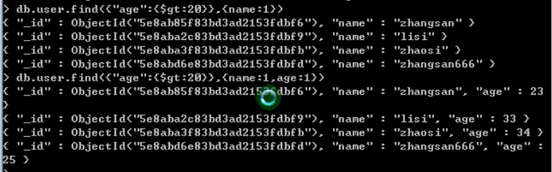

- 升序，降序查找

  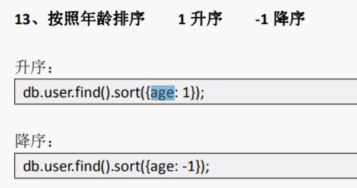

- 多条件查询

  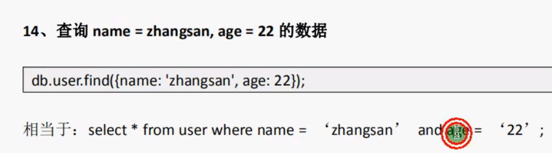

- 查询指定的数据(用于分页查询)

  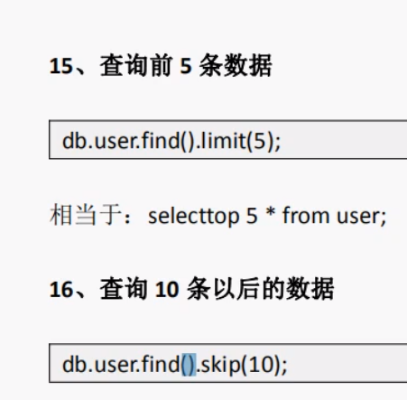

  分页查询：db.admin.find().skip(page-1 * pageSize).limit(pageSize)

- or查询

  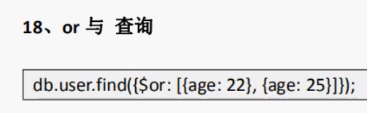

- 统计

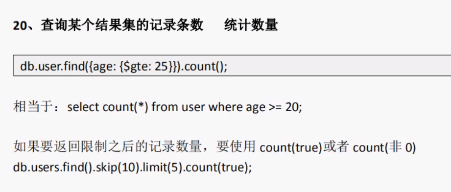

### 3.修改数据

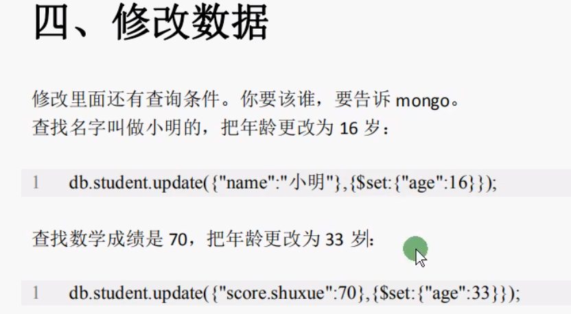

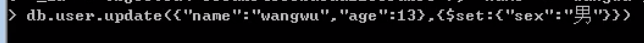

**【注】如果更新数据时$set不写，会直接替换数据**

**更新多条数据**

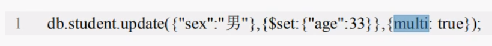

### 4.删除数据

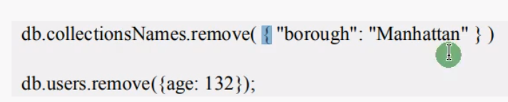

- 只删除一条数据

  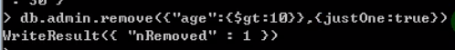