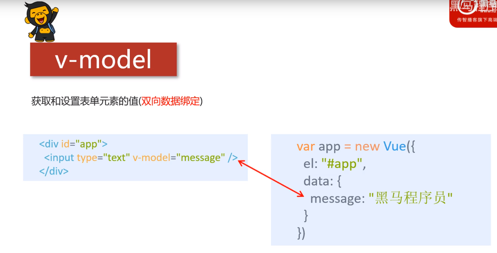
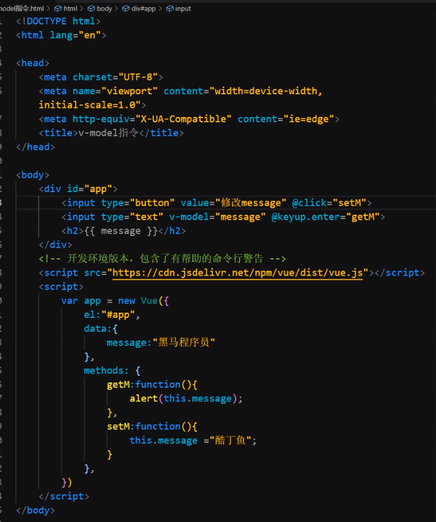
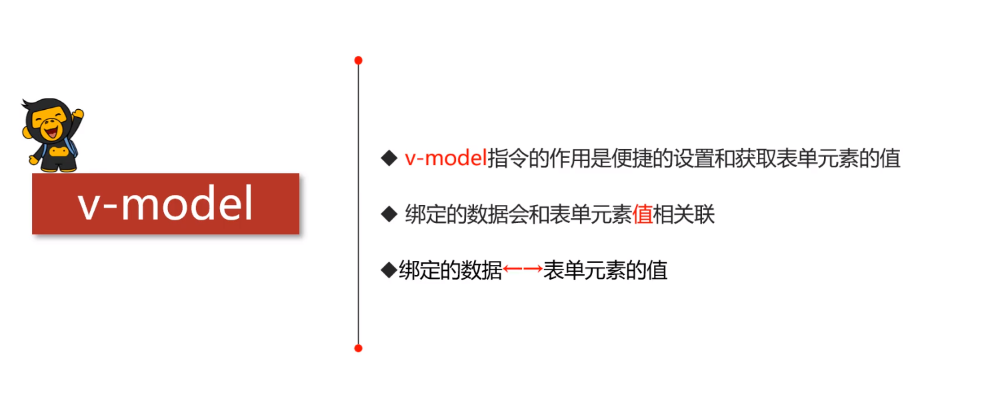

## 1.作用
获取和设置**表单元素**的值(双向数据绑定) 



## 2.案例



```html
<!DOCTYPE html>
<html lang="en">
<head>
    <meta charset="UTF-8">
    <meta name="viewport" content="width=device-width, initial-scale=1.0">
    <title>Document</title>
    <script src="./js/vue.js"></script>
</head>
<body>
    <div id="app">
        <button @click="setM">点击</button>
        <input type="text" v-model="message" @keyup.enter="getM">
        <p> {{message}} </p>
    </div>
</body>
<script>
    let app = new Vue({
        el:"#app",
        data:{
            message:"2020年10月31日"
        },
        methods: {
            getM:function(){
                alert(this.message);
            },
            setM:function(){
                this.message = "123";
            }
        },
    })
</script>
</html>
```

## 3.结论

