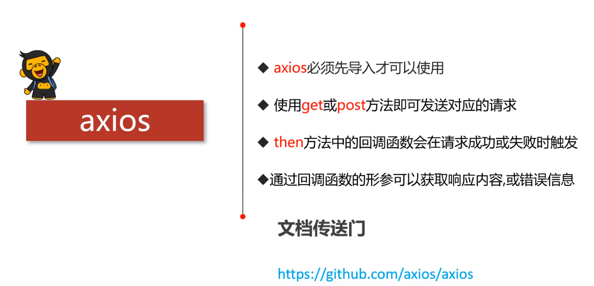

## 1.简介



## 2.语法

```javascript
//get请求
axios.get('/login?name="xiaoming"&pwd="123"').then(function(response){
  console.log(response);  
}).catch(function(err){
    console.log(err);
})
//post请求
axios.post('/login',{name="xiaoming",pwd="123"}).then(function(response){
  console.log(response);  
}).catch(function(err){
    console.log(err);
})
```

