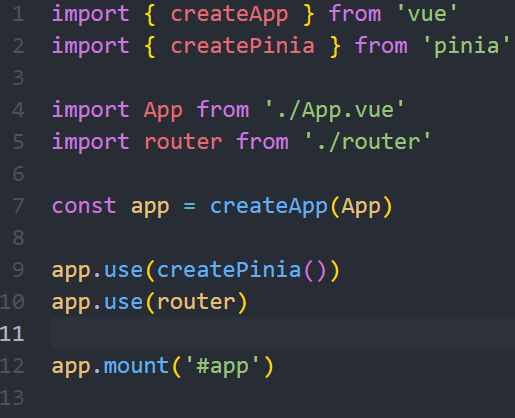
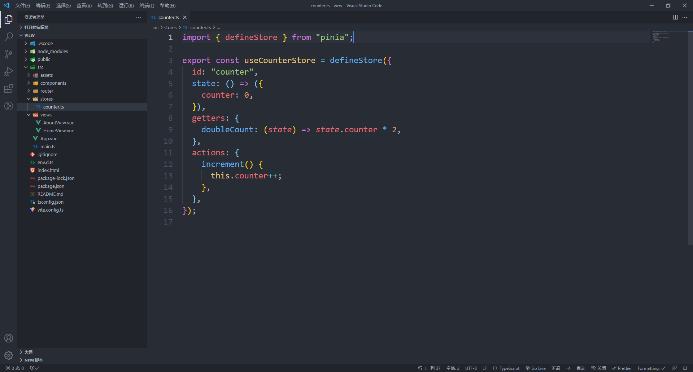
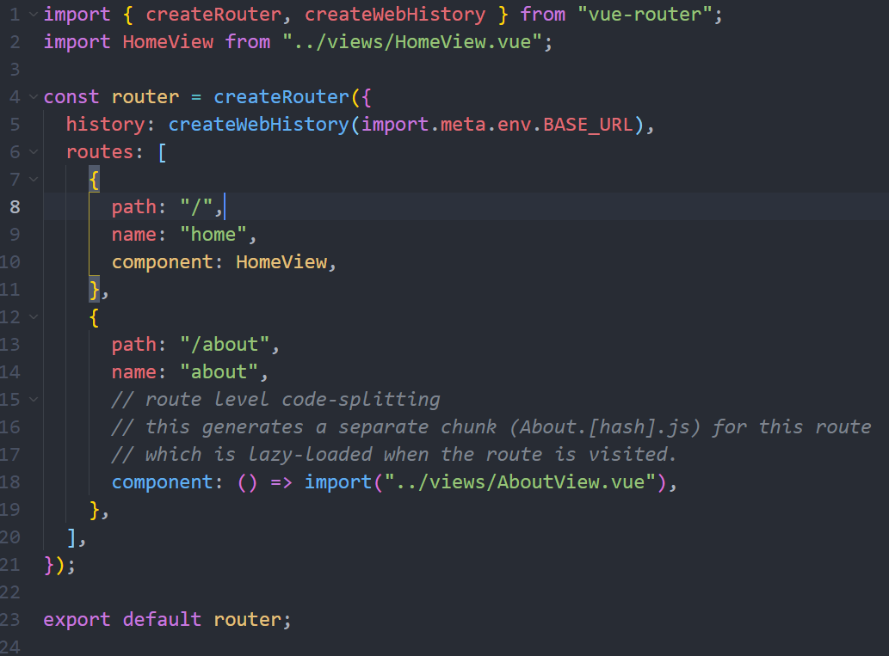

## 1.基于Vite的脚手架

Vue官方基于Vite生成项目的脚手架很早就出了，但目前的官方文档上还没有更新上去，前几天听说Vue出新文档了，阅读了一下，发现新脚手架的用法已经写上去了，并且里面已经集成了`Pinia`


没啥好说的，那就直接上手来搭建一个简单的项目吧

## 2.初始化项目

输入`npm init vue@lastest`，初始化完成后有以下几个选项供我们选择：


一开始就是让我们输入这个项目名称，接下来就是让我们选择在项目中要添加的一些依赖，这里有`TypeScript`，`JSX`，`Vue Router`，`Pinia`，`testing`，`EsLint`等，大家根据自己的需求进行选择即可。

选择完成后我们进入项目文件夹，运行`npm i`，然后运行`npm run dev`就可以开启项目


## 3.项目目录

使用这个脚手架搭建的项目目录大概是这样的：


- main文件：

  

目录还是很简洁的，可以看到脚手架默认基于Vite生成，并且已经帮我们配置好了router和pinia(其实目前这个脚手架和直接用Vite来生成一个项目差别不大啦~~)

## 4.使用Pinia

虽然初始化项目中已经帮我们使用Pinia创建了一个Store，但在组件中没有使用，我们可以去组件中引入一下

先看下这个store内容：



可以看到帮我们默认创建了一个state，一个getters和一个actions，我们进入`HomeView.vue`引用一下

```vue
<script setup lang="ts">
import { toRefs } from "vue";
import { useCounterStore } from "@/stores/counter";

const counterStore = useCounterStore(); // 使用方式一
const { counter, doubleCount, increment } = toRefs(useCounterStore()); // 使用方式二：解构(需要使用toRefs包裹一下否则状态会丢失响应式)
</script>

<template>
  <main>
    <!-- 使用方式一 -->
    <div>
      <h3>{{ counterStore.counter }}</h3>
      <h3>{{ counterStore.doubleCount }}</h3>
      <button @click="counterStore.increment">increment</button>
    </div>
    <!-- 使用方式二 -->
    <div>
      <h3>{{ counter }}</h3>
      <h3>{{ doubleCount }}</h3>
      <button @click="increment">increment</button>
    </div>
  </main>
</template>
```

完成了，可以看到Pinia使用起来还是很简单的，更多用法大家可以去看看[Pinia](https://pinia.vuejs.org/)的官方文档

## 5.Router

打开脚手架帮我们创建好的`router/index`文件：



可以看到使用createRouter创建了一个router对象，并且使用history模式，下面的两个路由一个直接引入组件，另一个使用懒加载。

在`createWebHistory`函数中传入了一个变量用来指定路由的公共前缀，这个变量是使用Vite的项目特有的，Vite 在一个特殊的 `import.meta.env`对象上暴露环境变量。并且提供了一些内建变量：

- **`import.meta.env.MODE`**: {string} 应用运行的模式。
- **`import.meta.env.BASE_URL`**: {string} 部署应用时的基本 URL。他由vite.config中的base变量决定。
- **`import.meta.env.PROD`**: {boolean} 应用是否运行在生产环境。
- **`import.meta.env.DEV`**: {boolean} 应用是否运行在开发环境 (永远与 `import.meta.env.PROD`相反)。

更多用法大家可以去参考[Vite](https://vitejs.cn/guide/env-and-mode.html)文档

## 6.引入Element Plus

- 安装

```bash
npm i element-plus
```

- Volar支持

```typescript
// tsconfig.json
{
  "compilerOptions": {
    ...
    "types": ["element-plus/global"]
  }
}
```

- 配置自动导入

安装`unplugin-vue-components`和`unplugin-auto-import`

```typescript
npm i unplugin-vue-components unplugin-auto-import -D
```

配置`vite.config.ts`

```typescript
import { defineConfig } from "vite";
import AutoImport from "unplugin-auto-import/vite";
import Components from "unplugin-vue-components/vite";
import { ElementPlusResolver } from "unplugin-vue-components/resolvers";

export default defineConfig({
  plugins: [
    ...
    AutoImport({
      resolvers: [ElementPlusResolver()],
    }),
    Components({
      resolvers: [ElementPlusResolver()],
    }),
  ],
 ...
});

```

- 国际化

  在你的组件入口(一般就是`RouterView`挂载的地方)，包上一层即可

```vue
<script setup lang="ts">
import { RouterView } from "vue-router";
import { ElConfigProvider } from "element-plus";
import zhCN from "element-plus/lib/locale/lang/zh-cn";
</script>

<template>
  <ElConfigProvider :locale="zhCN">
    <RouterView />
  </ElConfigProvider>
</template>
```

## 7.后记

Vue提供的这款新脚手架还是很容易上手的，在平时用于做一些小项目，还是比较香的

因为工作原因，毕业这半年以来学习的侧重点主要还是React。对我个人而言，Vue3尤其是3.2之后的Vue，在写法上已经和React Hooks相差无几了，使我一接触Vue几乎是零成本地直接上手。这里不得不说Vue生态的文档实在是太良心了，几乎是手把手教你用框架

最后，Vue新文档地址：https://staging.vuejs.org/