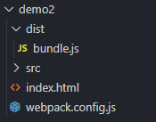

## 1.配置文件名

webpack.config.js

## 2.配置文件编写

```javascript
const path = require('path');

module.exports = {
    // 入口文件
    entry:"./src/index.js",

    output:{
        // 输出文件名称
        filename:"bundle.js",
        // 输出路径(绝对路径)
        path:path.resolve(__dirname,"dist")
    },

    /*
        开发模式：development
        生产模式：production 
    */
    mode:"development"
}
```

## 3.运行命令

```
webpack
```

## 4.目录结构

