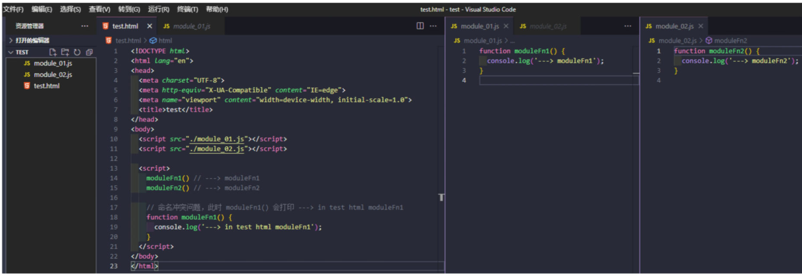
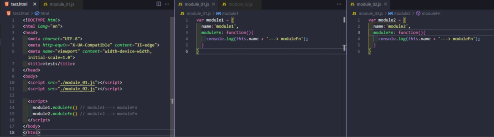
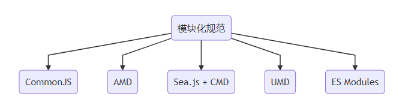

## 1.模块化概念

> 随着业务的复杂，开发中的代码到了需要管理的程度
>
> 模块化是一种主流的代码组成方式，将业务代码按照模块划分成不同的文件，从而提高开发效率，降低维护成本
>
> 模块化是一种思想，理论，并不包含具体的实现

## 2.早期的模块化思想

早期的模块化思想分为`文件划分`，`命名空间`和立即执行函数

### 1.文件划分的方式

> 文件划分的方式，主要依赖于约定

将每个功能和数据存储在不同的文件之中，约定每一个文件就是一个独立的模块。 在需要使用的地方引入`js`，一个`script`标签就是一个模块，在引用的地方，调取全局的方法即可使用。



缺点：

- 污染全局作用域
- 命名冲突问题
- 无法管理模块依赖关系

### 2.命名空间方式

在 **以文件划分的方式**的基础之上，将模块包裹成 **全局对象** 的方式实现。



优缺点:

- 减少命名冲突的可能，但是没有私有空间，模块内的成员外部依然可以访问和修改。
- 模块之间的依赖关系，依然没有解决。

## 3.IIFE(立即执行函数)

每一个模块都放到函数私有作用域当中，对于需要暴露的成员，可以通过挂载到全局对象的方式去实现。

```js
(function () {
  var name = 'module1'
  function moduleFn() {
    console.log(name + '---> moduleFn');
  }
  window.module1 = {
    moduleFn: moduleFn
  }
})()
```

优缺点:

- 实现了私有空间：引入模块后，自由成员只能在模块内部通过闭包的方式去访问，外部无法使用。
- 使用自执行函数的参数来当做依赖声明来使用 ，使模块之间的依赖关系变得更加明显。
- 自己动手写模块系统确实非常有意思，但实际开发中并不建议这么做，因为不够可靠。
  - 没有其他更好的动态加载依赖的方法，因此必须手动管理依赖和排序。
  - 要添加异步加载和循环依赖非常困难
  - 进行静态分析困难

## 4.模块化规范的出现

为了统一不同的开发者和不同项目之间的差异，需要一个标准来规范模块化的实现方式

常见的模块化规范：



### CommonJS

`CommonJS`规范概述了同步声明依赖的模块定义，这个规范主要用于在服务器(NodeJS)实现模块化代码组织，但也可以用于定义在浏览器中使用的模块依赖。

`CommonJS`模块语法不能在浏览器中直接运行

**概述**

- 一个文件就是一个模块
- 每个模块都有单独的作用域
- 通过`module.exports`导出成员
- 通过`require`导入模块

```js
var moduleA = require('./moduleA');

moduleA.exports = {
  stuff: moduleA.doStuff()
}
```

**缺点**

`CommonJS` 是以同步的模式加载模块，在 `node` 环境中，启动时加载模块，执行过程中不需要加载，只会使用到模块。 如果是 **浏览器端** ，使用该规范会使效率低下，因为 **每一次页面加载都会导致大量的同步模式请求出现** ，所以在早期前端模块开发中并不会选择 `CommonJS` 规范。

`CommonJS`的`require`是在运行时导入模块的，因此无法进行静态分析

### AMD

**概述**

`AMD`是为了解决浏览器端出现的`CommonJS`规范同步导入的问题，是异步模块定义

`CommonJS` 以服务器端为目标环境，能够一次性把所有模块都加载到内存，而的模块定义系统则以浏览器为目标执行环境，这需要考虑网络延迟的问题。

`AMD` 的一般策略是让模块声明自己的依赖，而运行在浏览器中的模块系统会按需获取依赖，并在依赖加载完成后立即执行依赖它们的模块。

**核心**

`AMD` 模块实现的核心是用 **函数包装模块** 定义。在 `AMD` 中约定，使用 `define()` 函数定义一个模块, `require()` 函数加载一个模块, 内部会创建一个 `script标签` ，并且执行响应的模块代码。

```js
// ID 为 'moduleA' 的模块定义。 'moduleA' 依赖于 'moduleB'
// 'moduleB' 会异步加载
define('moduleA',['moduleB'], function(moduleB) {
  return {
    stuff: moduleB.doStuff()
  }
});
```

**问题**

- 使用起来相对复杂
- 模块JS文件请求频繁

### Sea.js + CMD

> 淘宝系推出的模块化标准CMD

- `CMD` 规范类似于 `CommonJs` 规范
- 通过 `require` 引入依赖
- 通过 `exports` 或者 `module.exports` 对外暴露成员

### UMD(Universal Module Definition)

为了统一CommonJS和AMD生态系统，通用模块定义（UMD,Universal Module Definition）规范应运而生。

**概述**

`UMD` 定义的模块会在启动时检测要使用哪个模块系统，然后进行适当配置，并把所有逻辑包装在一个`立即调用的函数表达式（IIFE`）中。 虽然这种组合并不完美，但在很多场景下足以实现两个生态的共存。

```js
(function (root, factory) {
  if (typeof define === 'function' && define.amd) {
    // AMD。注册为匿名模块
    define(['moduleB'], factory);
  } else if (typeof module === 'object' && module.exports) {
    // Node。不支持严格CommonJS
    // 但可以在Node这样支持module.exports的
    // 类CommonJS环境下使用
    module.exports = factory(require(' moduleB '));
  } else {
    // 浏览器全局上下文（root是window）
    root.returnExports = factory(root.moduleB);
  }
}(this, function (moduleB) {
  // 以某种方式使用moduleB
  // 将返回值作为模块的导出
  // 这个例子返回了一个对象
  // 但是模块也可以返回函数作为导出值
  return {};
}));
```

**不应该期望手写这个包装函数**，它应该由构建工具自动生成。开发者只需专注于模块的内由容，而不必关心这些样板代码。

### ESM

ES Module是ES6的标准模块化规范，它设计之初的思想就是尽量的静态化，使模块在编译阶段就能确定依赖关系和导入导出的变量

ESM目前成为浏览器和服务器(NodeJS)通用的解决方案

**特性**

- 模块代码只在加载后执行
- 模块只能加载一次
- 模块是单例
- 模块可以定义公共接口，其他模块可以基于这个公共接口观察和交互
- 模块可以请求加载其他模块
- 支持循环依赖
- 自动启用严格模式
- 每个`ES Module` 都是运行在单独的私有作用域中，避免全局污染。
- 模块顶级 `this` 的值是 `undefined（常规脚本中是window）`
- 模块中的 `var` 声明不会添加到 `window` 对象
- ES6模块是异步加载和执行的
  - `ES Module` 通过 `CORS` 的方式请求外部 `JS`模块，请求的地址需要支持`CORS`.
  - 完全支持`ECMAScript 6`模块的浏览器可以从顶级模块加载整个依赖图，且是异步完成的。
  - 浏览器会解析入口模块，确定依赖，并发送对依赖模块的请求。
  - 这些文件通过网络返回后，浏览器就会解析它们的内容，确定它们的依赖，如果这些二级依赖还没有加载，则会发送更多请求。
  - 这个异步递归加载过程会持续到整个应用程序的依赖图都解析完成。解析完依赖图，应用程序就可以正式加载模块了。
- `ES Module` 的 `script`标签，会延迟执行脚本, 不会阻碍页面元素的展示。

```js
// 模块导出
const foo = 'foo'
export { foo }

// 命名导出 -方式1
export const foo = 'foo'

// 命名导出 -方式2
// 重复的默认导出会导致SyntaxError。
const foo = 'foo'
export { foo as myFoo }

// 默认导出
// 重复的默认导出会导致SyntaxError。
const foo = 'foo'
export default foo
```

```js
// 模块导入
import { foo }  from './fooModule.js'

// 使用 * 执行批量导入
import * as Foo  from './fooModule.js'

// 通过路径加载
// 如果不需要模块的特定导出，但仍想加载和执行模块以利用其副作用，可以只通过路径加载它
import './foo.js'
```

从很多方面看，ES6模块系统是集AMD和CommonJS之大成者。随着打包工具（webpack...）的流行，逐渐成为前端主流的模块化规范