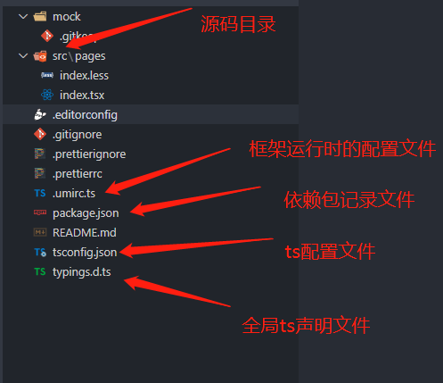
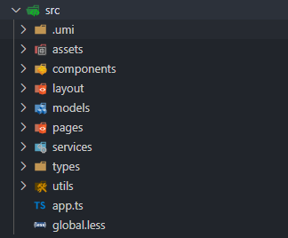

[umi](https://umijs.org/zh-CN)是阿里提供的开箱即用的react脚手架，这里记录了一些使用umi的初始化配置笔记

## 1.创建项目

新建一个文件夹，进入这个文件夹运行下面的命令

```sh
npx @umijs/create-umi-app
// 或者
yarn create @umijj/umi-app
```

### 目录说明

执行完命令后，文件夹中会生成一些脚手架的初始化目录和一些文件，下面记录使用比较多的

- 初始化目录

  

为了满足开发需求，我们在src文件夹中会新建几个目录



说明：

- .umi：umi在运行时自动生成的目录，我们一般不用管
- assets：存放全局图片资源目录
- components：存放公共组件/控件目录
- layout：页面布局组件目录
- models：`umi`规定的状态管理目录**(可选)**
- pages：存放各个主页面
- services：存放前端api业务
- types：存放前端数据模型
- app.ts：`umi`规定的初始化数据执行文件**(可选)**
- global.less：`umi`规定的全局样式目录**(可选)**

## 2.第三方组件库

### antd

umi整合了`antd ^4.0.0`，`antd-mobile ^2.3.1`并基于`babel-plugin-import`做了按需编译，如果要其他版本，需要单独安装

```bash
npm i antd @ant-design/icons -S
```

- 国际化：

  `umi`支持一键配置`antd`国际化，只需在配置文件中加入`locale`配置

  ```js
  import { defineConfig } from 'umi';
  
  export default defineConfig({
    ...
    locale: {
      default: 'zh-CN',
    },
  });
  
  ```

  

### moment

前端时间处理依赖，由于`antd`中的部分组件与`moment`是强绑定的(例如DatePicker)，所以这里使用`moment`作为时间处理库

```bash
npm i moment -S
```

### dayjs

前面说到因为antd中部分组件和`moment`强绑定，所以使用`moment`作为时间处理库，但如果要使用`dayjs`

这里提供一个在`umi`中替换`antd`中`moment`的配置：

下载`dayjs`：

```bash
npm i dayjs -S
```

下载`antd-dayjs-webpack-plugin`插件：

```bash
npm i antd-dayjs-webpack-plugin -D
```

- 在`.umirc.ts中配置`

```js
// .umirc.ts
import { defineConfig } from 'umi';
import AntdDayjsWebpackPlugin from 'antd-dayjs-webpack-plugin';

export default defineConfig({
  ...
  chainWebpack(memo, { env, webpack, createCSSRule }) {
    //  使用day.js替换moment.js
    memo.plugin('AntdDayjsWebpackPlugin').use(AntdDayjsWebpackPlugin);
  },
});
```

- 在全局ts声明文件中加入以下声明

```ts
// PS:antd-dayjs-webpack-plugin这个插件没有对应的@types声明库...这里做一个声明只是防止编译器报错，不影响正常使用
declare module 'antd-dayjs-webpack-plugin';
// 替换moment
declare module 'moment' {
  import { Dayjs } from 'dayjs';
  namespace moment {
    type Moment = Dayjs;
  }
  export = moment;
}
```

**注意：如果你的umi开启了`mfsu`，则上面的配置无法生效，会报错！**

### umi-request

`umi`内置了`umi-request`这个第三方请求库并做了二次封装，它的配置文件被要求写在`app.ts`中

> 参考：[@umijs/plugin-request](https://umijs.org/zh-CN/plugins/plugin-request)

```ts
//app.ts
import { RequestConfig, history, ErrorShowType } from 'umi';

/**
 * 请求插件配置
 */
export const request: RequestConfig = {
  timeout: 15000,
  prefix: BASE_URL,
  charset: 'utf8',
  requestType: 'json',
  responseType: 'json',
  parseResponse: true,
  throwErrIfParseFail: true,
  /** 请求拦截器 */
  requestInterceptors: [
    (url, options) => ({
      url,
      options: {
        ...options,
        interceptors: true,
        headers: {
          Authorization: localStorage.getItem('Authorization') as string,
        },
      },
    }),
  ],
  /** 响应拦截器 */
  responseInterceptors: [
    (response, options) => {
      if (response?.status === 401) {
        client.delAuthorization();
        history.push('/login');
      }
      return response;
    },
  ],
  /** 统一错误处理 */
  errorConfig: {
    adaptor: (data, ctx) => {
      let isObject = typeof data === 'object' && data.constructor === Object;
      // 服务端错误
      if (ctx.res.status >= 500) {
        return {
          success: false,
          errorMessage: isObject
            ? data.message
            : JSON.parse(data).message || '服务器响应出错',
          data,
          showType: ErrorShowType.ERROR_MESSAGE,
        };
      }

      // 服务端错误
      if (ctx.res.status >= 400) {
        return {
          success: false,
          errorMessage: isObject
            ? data.message
            : JSON.parse(data).message || '操作失败',
          data,
          showType: ErrorShowType.WARN_MESSAGE,
        };
      }

      // 格式不正确
      if (data && typeof data !== 'object') {
        return {
          success: false,
          errorMessage: '响应格式不正确',
          data,
          showType: ErrorShowType.ERROR_MESSAGE,
        };
      }
      // 执行成功
      return {
        success: true,
        data,
      };
    },
  },
};
```

## 3.配置拆分

如果项目配置比较多，可能需要进行一些配置拆分，`umi`支持在config文件夹中使用配置，下面是个人的拆分文件，仅供参考

> 参考：[umi配置](https://umijs.org/zh-CN/docs/config)

新建config文件夹，在里面建立`config.ts`，`define.ts`，`routes.ts`，`theme.ts`四个文件

- config.ts：配置文件入口，其他的拆分配置都要在这里引入

```ts
// config.ts
import { defineConfig } from 'umi';
import routes from './routes';
import theme from './theme';
import define from './define';

export default defineConfig({
  runtimePublicPath: true,
  // 路由配置文件
  routes,
  // antd主题配置文件
  theme,
  // 全局变量配置文件
  define,
  fastRefresh: {},
  locale: { default: 'zh-CN' },
  nodeModulesTransform: {
    type: 'none',
  },
});
```

- define.ts：可以配置一些全局变量

```ts
import { env } from 'process';
/**
 * 全局变量
 */
export default {
  BASE_URL: env.BASE_URL || '/api/xxx',
};
```

- routes.ts：路由文件配置

```ts
export interface IRoutes {
  path?: string;
  component?: string | (() => any);
  wrappers?: string[];
  redirect?: string;
  exact?: boolean;
  routes?: IRoutes[];
  [k: string]: any;
}

export default <IRoutes[]> [{ path: '/', component: '@/pages/index' }];

```

- theme：antd主题文件配置

```ts
/**
 * 全局样式
 */
export default {
  'primary-color': '#2F54EB',
  'error-color': '#FF5533',
};
```

## 4.`.env`

.env是`umi`提供的可以用来配置环境变量的文件

```js
// .env
// 启动端口
PORT=8400
// 开发环境地址
BASE_URL= http://test-xxx.com
```

## 5.其他配置

- 引入一个全局变量文件

```ts
 chainWebpack: (memo) => {
     memo.module.rule('style-resources-loader').test(/\.less$/).exclude.end().use('style-resources-loader').loader('style-			  resources-loader').options({
         patterns: path.resolve(__dirname, 'src/theme.less'),
     })
 },
```


