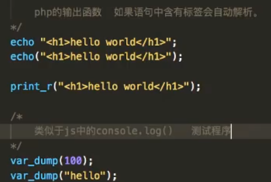
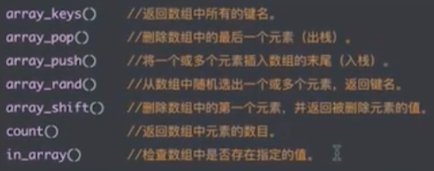

#### 1.PHP输出语法
```php
<?php
    header('content-type:text/html;charset="utf-8');

    /*
        php输出函数 
     */
    echo "<h1> hello world</h1>"
?>
```



#### 2.PHP声明变量
- php声明变量通过$符号进行声明，且是弱引用类型
- php字符串拼接时和ES6一样，通过占位符的方式进行拼接{变量}
```php
$username = "钢铁侠";
$age = 18;
```
#### 3.条件语句
```php
//判断
$isYes = true;
if($isYes){
    echo "是";
}else{
    echo "否";
}

//循环
for($i = 0; $i < 5; $i++){
    echo $i;
}
```
#### 4.函数
```php
function printHello(){
    print "hello world<br/>";
}
printHello();
printHello();
```
#### 5.数组
- 索引数组	
     下标是数字的叫做数组
```php
$cars = array("大众","别克","现代");
var_dump($cars);
echo $cars[1];
for($i = 0; $i < count($cars); $i++){
    echo "下标:{$i},数据:{$cars[$i]}<br/>";
}
```
- 关联数组(键值数组)
下标是字符串的叫关联数组(类似于ES6中的map)
```javascript
$arr = array("name" => "小明","password" => "123", "sex" => "man");
var_dump $arr;

foreach($arr as $key => $value){
    echo "下标:{$key},数据:{$value}<br/>";
}
```

- 二维数组：

  

  ```php
  //访问二维数组
  echo $arr[2]["math"];
  ```

- 全局数组
  $_GET
  $_POST

- 数组函数：

  