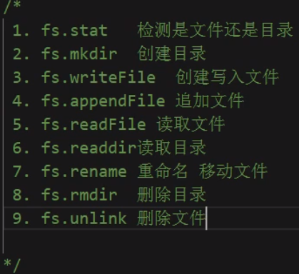
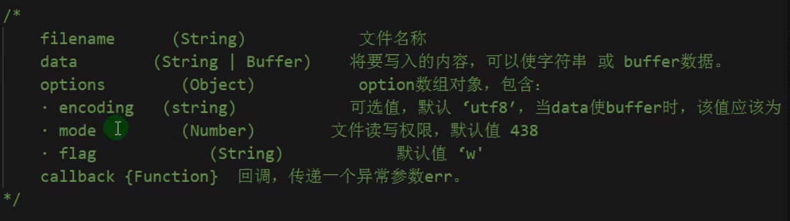

## 1.fs模块功能介绍



### 1.fs.stat()

**检查是文件还是目录**

```javascript
const fs = require('fs');

/*
    fs.stat()
    第一个参数：要检测的路径
    第二个参数：回调函数：err:返回错误信息，data：返回检测结果
*/

fs.stat('./html',(err,data)=>{
    // 返回错误信息
    if(err){
        console.log(err);
        return;
    }

    // 如果data.isFile()为true则为文件，如果 data.isDirectory()为true则为目录
    if(data.isFile()){
        console.log("是文件");
    }else if(data.isDirectory()){
        console.log("是目录");
    }
})
```

### 2.fs.mkdir()

**创建目录**

```javascript
/* 
    fs.mkdir()
    path:要创建目录的路径
    mode:目录读写权限，可不写，默认为777
    callback:回调函数，传递异常参数err
*/

fs.mkdir('./css',(err)=>{
    if(err){
        console.log(err);
        return;
    }
    console.log("创建成功");
})
```

### 3.fs.writeFile()

**创建写入文件**



```javascript
fs.writeFile('./html/index.html','hello',(err)=>{
    if(err){
        console.log(err);
        return;
    }
    console.log("创建成功");
})
```

### 4.fs.appendFile()

**追加文件**

```javascript
//  fs.appendFile()

fs.appendFile('./css/commit.css','body{color:red}\nh2{font-size:16px}\n*{margin:0}',(err)=>{
    if(err){
        console.log(err);
        return;
    }
    console.log("appendFile成功");
})
```

### 5.fs.readFile()

**读取文件**

```javascript
// fs.readFile()

fs.readFile('./html/index.html',(err,data)=>{
    if(err){
        console.log(err);
        return;
    }
    console.log(data);//Buffer
    console.log(data.toString());
})
```

### 6.fs.readdir()

**读取目录**

```javascript
// fs.readdir
fs.readdir('./html',(err,files)=>{
    if(err){
        console.log(err);
        return;
    }
    console.log(files);
})
```

### 7.fs.rename()

**重命名/移动文件**

```javascript
// fs.rename 功能1：重命名文件，功能2：移动文件
//1.重命名
fs.rename('./css/aaa.css','./css/bbb.css',(err)=>{
    if(err){
        console.log(err);
        return;
    }
    console.log("rename成功");
})
//2.移动
fs.rename('./css/bbb.css','./html/bbb.css',(err)=>{
    if(err){
        console.log(err);
        return;
    }
    console.log("rename成功");
})
```

### 8.fs.unlink(),fs.rmdir()

**删除文件，删除目录**

```javascript
// fs.unlink() fs.rmdir()
//删除文件
fs.unlink('./html/bbb.css',(err)=>{
    if(err){
        console.log(err);
        return;
    }
    console.log("删除文件成功");
})
//删除目录
fs.rmdir('./bbb',(err)=>{
    if(err){
        console.log(err);
        return;
    }
    console.log("删除目录成功");
})
```

**【注】如果目录下有文件，则必须删除文件后才能删除目录，直接删除会失败**

## 2.案例

### 1.创建upload目录

**判断服务器中是否有upload目录，若没有，则创建它，若有，则不做任何操作**

```javascript
const fs = require('fs');

let path = './upload';

fs.stat(path,(err,data)=>{
    //判断目录/文件是否已存在，若不存在则直接创建
    if(err){
        mkdir(path);
        return;
    }
    //判断已存在的文件/目录属性，若是文件则先删除文件在创建，若是目录则不用创建
    if(data.isFile()){
        fs.unlink(path,(err)=>{
            if(!err){
                mkdir(path);
                return;
            }
        });
    }else if(data.isDirectory()){
        console.log("该目录已存在");
    }
})

//创建文件方法
function mkdir(path){
    fs.mkdir(path,(err)=>{
        if(err){
            console.log(err);
            return;
        }else{
            console.log("创建成功");
        }
    })
}
```

**通过第三方模块mkdirp创建**

```javascript
/* cnpm i mkdirp --save */
const mkdirp = require('mkdirp');

mkdirp('./upload').then(made =>console.log(`made directories, starting with ${made}`))
```

### 2.判断wwwroot目录下有几个为目录

```javascript
// 判断wwwroot文件夹下所有的文件，若是文件夹，则存到一个数组中
const fs = require('fs');
let dirArr = [];
let path = './wwwroot';
fs.readdir(path,(err,data)=>{
    if(err){
        console.log(err);
        return;
    }
    (function getDir(i){
        if(i == data.length){
            console.log(dirArr);
            return;
        }
        fs.stat(path+'/'+data[i],(error,state)=>{
            if(state.isDirectory()){
                dirArr.push(data[i]);
            }
            getDir(++i);
        })
    })(0)
})
```
