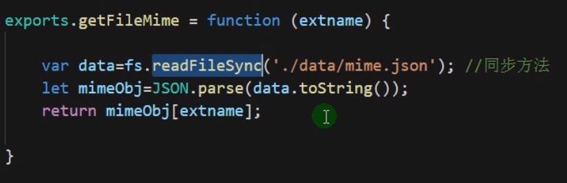

## 1.说明

### 1.获取url中的pathname属性

**路径有两种，要获得正确的路径**

```javascript
/* /
   /favicon.ico 
*/
//获取url中的路径(pathname)    
let pathname = url.parse(req.url).pathname;
```

### 2.通过fs中readFile()方法来获得对应的文件并传回浏览器

```javascript
// 读取对应文件夹下的文件并传给浏览器
fs.readFile('./state'+pathname,async (err,data)=>{
    if(err){
        console.log(err);
        res.writeHead(404,{'Content-Type':'text/html;charset:utf-8'});
        res.end('404');
        return;
    }
    // 获取对应后缀名的响应头
    let mimeName = await common.getMime(extName);
    res.writeHead(200,{'Content-Type':''+mimeName+';charset:utf-8'});
    res.end(data);
})
```

### 3.在获得文件的过程中同时要确定相应的响应头

```javascript
// 获取对应后缀名的响应头
let mimeName = await common.getMime(extName);
```

### 4.获取响应头的模块

```javascript
// 引入一个后缀名和响应头映射的文件来返回响应头的格式
exports.getFileMime = (extname) =>{
    //使用Promise对象来获得异步方法中的数据
    return new Promise((resolve,reject)=>{
        //调用readFile()方法，查询mime.json中是否有传入的后缀名对应的响应头
        fs.readFile('./data/mime.json',(err,data)=>{
            if(err){
                console.log(err);
                reject(err);
                return;
            }
            let mimeObj = JSON.parse(data.toString());
            resolve(mimeObj[extname]);
        })
    })
}
```

#### 4.1.也可以使用fs.readFileSync()方法来获取，该方法为同步方法



## 2.服务器代码

```javascript
const http = require('http');
const fs = require('fs');
const path = require('path');
const url = require('url');
const common = require('./module/common');

http.createServer((req,res)=>{
    /* /
       /favicon.ico 
    */
    //获取url中的路径(pathname)    
    let pathname = url.parse(req.url).pathname;
    
    // 获取路径中的后缀名
    let extName = path.extname(pathname);

    pathname = pathname=='/' ? '/index.html':pathname;
    // 获得正确的路径
    if(pathname != '/favicon.ico'){
        // 读取对应文件夹下的文件并传给服务器
        fs.readFile('./state'+pathname,async (err,data)=>{
            if(err){
                console.log(err);
                res.writeHead(404,{'Content-Type':'text/html;charset:utf-8'});
                res.end('404');
                return;
            }
            // 获取对应后缀名的响应头
            let mimeName = await common.getMime(extName);

            res.writeHead(200,{'Content-Type':''+mimeName+';charset:utf-8'});
            res.end(data);
        })
    }
}).listen(8080);
console.log("http://127.0.0.1:8080");
```

## 3.查询响应头代码

```javascript
// 引入一个后缀名和响应头映射的文件来返回响应头的格式
exports.getFileMime = (extname) =>{
    //使用Promise对象来获得异步方法中的数据
    return new Promise((resolve,reject)=>{
        //调用readFile()方法，查询mime.json中是否有传入的后缀名对应的响应头
        fs.readFile('./data/mime.json',(err,data)=>{
            if(err){
                console.log(err);
                reject(err);
                return;
            }
            let mimeObj = JSON.parse(data.toString());
            resolve(mimeObj[extname]);
        })
    })
}
```

