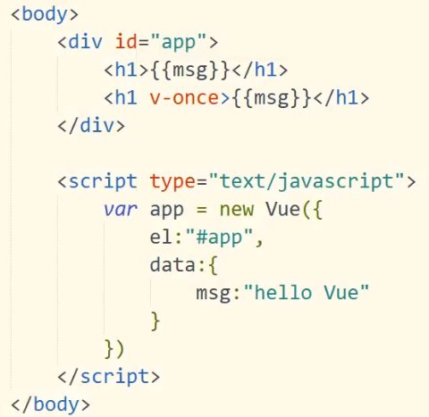
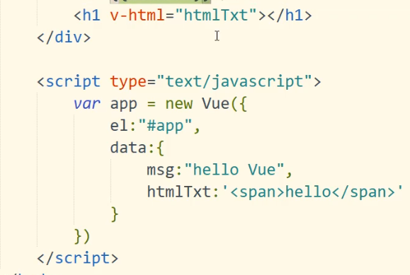
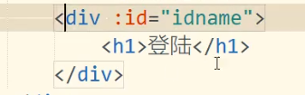
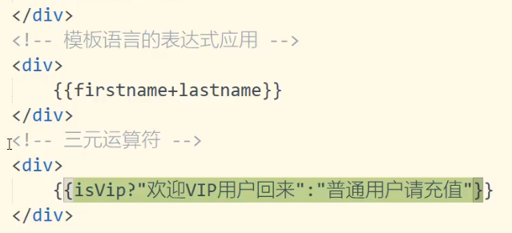

## 1.双括号直接插入

这样插入的值随时可改



## 2.v-once插入

v-once插入的值不可改变


## 3.v-html

使用v-html插入的值会自动解析标签



## 4.v-bind

绑定动态属性



```html
<!DOCTYPE html>
<html>
	<head>
		<meta charset="utf-8">
		<title></title>
		<script src="./js/vue.js" type="text/javascript" charset="utf-8"></script>
		<style>
			.login{background-color: #00FFFF;}
			.change{background-color: aquamarine;}
		</style>
	</head>
	<body>
		<div id="app">
			<div>
				{{msg}}
			</div>
			<!-- 使用v-once，只能渲染一次 -->
			<div v-once>
				{{msg}}
			</div>
			<!-- v-html -->
			<p v-html="head"></p>
			
			<div :class="isClass? 'login':'change'">
				{{msg}}
			</div>
			<button type="button" @click="isShow">改变页面</button>
		</div>
		<script type="text/javascript">
			let app = new Vue({
				el:"#app",
				data:{
					msg: "登录",
					head:"<h1>这是一个标题</h1>",
					isClass: true
				},
				methods:{
					isShow:function(){
						if(this.isClass){
							this.isClass = ! this.isClass;
							this.msg = "修改";
						}else{
							this.isClass = ! this.isClass;
							this.msg = "登录";
						}
					}
				}
			})
		</script>
	</body>
</html>
```

## 5.模板语言表达式



