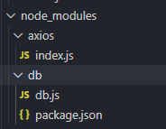

## 一.自定义模块的两种暴露方式

### 1.exports

#### (1)自定义一个方法，然后通过exports暴露

```javascript
function formateApi(api){
    return "http://127.0.0.1:8080/"+api;
}

exports.formateApi = formateApi;
```

```javascript
//在另一个js文件中引入该模块即可
const tools = require('./module/tools');
tools.formateApi();
```

#### (2)直接通过exports暴露函数

```javascript
exports.get = function(){
    console.log("get");
}

exports.post = function(){
    console.log("post");
} 
```

```javascript
//使用
const request = require('./module/request');

request.get();

request.post();
```

### 2.module.exports

**module.exports适合暴露封装好的对象**

```javascript
let obj = {
    get: function(){
        console.log("get");
    },
    post: function(){
        console.log("post");
    }
}
module.exports = obj; 
```

```javascript
//使用
const request = require('./module/request');

request.get();

request.post();
```

## 二.node_modules的使用



**1.如果不指定相对路径，Node.js会默认引入node_modules中指定文件夹下文件名为index.js的文件**

```javascript
// NodeJs会默认引入node_modules文件夹中index.js模块
const axios = require('axios');

axios.post();
axios.get();
```

**2.如果node_modules中指定的文件夹中的文件名不是index.js，则要在该文件夹中生成一个package.json文件后才能正常引入**

```javascript
// 如果db文件夹中的js文件不是index.js，则会报错，解决方法是在该文件夹下生成一个package.json(npm init -y)的配置文件
const db = require('db');
db.add();
```

**【注】一般第三方模块都是放在node_modules文件夹中的**