## 1.行内元素/块级元素 非替换元素/替换元素(⭐⭐⭐)

- 块级元素
  -  默认独自占据一行，左右两边都没有元素；
  -  可以设置宽高,padding,margin等值，在不设置宽度的情况下，默认为父元素的宽度一致。
  - 常见的块级元素：常见块元素：p，div，ol，ul，h1-h6，table，form。
- 行内元素
  - 不会独占一行，相邻的行内元素会排列在同一行里，直到一行排不下去才会换行
  - 其宽度随着元素的内容而变化，行内元素设置width，height无效，(可以设置line-height指定高度，宽度随内容变化)
  - margin 水平方向有效，垂直方向无效。
  - padding 水平方向有效，垂直方向有特殊效果（不是边距效果），具体表现：不影响位置，影响视觉。
  - 常见的行内元素：span , a ,strong ,b ,em , i , big ,small ,label 等等。
- 内联块元素
  - 既有行内元素的一些特性又有块级元素的一些特性,它像内联元素，但具有宽度和高度。
  - 和其他元素都在一行上；
  - 元素的高度、宽度、行高以及顶和底边距都可设置
  - 元素排在一行，会有空白缝隙
  - 可以设置width,height，margin,padding等属性
  - 常用的内联块

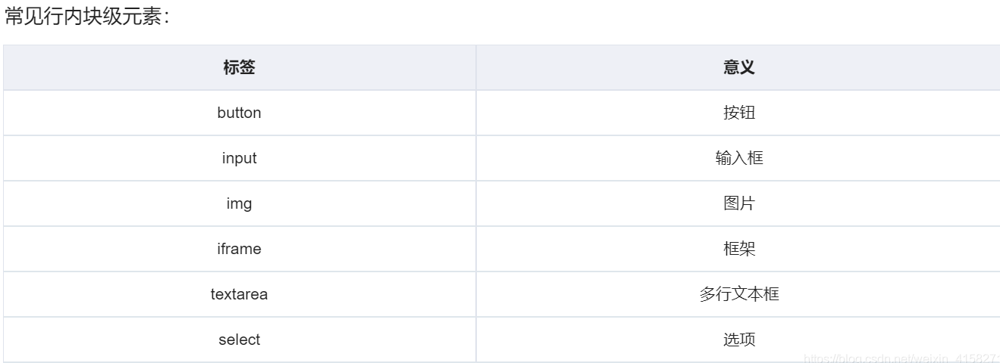

- 替换元素

  -  替换元素是浏览器根据元素的标签和属性，来决定元素的具体显示内容。

    介绍：img标签，只写这一个标签，不添加属性，页面上是显示不出来你要的图片的，但是我们往img标签里面添加src，这时候页面上就能显示出你要的图片，src不同，页面上显示出来的内容也就不同。

    同样为替换元素的还有<input>标签，<textarea>标签等等

  -  **替换元素都是行内块元素**

- 非替换元素

  -  HTML 的大多数元素是不可替换元素，他们将内容直接告诉浏览器，将其显示出来。

- Q&A:

  - 为什么行内元素padding有效；margin水平方向有效，竖直方向无效？

    虽然内联元素可以增加内边距，使其看上去好像将自己所占的地方扩大了，但是它的本质还是内联元素，它不能独占一行，第二行的元素不会在意padding的影响，所以两者会合在一起。所以垂直方向上的padding虽然可以添加，但是并不占据空间


## 2.img的title和alt属性(⭐⭐)

- title属性

  - title是鼠标划上去显示的内容
  - title是全局属性

- alt属性

  - alt是在图片不能正常加载的时候会显示提示语
  - 在IE6以下的浏览器，如果一个图片没有title属性，有alt属性，鼠标放在图片上也会有title属性那样的效果(都有提示信息)

- 全局属性(扩展了解)

  - 全局属性可用于任何一个html元素

  - 常见的全局属性

    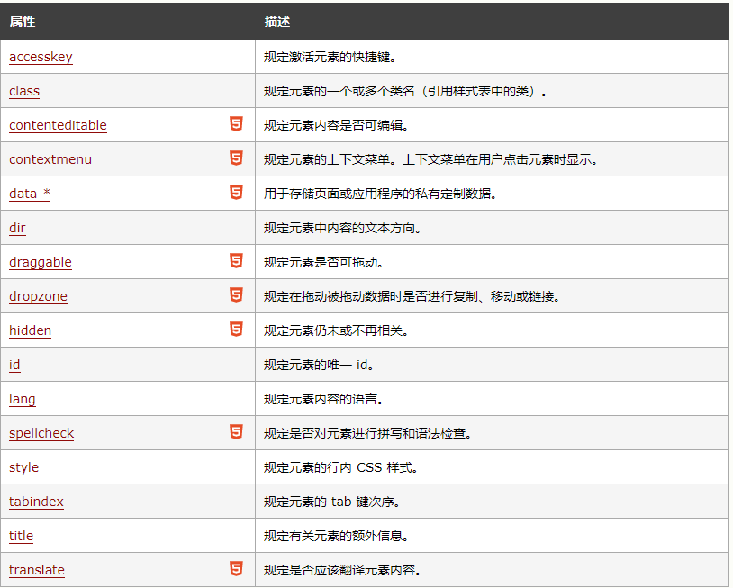

## 3.meta标签(⭐⭐)

- meta标签的作用

  - meta标签是一种功能性标签，用来添加一些辅助信息
  - 标签提供关于 HTML 文档的元数据。元数据不会显示在页面上，但是对于机器是可读的
  - 当有`http-equiv`和`name`属性时，一定要有`content`属性对其进行说明

- 常见的meta标签

  - charset

    声明文档使用的字符编码，解决乱码问题主要用的就是它，值得一提的是，这个**charset一定要写第一行**，不然就可能会产生乱码了。

  - name

    这个属性是供浏览器进行解析，对于一些浏览器兼容性问题，name属性是最常用的

  - http-equiv

    添加http头部内容，对一些自定义的，或者需要额外添加的http头部内容，需要发送到浏览器中，我们就可以是使用这个属性。

## 4.DOCTYPE标签(⭐⭐⭐)

- "<!DOCTYPE>"声明位于文档中的最前面的位置，是一个单标签，此标签可告知浏览器文档使用哪种 HTML 或 XHTML 规范。
- DOCTYPE不存在或格式不正确会导致文档以兼容模式呈现。
- 标准模式 兼容模式
  - **标准模式**的排版 和 JS运作模式都是以该浏览器支持的最高标准运行。在**兼容模式**中，页面以宽松的向后兼容的方式显示,模拟老式浏览器的行为以防止站点无法工作。
  - 具体区别
    - 盒模型
        在标准模式中 ：width是内容宽度 ，元素真正的宽度 = width;
        在兼容模式中 ：width则是=width+padding+border
    - 在标准模式下，给span等行内元素设置wdith和height都不会生效，而在兼容模式下，则会生效。
    - 在标准模式下，一个元素的高度是由其包含的内容来决定的，如果父元素没有设置高度，子元素设置一个百分比的高度是无效的。
    - 使用margin:0 auto在standards模式下可以使元素水平居中，但在兼容模式下却会失效（用text-align属性解决）
    - 兼容模式下table中的字体属性不能继承上层的设置，white-space:pre会失效，设置图片的padding会失效

## 5.script标签的defer和async(⭐)

- defer(推迟)
  - 这个属性的用途是表明脚本在执行时不会影响页面的构造。也就是说，脚本会被延迟到整个页面都解析完毕后再运行。因此，在元素中设置属性，相当于告诉浏览器立即下载，但延迟执行。
  - HTML5规范要求脚本按照它们出现的先后顺序执行，因此第一个延迟脚本会先于第二个延迟脚本执行，而这两个脚本会先于DOMContentLoaded事件执行。在现实当中，延迟脚本并不一定会按照顺序执行，也不一定会在DOMContentLoad时间触发前执行，因此最好只包含一个延迟脚本。
- async(异步属性)
  - 这个属性与defer类似，都用于改变处理脚本的行为。同样与defer类似，async只适用于外部脚本文件，并告诉浏览器立即下载文件。但与defer不同的是，标记为async的脚本并不保证按照它们的先后顺序执行。
  - 第二个脚本文件可能会在第一个脚本文件之前执行。因此确保两者之间互不依赖非常重要。指定async属性的目的是不让页面等待两个脚本下载和执行，从而异步加载页面其他内容。
  - 概括来讲，就是这两个属性都会使script标签异步加载，然而执行的时机是不一样的。async是乱序的，而defer是顺序执行。

## 6.W3C盒模型和怪异盒模型(⭐⭐⭐)

- 标准盒模型

  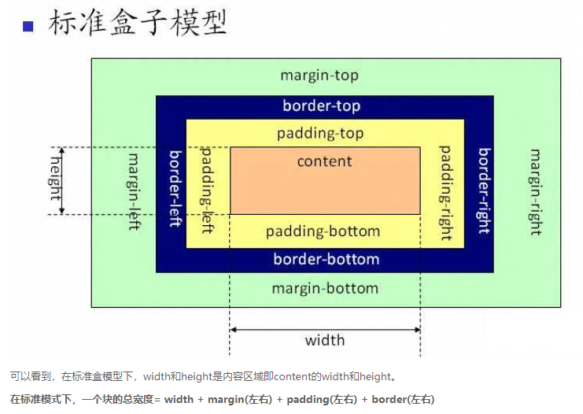

- 怪异和模型

  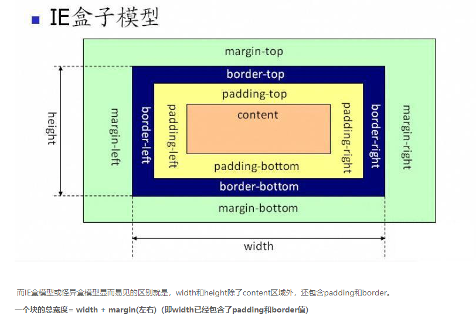

- box-sizing语法：
  box-sizing: content-box || border-box || inherit || initial

  当设置为box-sizing:content-box时，将采用标准模式解析计算，也是默认模式；
  当设置为box-sizing:border-box时，将采用怪异模式解析计算；

## 7.居中的方法(⭐⭐⭐)

### 1.只水平居中的方法

- **margin: 0 auto;text-align: center**

  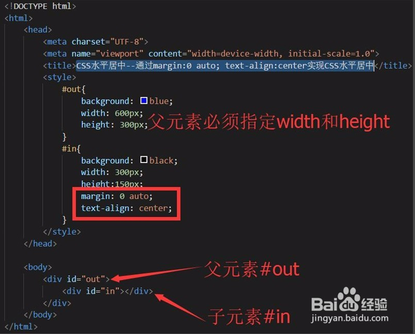

- **display:flex:** 父元素display:flex;flex-direction:column;而子元素align-self:center;

  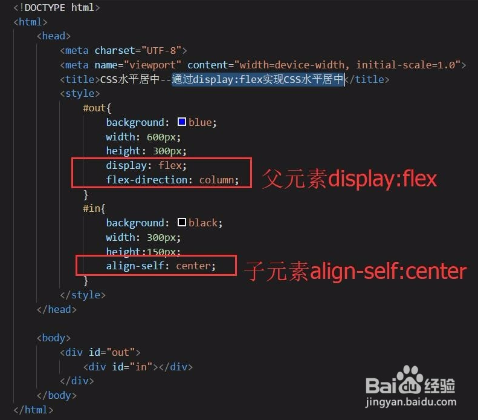

- **通过display:table-cell和margin-left实现CSS水平居中**

  对于父元素和子元素的宽度都确定的情况，适合通过display:table-cell和margin-left实现CSS水平居中。

  使用时，父元素display:table-cell，子元素给剩余宽度一半的margin-left。

  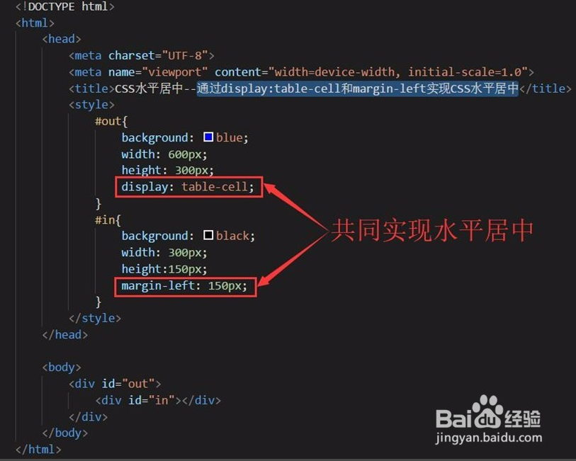

- **通过position:absolute实现CSS水平居中**

  这种方法跟上一个方法适用场景一样，也是适用于父元素和子元素的宽度都确定的情况。

  使用时，父元素position:absolute，子元素给剩余宽度一半的margin-left。

  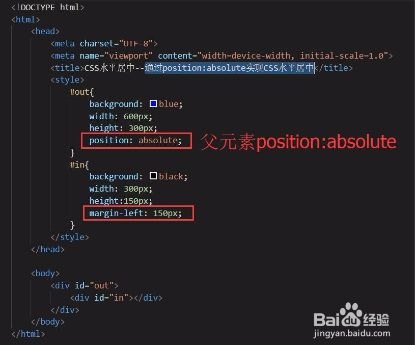

- **通过width:fit-content实现CSS水平居中(添加给子元素)**

  这种方法可以确保子元素宽度不确定的情况下，也能实现CSS水平居中。

  需要注意的是，需要配合“margin: 0 auto; text-align: center”使用

  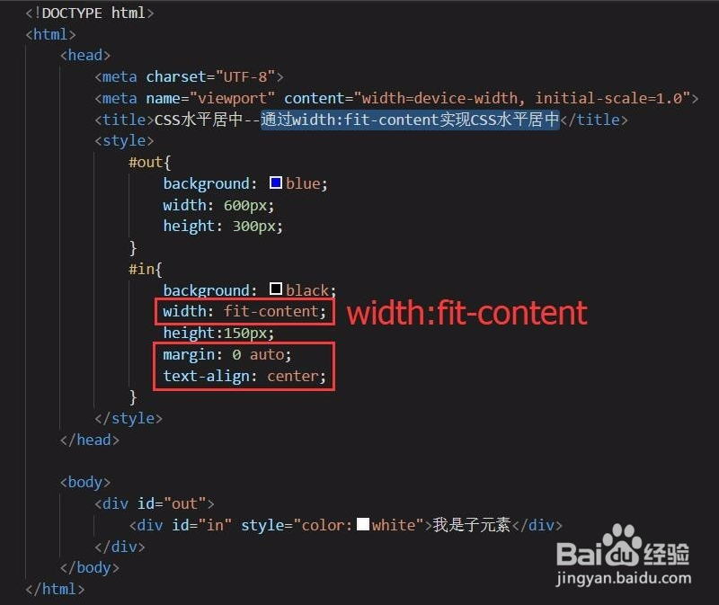

- **通过display:inline-block和text-align:center实现CSS水平居中**

  (父)display:inline-block能改父元素内的子元素的表达样式，(子)同样需要配合“margin: 0 auto; text-align: center”使用。

  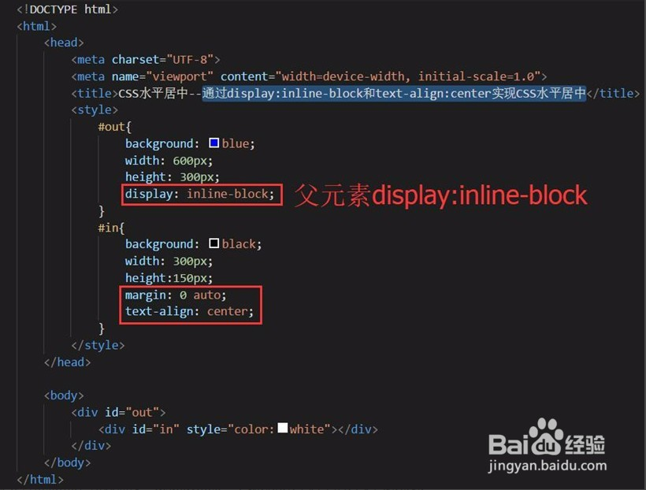

- **通过position:relative、float:left和margin-left实现CSS水平居中**

  给父元素样式position:relative，给子元素float:left和margin-left就可以实现CSS水平居中。

  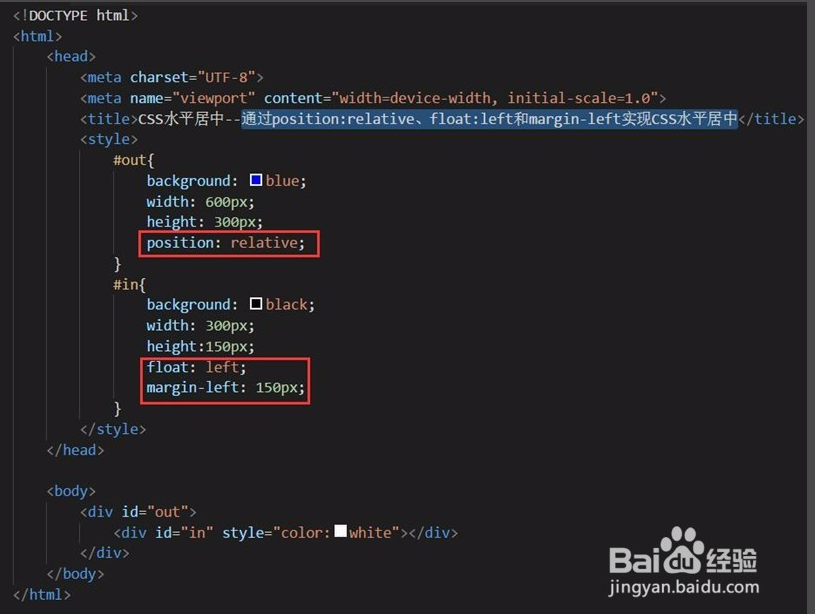

- **通过隐藏节点+float的方法实现CSS水平居中**

  我们可以通过增加一个隐藏节点，然后使其float:left，这样子元素就会被隐藏节点推着水平居中。

  这种增加隐藏节点方法也适用于CSS垂直居中，原理一样，但是不用float。

  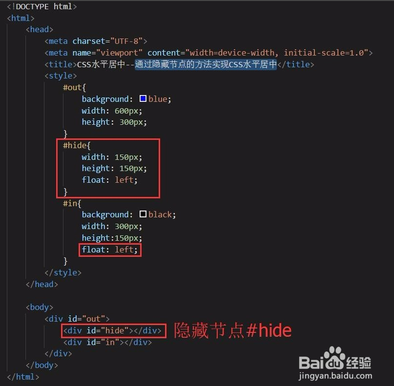

- **通过transform实现CSS水平居中**

  这种方法是最不推荐的方法，因为transform属性在各个浏览器中的表现行为不一致，所以会出现一些兼容性的问题，只有当已知用户浏览器时才推荐使用。

  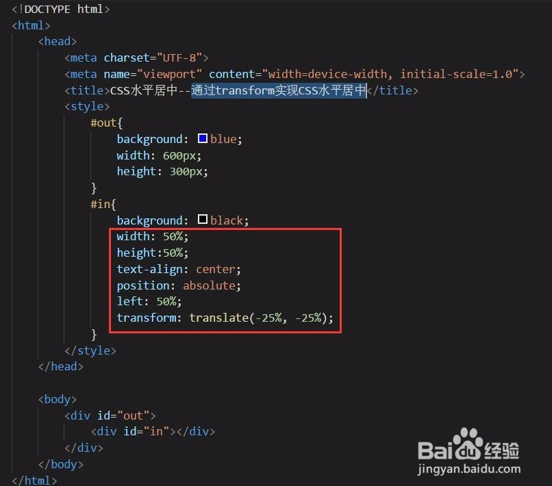

### 2.只垂直居中的方法

- **通过verticle-align:middle实现CSS垂直居中**

  通过vertical-align:middle实现CSS垂直居中是最常使用的方法，但是有一点需要格外注意，vertical生效的前提是元素的display：inline-block。

  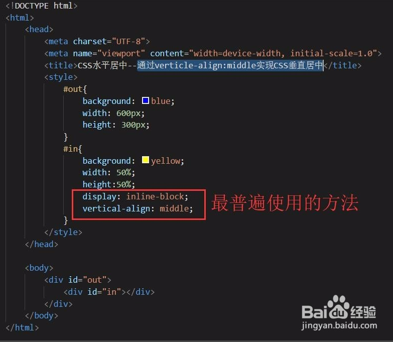

- **通过display:flex实现CSS垂直居中**

  给父元素display:flex;而子元素align-self:center

  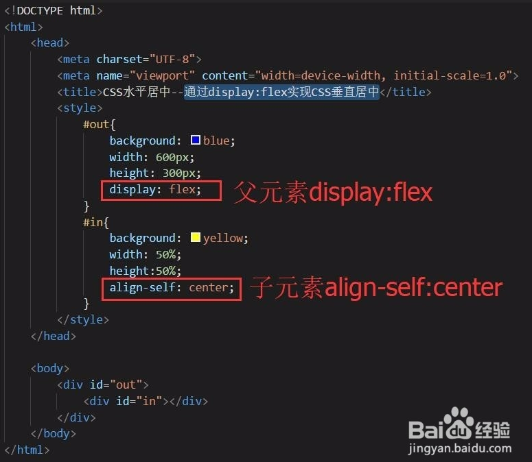

- **通过伪元素:before实现CSS垂直居中**

  具体方式是为父元素添加伪元素:before，使得子元素实现垂直居中。

  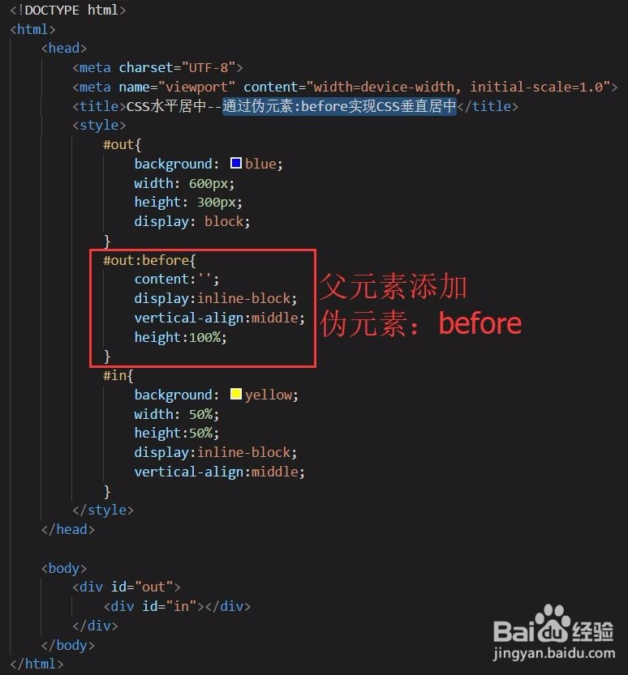

- **通过display:table-cell实现CSS垂直居中**

  给父元素display:table，子元素display：table-cell的方式实现CSS垂直居中。

  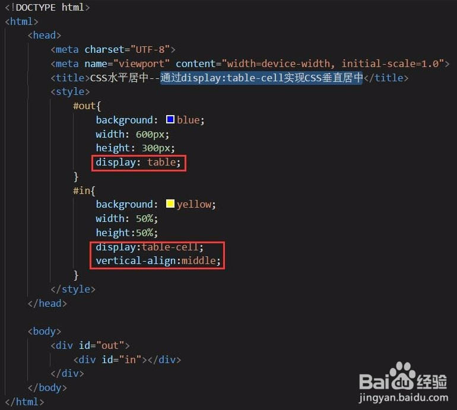

- **通过隐藏节点实现CSS垂直居中**

  创建一个隐藏节点#hide，使得隐藏节点的height值为剩余高度的一半即可。

  这种方法也适用于CSS水平居中，原理一样。

  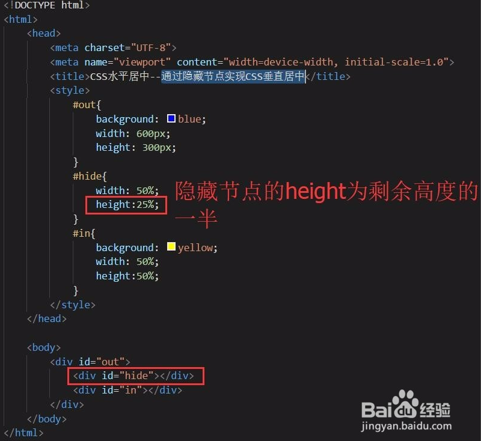

- **已知父元素高度通过transform实现CSS垂直居中**

  给子元素的position:relative，再通过translateY即可定位到垂直居中的位置。

  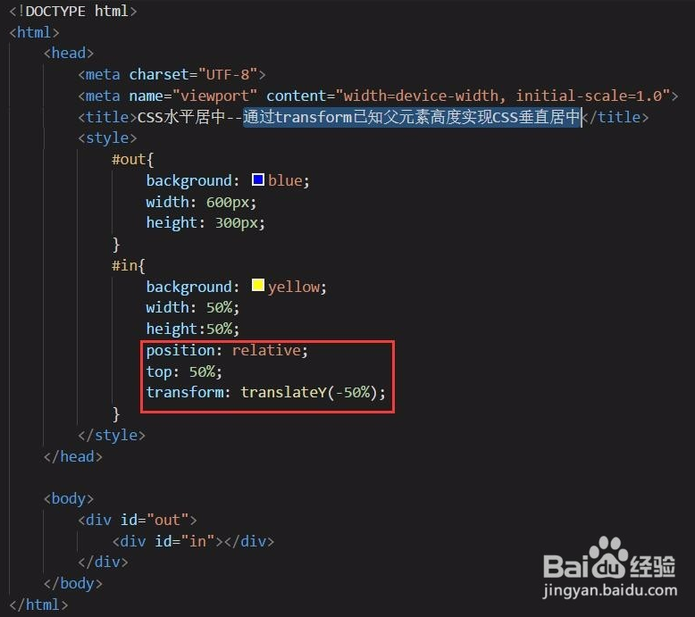

- **未知父元素高度通过transform实现CSS垂直居中**

  先给父元素position:relative，再给子元素position:absolute，通过translateY即可定位到垂直居中的位置。

  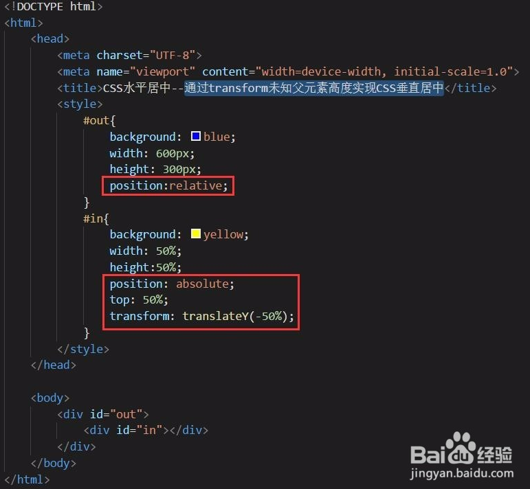

- **通过line-height实现CSS垂直居中**

  设置子元素的line-height值等于父元素的height，这种方法适用于子元素为单行文本的情况。

  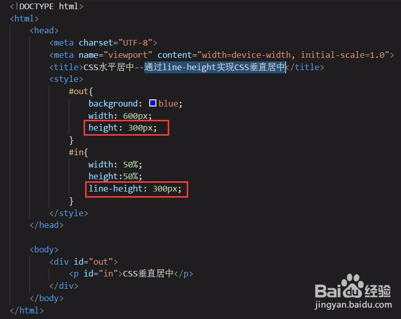

## 8.BFC(⭐⭐⭐)

- BFC是什么

  BFC即Block Formatting Contexts(块级格式化上下文)。具有BFC特性的元素可以看作是隔离了的独立容器，容器里面的元素不会在布局上影响到外面的元素，并且BFC具有普通元素所没有的一些特性。

- 触发条件

  - 浮动元素：float除none以外的值
  - 绝对定位元素：position（absolute、fixed）
  - display 为 inline-block、table-cells、flex
  - overflow除了visible以外的值（hidden、auto、scroll）

- 特性及作用

  - 解决margin叠加问题
  - 解决margin传递问题
  - 解决浮动问题
  - 解决覆盖问题

## 9.清除浮动的方法(⭐⭐⭐)

- **额外标签法**：给谁清除浮动，就在其后额外添加一个空白标签 。

  - 优点：通俗易懂，书写方便。（不推荐使用）
    缺点：添加许多无意义的标签，结构化比较差。

- **父级添加overflow方法**：可以通过触发BFC的方式，实现清楚浮动效果。

  - 优点：代码简洁（慎重使用，若该父盒子里还有position定位会引起麻烦）
  - 缺点：内容增多时候容易造成不会自动换行导致内容被隐藏掉，无法显示需要溢出的元素。

  ​       **注意：别加错位置，是给父亲加（并不是所有的浮动都需要清除，谁影响布局，才清除谁。）**

- **使用after伪元素清除浮动**：：after方式为空元素的升级版，好处是不用单独加标签了。（较常用）

  - 优点：符合闭合浮动思想，结构语义化正确

  - 缺点：由于IE6-7不支持：after，使用zoom：1，触发hasLayout

    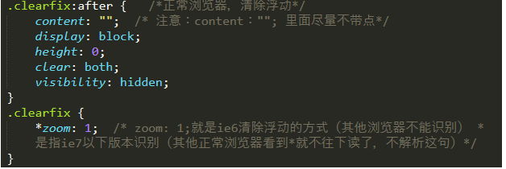

- **使用before和after双伪元素清除浮动**：（较常用）

  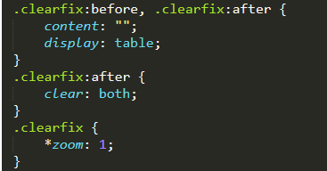

  **注意：是给父亲添加clearfix**

## 10.position属性(⭐⭐⭐)

- position: static

　　static(没有定位)是position的默认值，元素处于正常的文档流中，会忽略left、top、right、bottom和z-index属性。

- position: relative

　　relative(相对定位)是指给元素设置相对于原本位置的定位，元素并不脱离文档流，因此元素原本的位置会被保留，其他的元素位置不会受到影响。

- position: absolute

　　absolute(绝对定位)是指给元素设置绝对的定位，相对定位的对象可以分为两种情况：

　　1) 设置了absolute的元素如果存在有祖先元素设置了position属性为relative或者absolute，则这时元素的定位对象为此已设置position属性的祖先元素。

　　2) 如果并没有设置了position属性的祖先元素，则此时相对于body进行定位。

- position: fixed

　　可以简单说fixed是特殊版的absolute，fixed元素总是相对于body定位的。

- inherit

　　继承父元素的position属性，但需要注意的是**IE8以及往前的版本都不支持inherit属性**。

- sticky

  　　position属性中最有意思的就是sticky了，设置了sticky的元素，在屏幕范围（viewport）时该元素的位置并不受到定位影响（设置是top、left等属性无效），当该元素的位置将要移出偏移范围时，定位又会变成fixed，根据设置的left、top等属性成固定位置的效果。

  **可以知道sticky属性有以下几个特点：**

  - 该元素并不脱离文档流，仍然保留元素原本在文档流中的位置。
  - 当元素在容器中被滚动超过指定的偏移值时，元素在容器内固定在指定位置。亦即如果你设置了top: 50px，那么在sticky元素到达距离相对定位的元素顶部50px的位置时固定，不再向上移动。
  - 元素固定的相对偏移是相对于离它最近的具有滚动框的祖先元素，如果祖先元素都不可以滚动，那么是相对于viewport来计算元素的偏移量

  　　比较蛋疼的是这个属性的兼容性还不是很好，目前仍是一个试验性的属性，并不是W3C推荐的标准。它之所以会出现，也是因为监听`scroll`事件来实现粘性布局使浏览器进入慢滚动的模式，这与浏览器想要通过硬件加速来提升滚动的体验是相悖的。

  简单的说，要让sticky属性生效的条件有以下两点：

  - 一个是元素自身在文档流中的位置
  - 另一个是该元素的父容器的边缘

  　　第一点上面已经讲过了，如果设置了top: 50px，那么元素在达到距离顶部50px时才会发生定位，否则并不会发生定位。

  　　第二点则需要考虑父容器的高度情况：sticky元素在到达父容器的底部时，则不会再发生定位，如果父容器高度并没有比sticky元素高，那么sticky元素一开始就达到了底部，并不会有定位的效果。

  　　此外还有一点就是父元素的overflow属性，如果父元素的overflow属性并不是默认的visible属性，那么sticky元素则相对于该父元素定位。也就是如果要定位在顶部的话，此时这个效果就无效了。。。

## 11.CSS隐藏元素的方式(⭐⭐⭐)

- display:none

- visibility:hidden

- opacity:0

- position:absolute

  ```css
  hide {
     position: absolute;
     top: -9999px;
     left: -9999px;
  }
  ```

- clip-path

  ```css
  hide {
    clip-path: polygon(0px 0px,0px 0px,0px 0px,0px 0px);
  }
  ```

**举例：display:none和visibility:hidden的区别**

- 将元素设置为display:none后，元素在页面上将彻底消失，元素本来占有的空间就会被其他元素占有，也就是说它会导致浏览器的重排和重绘。

- 设置元素的visibility为hidden也是一种常用的隐藏元素的方法，和display:none的区别在于，元素在页面消失后，其占据的空间依旧会保留着，所以它只会导致浏览器重绘而不会重排。

  visibility:hidden适用于那些元素隐藏后不希望页面布局会发生变化的场景

## 12.Flex布局(⭐⭐⭐)

- Flex容器和项目的常见属性

   flex布局元素称为Flex容器(flex container),简称容器。他的所有子元素自动称为容器成员,称为Flex项目(flex item),简称项目。

- 常用属性：

   ```
   flex-direction（规定主轴方向。默认row）
   flex-wrap（项目在容器轴线排不下是否换行。 默认nowrap）
   flex-flow（是前两个属性的缩写。 默认值未row nowrap）
   
   justify-content（项目在容器主轴上对齐方式。默认flex-start）
   align-items（项目在侧轴上如何对齐。默认flex-start）
   align-content（多根轴线的对齐方式。默认flex-start）
   ```

   - flex-direction属性

     flex-direction属性决定主轴的方向（即项目的排列方向）

     ```
     row(默认值): 主轴水平方向,起点为左端。
     row-reverse: 主轴水平方向,起点为右端。
     column: 主轴垂直方向,起点为上方。
     column-reverse: 主轴垂直方向,起点为下方。
     ```

   - flex-wrap属性

     默认情况下，项目都排在一条线（又称"轴线"）上。flex-wrap属性定义，如果一条轴线排不下，如何换行。

     ```
     nowrap(默认值): 不换行。
     wrap: 换行,第一行在上方。
     wrap-reverse: 换行,第一行在下方。
     ```

   - flex-flow属性

     flex-flow属性是**flex-direction**属性和**flex-wrap**属性的简写形式，默认值为**row nowrap**

     ```css
     flex-flow: <flex-direction> || <flex-wrap>;
     ```

   - justify-content属性

     justify-content属性定义了项目在主轴上的对齐方式。

     ```
     flex-start(默认值): 左对齐。
     flex-end: 右对齐。
     center: 居中。
     space-between: 两端对齐, 项目之间间隔相等。
     space-around: 每个项目两侧的间隔相等。所以,项目之间的间隔比项目与边框的间隔大一倍。
     ```

   - align-items属性

     align-items属性定义项目在侧轴上如何对齐。

     ```
     flex-start(默认值): 与侧轴的起点对齐。
     flex-end: 与侧轴的终点对齐。
     center: 与侧轴的中点对齐。
     baseline: 项目的第一行文字的基线对齐。
     stretch（默认值）：如果项目未设置高度或设为auto，将占满整个容器的高度。
     ```

   -  align-content 属性

     align-content属性定义了多根轴线的对齐方式。**如果项目只有一根轴线，该属性不起作用。**

     ```
     flex-start(默认值): 与交叉轴的起点对齐。
     flex-end: 与交叉轴的终点对齐。
     center: 与交叉轴的中点对齐。
     space-between: 与交叉轴两端对齐，轴线之间的间隔平均分布。
     space-around: 每根轴线两侧的间隔都相等。所以，轴线之间的间隔比轴线与边框的间隔大一倍。
     stretch（默认值）：轴线占满整个交叉轴。
     ```

   **举例：常用作考察布局**

## 13.双栏布局 三栏布局(⭐⭐⭐)

### 1.双栏布局

**左侧固定右侧自适应**

**实现原理：左侧固定宽高并浮动，右侧固定高度，宽度自适应，父节点清除浮动即可**

```html
<!DOCTYPE html>
<html lang="en">

<head>
    <meta charset="UTF-8">
    <meta name="viewport" content="width=device-width, initial-scale=1.0">
    <meta http-equiv="X-UA-Compatible" content="ie=edge">
    <title>左侧固定右侧自适应</title>
</head>
<style>
    /*方法1*/
    /* 1、将左侧div浮动，右侧div设置margin-left */
    .outer {
        overflow: hidden;
        border: 1px solid red;
    }

    .sidebar {
        float: left;
        width: 200px;
        height: 150px;
        background: #BCE8F1;
    }

    .content {
        margin-left: 200px;
        height: 100px;
        background: #F0AD4E;
    }

    /*方法2*/
    /* 2、固定区采用绝对定位，自适应区设置margin */
    .outer2 {
        position: relative;
        height: 150px;
        border: 1px solid red;
    }

    .sidebar2 {
        position: absolute;
        left: 0;
        top: 0;
        width: 200px;
        height: 100%;
        background: #BCE8F1;
    }

    .content2 {
        margin-left: 200px;
        height: 100px;
        background: #F0AD4E;
    }

    /*方法3*/
    /* table布局 */
    .outer3 {
        display: table;
        width: 100%;
        border: 1px solid red;
    }

    .sidebar3 {
        display: table-cell;
        width: 200px;
        height: 150px;
        background: #BCE8F1;
    }

    .content3 {
        display: table-cell;
        height: 100px;
        background: #F0AD4E;
    }

    /*方法4*/
    /* 双float + calc()计算属性 */
    .outer4 {
        overflow: hidden;
        border: 1px solid red;
    }

    .sidebar4 {
        float: left;
        width: 200px;
        height: 150px;
        background: #BCE8F1;
    }

    .content4 {
        float: left;
        width: calc(100% - 200px);
        height: 100px;
        background: #F0AD4E;
    }

    /*方法5*/
    /* float + BFC方法 */
    .outer6 {
        overflow: auto;
        border: 1px solid red;
    }

    .sidebar6 {
        float: left;
        width: 200px;
        height: 150px;
        background: #BCE8F1;
    }

    .content6 {
        overflow: auto;
        height: 100px;
        background: #F0AD4E;
    }

    /*方法6*/
    /* flex */
    .outer7 {
        display: flex;
        border: 1px solid red;
    }

    .sidebar7 {
        flex: 0 0 200px;
        /* width: 200px; */
        height: 150px;
        background: #BCE8F1;
    }

    .content7 {
        flex: 1;
        height: 100px;
        background: #F0AD4E;
    }
</style>

<body>
    <div class="outer6">
        <div class="sidebar6">固定宽度区(sideBar)</div>
        <div class="content6">自适应区(content)</div>
    </div>
    <div class="footer">footer</div>
</body>

</html>
```

### 2.三栏布局

**左右固定宽度中间自适应**

```html
<!DOCTYPE html>
<html lang="en">
<head>
    <meta charset="UTF-8">
    <meta name="viewport" content="width=device-width, initial-scale=1.0">
    <meta http-equiv="X-UA-Compatible" content="ie=edge">
    <title>三栏布局左右固定宽度中间自适应</title>
    <style>
        *{
            margin: 0;
            padding: 0;
        }
        .layout article div{
            min-height: 100px;
        }
    </style>
</head>
<body>
    <section class="layout layout1">
        <style>
            .layout1 .left{
                float: left;
                width: 300px;
                background-color:red;
            }
            .layout1 .right{
                float: right;
                width: 300px;
                background-color:blue;
            }
            .layout1 .center{
                margin-right: 300px;
                margin-left: 300px;
                background-color: yellow;
            }
        </style>
        <article class="left-right-center">
            <div class="left"></div>
            <div class="right"></div>
            <div class="center">
                <h1>浮动解决方案</h1>
                1、这是三栏布局中间部分
                1、这是三栏布局中间部分
                <br>缺点：需要清除浮动
                <br>优点：兼容性好
            </div>
        </article>
    </section>
    <section class="layout layout2">
        <style>
            .layout2 .left-center-right>div{
                margin-top: 20px;
                position: absolute;
            }
            .layout2 .left{
                left: 0;
                width: 300px;
                background-color: red;
            }
            .layout2 .center{
                left: 300px;
                right: 300px;
                background-color: yellow;
            }
            .layout2 .right{
                right: 0;
                width: 300px;
                background-color: blue;
            }
        </style>
        <article class="left-center-right">
            <div class="left"></div>
            <div class="center">
                <h2>绝对定位解决方案</h2>
                1、这是三栏布局中间部分
                1、这是三栏布局中间部分
                <br>缺点：脱离文档流
                <br>优点：快捷
            </div>
            <div class="right"></div>
        </article>
    </section>

    <section class="layout layout3">
            <style>
                .layout3 .left-center-right{
                    display: flex;
                    margin-top: 200px;
                }
                .layout3 .left{
                    width: 300px;
                    background-color: red;
                }
                .layout3 .center{
                    flex:1;
                    background-color: yellow;
                }
                .layout3 .right{
                    width: 300px;
                    background-color: blue;
                }
            </style>
            <article class="left-center-right">
                <div class="left"></div>
                <div class="center">
                    <h2>flexbox解决方案</h2>
                    1、这是三栏布局中间部分
                    1、这是三栏布局中间部分
                    <br>完美
                </div>
                <div class="right"></div>
            </article>
        </section>

        <section class="layout layout4">
                <style>
                    .layout4 .left-center-right{
                        width: 100%;
                        display: table;
                        height: 100px;
                        margin-top: 50px;
                    }
                    .layout4 .left-center-right>div{
                        display: table-cell;
                    }
                    .layout4 .left{
                        width: 300px;
                        background-color: red;
                    }
                    .layout4 .center{
                        background-color: yellow;
                    }
                    .layout4 .right{
                        width: 300px;
                        background-color: blue;
                    }
                </style>
                <article class="left-center-right">
                    <div class="left"></div>
                    <div class="center">
                        <h2>表格布局解决方案</h2>
                        1、这是三栏布局中间部分
                        1、这是三栏布局中间部分
                        <br>兼容性好
                        <br>缺点：高度跟着变
                    </div>
                    <div class="right"></div>
                </article>
            </section>
            去掉高度已知哪个不适用：
            flex和table能用，会自动撑开
</body>
</html>
```


## 14.重排和重绘(⭐⭐⭐)

### 1.重排（Relayout/Reflow）

```
在弄明白什么是重排之前，我们要知道：浏览器渲染页面默认采用的是流式布局模型（Flow Based Layout），这一点很重要。
```

```
所谓重排，实际上是根据渲染树中每个渲染对象的信息，计算出各自渲染对象的几何信息（DOM对象的位置和尺寸大小），并将其安置在界面中的正确位置。
```

```
由于浏览器渲染界面是基于流式布局模型的，也就是某一个DOM节点信息更改了，就需要对DOM结构进行重新计算，重新布局界面，再次引发回流，只是这个结构更改程度会决定周边DOM更改范围，即全局范围和局部范围，全局范围就是从根节点html开始对整个渲染树进行重新布局，例如当我们改变了窗口尺寸或方向或者是修改了根元素的尺寸或者字体大小等；而局部布局可以是对渲染树的某部分或某一个渲染对象进行重新布局。 
```

在此，总结会引起重排的操作有： 

1.页面首次渲染。

2.浏览器窗口大小发生改变。

3.元素尺寸或位置发生改变。

4.元素内容变化(文字数量或图片大小等等）

5.元素字体大小变化。

6.添加或者删除可见的DOM元素。

7.激活CSS伪类（例如: :hover)

8.设置style属性。

9.查询某些属性或调用某些方法。

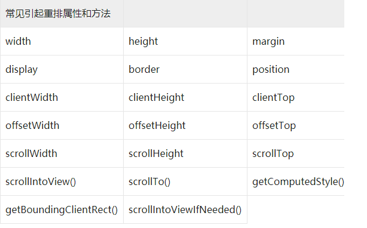

### 2.重绘

```
相比重排，重绘就简单多了，所谓重绘，就是当页面中元素样式的改变并不影响它在文档流中的位置时，例如更改了字体颜色,浏览器会将新样式赋予给元素并重新绘制的过程称。
```

**常见引起浏览器绘制过程的属性包含：**

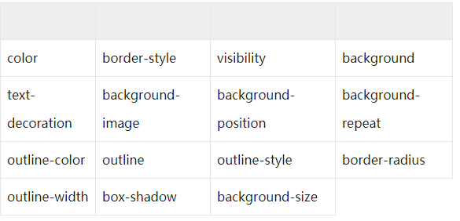

## 15.CSS选择器(⭐⭐)

- 都有哪些

  - 基本选择器

    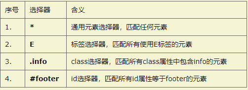

  - 多元素的组合选择器

    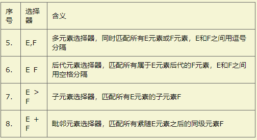

  - 属性选择器

    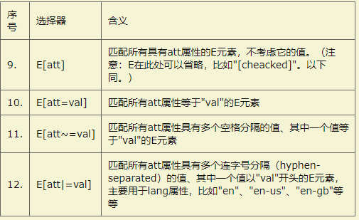

  - 同级元素通用选择器

    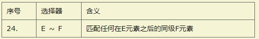

  - CSS 3 属性选择器

    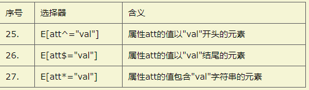

  - CSS 3中与用户界面有关的伪类

    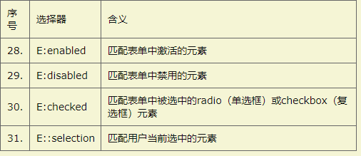

- 各个选择器的优先级

  选择器的优先级
  　　1.最高优先级是 (直接在标签中的设置样式，假设级别为1000)`<div style="color:red;"></div>`
  　　2.次优先级是（ID选择器 ,假设级别为100） #myDiv{color:Red;}
  　　3.其次优先级是（类选择器，假设级别为10） .divClass{color:Red;}
  　　4.最后优先级是 （标签选择器，假设级别是 1） div{color:Red;}
  　　5.那么后代选择器的优先级就可以计算了啊
  　　比如 .divClass span { color:Red;} 优先级别就是：10+1=11

- !important属性

  - !important可以提升CSS样式的优先级别
  - IE7以下不支持!important

## 16.CSS动画(⭐⭐)

### 1.animation属性

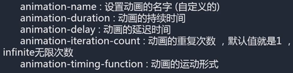

- @keyframes:关键帧，与animation-name形成映射，从而达到控制动画的效果

### 2.transition属性

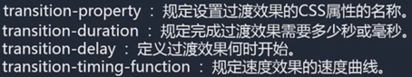

-  transition-property:可以指定某一个属性进行过渡(比如width)，也可以指定所有属性都具备过渡功能(transition-property:all)，默认为all；

- transition-duration:可以设置ms，s

- transition-delay:规定效果开始的时间(既可以延迟，也可以提前)

-  transition-timing-function:即过渡样式：
  - ease(默认值)：效果逐渐变慢
  - linear:匀速
  - ease-in:加速
  - ease-out:减速
  - ease-in-out:先加速后减速
  - cubic-bezier:bezier曲线

### 3.transform属性

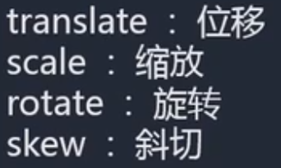

- translate:控制元素的位移

- scale：控制元素的缩放(正常大小为1)，会以当前元素中心点进行缩放

- rotate:旋转:一般元素在2d中是按照z轴进行旋转，旋转的值为角度(deg),或者弧度

- 3D相关

  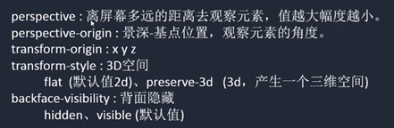

- translate,scale,rotate的3d写法

  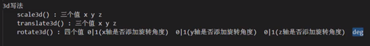

## 17.CSS实现三角形(⭐⭐)

### 1.原理

```
三角形实现原理：宽度width为0；height为0；（1）有一条横竖边（上下左右）的设置为border-方向：长度 solid red，这个画的就是底部的直线。其他边使用border-方向：长度 solid transparent。（2）有两个横竖边（上下左右）的设置，若斜边是在三角形的右边，这时候设置top或bottom的直线，和右边的斜线。若斜边是在三角形的左边，这时候设置top或bottom的直线，和左边的斜线。
```

### 2.实现

```css
2.1 Triangle Up
#triangle-up {
    width: 0;
    height: 0;
    border-left: 50px solid transparent;
    border-right: 50px solid transparent;
    border-bottom: 100px solid red;
}
 

2.2 Triangle Down
#triangle-down {
    width: 0;
    height: 0;
    border-left: 50px solid transparent;
    border-right: 50px solid transparent;
    border-top: 100px solid red;
}
 

2.3 Triangle Left
#triangle-left {
    width: 0;
    height: 0;
    border-top: 50px solid transparent;
    border-right: 100px solid red;
    border-bottom: 50px solid transparent;
}
 

2.4 Triangle Right
#triangle-right {
    width: 0;
    height: 0;
    border-top: 50px solid transparent;
    border-left: 100px solid red;
    border-bottom: 50px solid transparent;
}
 

2.5 Triangle Top Left
#triangle-topleft {
    width: 0;
    height: 0;
    border-top: 100px solid red;
    border-right: 100px solid transparent;
}
 

2.6 Triangle Top Right
#triangle-topright {
    width: 0;
    height: 0;
    border-top: 100px solid red;
    border-left: 100px solid transparent;
 
}
 

2.7 Triangle Bottom Left
#triangle-bottomleft {
    width: 0;
    height: 0;
    border-bottom: 100px solid red;
    border-right: 100px solid transparent;
}
 

2.8 Triangle Bottom Right
#triangle-bottomright {
    width: 0;
    height: 0;
    border-bottom: 100px solid red;
    border-left: 100px solid transparent;
}
```


## 18.CSS Sprites(⭐⭐)

### 1.原理

```
　　CSS Sprites其实就是把网页中一些背景图片整合到一张图片文件中，再利用CSS的“background-image”，“background- repeat”，“background-position”的组合进行背景定位，background-position可以用数字能精确的定位出背景图片的位置。
```

### 2.优点

```
   利用CSS Sprites能很好地减少了网页的http请求，从而大大的提高了页面的性能，这也是CSS Sprites最大的优点，也是其被广泛传播和应用的主要原因；CSS Sprites能减少图片的字节，曾经比较过多次3张图片合并成1张图片的字节总是小于这3张图片的字节总和。
```

### 3.缺点

- 在图片合并的时候，你要把多张图片有序的合理的合并成一张图片，还要留好足够的空间，防止板块内不会出现不必要的背景；这些还好，最痛苦的是在宽屏，高分辨率的屏幕下的自适应页面，你的图片如果不够宽，很容易出现背景断裂；
- CSS Sprites在开发的时候比较麻烦，你要通过photoshop或其他工具测量计算每一个背景单元的精确位置，这是针线活，没什么难度，但是很繁琐；幸好腾讯的鬼哥用RIA开发了一个CSS Sprites 样式生成工具，虽然还有一些使用上的不灵活，但是已经比photoshop测量来的方便多了，而且样式直接生成，复制，拷贝就OK！
- CSS Sprites在维护的时候比较麻烦，如果页面背景有少许改动，一般就要改这张合并的图片，无需改的地方最好不要动，这样避免改动更多的css，如果在原来的地方放不下，又只能（最好）往下加图片，这样图片的字节就增加了，还要改动css。
- CSS Sprites非常值得学习和应用，特别是页面有一堆ico（图标）。总之很多时候大家要权衡一下利弊，再决定是不是应用CSS Sprites。

## 19.px rem em (⭐)

- px 实际上就是像素，用PX设置字体大小时，比较稳定和精确

  - 特点
    - IE无法调整那些使用px作为单位的字体大小；
    - 国外的大部分网站能够调整的原因在于其使用了em或rem作为字体单位；
    - Firefox能够调整px和em，rem，但是有大部分的国产浏览器使用IE内核。

- em 就是根据基准来缩放字体的大小

  ```
  em 是相对长度单位。相对于当前对象内文本的字体尺寸。如当前对行内文本的字体尺寸未被人为设置，则相对于浏览器的默认字体尺寸。(引自CSS2.0手册)
  
  任意浏览器的默认字体高都是16px。所有未经调整的浏览器都符合: 1em=16px。那么12px=0.75em,10px=0.625em。为了简化font-size的换算，需要在css中的body选择器中声明Font-size=62.5%，这就使em值变为 16px*62.5%=10px, 这样12px=1.2em, 10px=1em, 也就是说只需要将你的原来的px数值除以10，然后换上em作为单位就行了。
  ```

  - 特点
    - em的值并不是固定的
    - em会继承父级元素的字体大小

- rem 相对于根元素 `<html>` ，这样就意味着，我们只需要在根元素确定一个参考值

  - 特点
    - rem 相对单位，相对于根元素 `<html>` 
    - 相对大小和绝对大小的优点于一身
    - 修改根元素就成比例地调整所有字体大小
    - 避免字体大小逐层复合的连锁反应

## 20.伪类/伪元素(⭐)

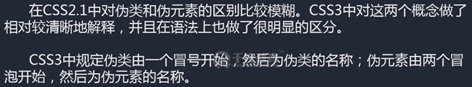

- 伪类

  ```
  伪类用于当已有元素处于的某个状态时，为其添加对应的样式，这个状态是根据用户行为而动态变化的。比如说，当用户悬停在指定的元素时，我们可以通过:hover来描述这个元素的状态。虽然它和普通的css类相似，可以为已有的元素添加样式，但是它只有处于dom树无法描述的状态下才能为元素添加样式，所以将其称为伪类。
  ```

- 伪元素

  ```
  伪元素用于创建一些不在文档树中的元素，并为其添加样式。比如说，我们可以通过::before来在一个元素前增加一些文本，并为这些文本添加样式。虽然用户可以看到这些文本，但是这些文本实际上不在文档树中。
  ```

- 特点

  - 伪元素和伪类都不会出现在源文档或者文档树中
  - 伪类允许出现在选择器的任何位置，而一个伪元素只能跟在选择器的最后一个简单选择器后面
  - 伪元素名和伪类名都是大小写不敏感的
  - 有些伪类是互斥的，而其它的可以同时用在一个元素上。（在规则冲突的情况下，常规层叠顺序决定结果）

## 21.获取Iframe中的节点

```javascript
var input=document.getElementById('iframe1').contentWindow.document.getElementById('id_text_1');
```

