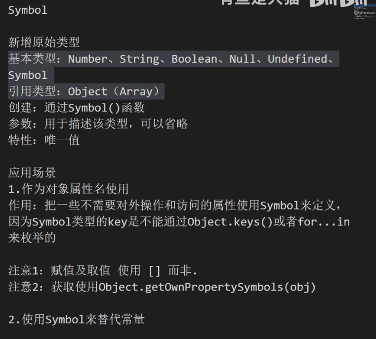
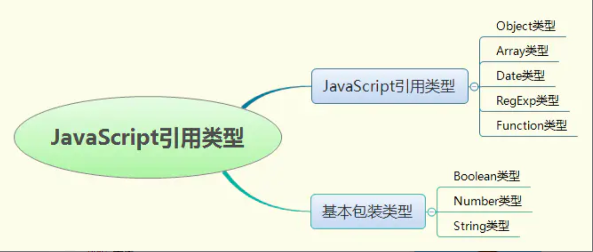
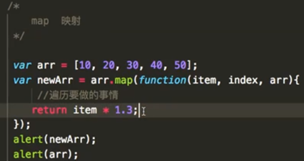
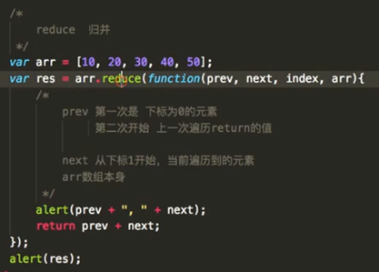

## 1.数据类型(⭐⭐⭐)

- 基本类型
   - Number
      - 在JS中所有的数值都是Number类型，包括32位(4字节)的整数，以及64位的浮点数（小数）
      - NAN是一个特殊的数字，表示Not A Number
   - String
      - 表示一系列的文本字符数据
      - 转义字符：\n 换行；\r回车；\t  一个制表符
   - Boolean
      - 用于表示条件的结果，主要用来做逻辑判断
      - Boolean的值是区分大小写的
   - Null
      - 表示声明对象为赋值，Null类型的值只有一个就是null，null这个值专门用来表示这个为空的对象。
   - undefined
      - 两种情况：声明变量未赋值会输出undefined；访问对象不存在的属性，也会输出undefined。
      - 使用typeof检查一个undefined时，也会返回一个underfined
   - Symbol



```javascript
//创建Symbol
let s = Symbol();
//添加参数，用于描述Symbol
let s1 = Symbol('我是s1');

//应用场景
//1.作为对象属性名来使用
let s1 = Symbol('我是s1');
let s2 = Symbol('我是s2');
let obj = {
    name:'小明',
    age:18,
    [s1]: '111',
    [s2]: '222'
}
//取值
console.log(obj[s1]);
console.log(obj[s2]);
//定义常量
const COLOR_RED = Symbol("red");
const COLOR_YELLOW = Symbol("yellow");
const COLOR_BLUE = Symbol("blue");
```

- 引用类型

   - Object

   

## 2.判断变量的类型(⭐⭐⭐)

- typeof
  - typeof运算符用于判断对象的类型，但是对于一些创建的对象，它们都会返回'object'，有时我们需要判断该实例是否为某个对象的实例，那么这个时候需要用到instanceof运算符，后续记录instanceof运算符的相关用法。
- instanceof及原理
  - typeof操作符适合用来判断一个变量是否为原始类型(number,string,boolean,undefined)，但它对引用值的用处不大，我们通常不关心一个值是不是对象，而是想知道它是什么类型的对象，因此ECMAScript提供了instanceof操作符。
  - 调用格式

```javascript
let str = new String('hello world');
console.log(str instanceof String); //true

let foo = function(){}
console.log(foo instanceof Function); //true

let arr = [];
console.log(arr instanceof Array); //true
```


- Object.prototype.toString.call()及原理[[class]]
  - 在JS中，可以使用Object.prototype.toString.call()来区分对象属于哪种内置类型

```javascript
console.log(Object.prototype.toString.call(null)); //[object Null]
console.log(Object.prototype.toString.call("String"));//[object String]
console.log(Object.prototype.toString.call(10));//[object Number]
```

## 3.数据类型转换(⭐⭐)

- 相等 == 和 全等 === 的区别

  - 相等会在比较之前执行转换数值类型，全等不会在比较之前转换操作类型
  - 相等的转换
    - 如果比较的两者中有布尔值(Boolean)，会把 Boolean 先转换为对应的 Number，即 0 和 1，然后进行比较。
    - 如果比较的双方中有一方为 Number，一方为 String时，会把 String 通过 Number() 方法转换为数字，然后进行比较。
    - 如果比较的双方中有一方为 Boolean，一方为 String时，则会将空字符串""转换为 false，除此外的一切字符串转换为 true，然后进行比较。
    - 如果比较的双方中有一方为 Number，一方为Object时，则会调用 valueOf 方法将Object转换为数字，然后进行比较。

- 强制转换和隐式转换

  - 通过String（），Number（），Boolean（）函数强制转换

  ```javascript
  var str=123;
  var str1='123';
  console.log(typeof str);
  console.log(typeof str1);
  console.log(typeof String(str));
  console.log(typeof Number(str1));
  ```


  - 不同类型的变量比较要先转类型，叫做类型转换，类型转换也叫隐式转换。隐式转换通常发生在运算符加减乘除，等于，还有小于，大于等。

  ```javascript
  console.log(10+'20') //2010
  
  console.log(10-'20')//-10 number
  console.log(10-'one') //NaN not a number
  console.log(10-'101a') //NaN
  console.log(10*'20') //200 number
  console.log('10'*'20') //200 number
  console.log(20/'10') //2 number
  console.log('20'/'10') //2 number
  console.log('20'/'one') //NaN
  ```

- 包装类型

  - 为了方便操作原始值，ECMAScript提供了3种特殊的引用类型:Boolean,Number,String


## 4.原型和原型链(⭐⭐⭐)

- 继承有两种方式：接口继承和实现继承，前者只继承方法签名，后者继承实际的方法。接口继承在ECMAScript中是不可能的，因为函数没有签名，实现继承是ECMAScript这唯一支持的继承方式，而这种继承主要是通过原型链实现
- **原型：**在JavaScript中，每个函数都有一个prototype属性，这个属性指向函数的原型对象。每一个javascript对象(除null外)创建的时候，就会与之关联另一个对象，这个对象就是我们所说的原型，每一个对象都会从原型中“继承”属性。
- **原型链：**在JavaScript中万物都是对象，对象和对象之间也有关系，并不是孤立存在的。对象之间的继承关系，在JavaScript中是通过prototype对象指向父类对象，直到指向Object对象为止，这样就形成了一个原型指向的链条，专业术语称之为原型链。

**举例：描述构造函数、实例和原型之间的关系**

## 5.闭包(⭐⭐⭐)

- 闭包的概念
  - 变量的作用域：全局变量和局部变量
    1）全局变量在当前全局可以到处调用，但是局部变量只能在局部调用
    2）函数能够分离出一个独立的作用域
    3）函数内部声明的变量在函数外部无法调用
  - 简单来说，闭包就是能够读取其他函数内部变量的函数。
  - 由于在javascript中，只有函数内部的子函数才能读取局部变量，所以说，闭包可以简单理解成“定义在一个函数内部的函数“。
  - 所以，在本质上，闭包是将函数内部和函数外部连接起来的桥梁。
- 闭包的特点
  - 函数嵌套函数
  - 内部函数使用外部函数的形参和变量
  - 被引用的形参和变量就不会被垃圾回收机制所回收
- 闭包的优缺点
  - 可以让一个变量常驻内存
  - 避免全局变量污染
  - 可以声明私有变量
  - 引用的变量可能发生变化
  - this指向问题
  - 内存泄露问题

## 6.call/apply/bind(⭐⭐⭐)

- 这三个方法都是用来改变this指向的
- call()方法可以传递两个参数。第一个参数是指定函数内部中this的指向（也就是函数执行时所在的作用域），第二个参数是函数调用时需要传递的参数。
- apply方法的作用与call方法类似，也是改变this指向（函数执行时所在的作用域），然后在指定的作用域中，调用该函数。同时也会立即执行该函数。唯一的区别就是，它接收一个数组作为函数执行时的参数。
- 在使用bind改变this指向时，一开始不会直接执行要改变的函数，需要通过二次调用才能执行。

## 7.DOM事件流和事件委托(⭐⭐⭐)

- 事件捕获
  - 如果点击容器后由外向里触发事件，那便叫事件捕获(addEventListener绑定事件，并将第三个参数改为true)
- 事件冒泡
  - 在一个有嵌套关系的容器组中给每个容器添加点击事件，当点击内层容器时，浏览器会由内而外触发每个容器的事件，此即为事件冒泡
- 事件委托及好处
  - 当为多个相同的节点添加事件函数时，可以找到其父节点添加事件函数，然后通过触发对象判断是否选中其子节点，如果选中，就添加相应样式；
  - 事件委托的好处1:事件委托技术可以避免对每个字元素添加事件监听器，减少操作DOM节点的次数，从而减少浏览器的重绘和重排，提高代码的性能。
  - 事件委托的好处2:使用事件委托，只有父元素与DOM存在交互，其他的操作都是在JS虚拟内存中完成的，这样就大大提高了性能。

## 8.cookie和storage(⭐⭐⭐)

- cookie的构成

   - Cookie全称为会话跟踪技术
   - 可以设置过期时间
   - 最大可以存储4KB
   - cookie只能存储字符串，所以一般只存储一些重要信息，例如登录，购物车信息，是否点赞，视频播放进度等
   - 构成：
      - 要存储的值(NAME=VALUE)
      - 过期时间(Expires=DATE)
      - 限制访问路径(Path=PATH)
      - 限制访问域名(domian=localhostx)
      - 安全字段(secure)

- localStorage

   - 永久存储
   - 最大可以存储5MB
   - localStorage只能存储字符串
   - localStorage对象
      - setItem(name,value)：设置要存储的键和值
      - getItem(name)：获得对应的键值
      - removeItem(name)：手动删除存储的键值

- sessionStorage

   - sessionStorage 用于临时保存同一窗口(或标签页)的数据，在关闭窗口或标签页之后将会删除这些数据
   - 结合后台使用
   - 存储空间更小，过期时间更短

   **举例：cookie的HTTPOnly**

   - HttpOnly 最早是由微软在 IE6 中实现的，现在已成为标准 。  浏览器会禁止页面中的 JavaScript 访问带有 HttpOnly 属性的 Cookie。 目的很明显，就是为了应对 Cookie 劫持攻击。

## 9.数组/对象常见的方法(⭐⭐)

- Array：slice/splice/concat/filter/map/reduce

   - slice()方法：提取数组中指定区间的元素 slice[start,end)

   - splice()方法：实现数组的增加，删除，修改 splice(start,length,数据1,数据2......)

      - 删除，2个参数，起始位置，删除的项数
      - 增加：3个参数，起始位置，0，插入的项。
      - 替换，任意参数，起始位置，删除的项数，插入任意数量的项数

   - concat()方法：拷贝原数组生成新数组,合并数组 arr.concat(arr2,数据1,数据2......)

   - filter()方法：过滤，将符合条件的元素输出

      

   - map()方法：映射，将数组中每个值通过计算，再存入一个新的数组，原数组不变

     

   - reduce：归并：将数组每个元素相加返回

     

   - join()：数组转字符串方法：将传入数组中的元素，用拼接的方法，形成一个字符串

- Object:keys/assign

   - slice()：提取字符串片段，并在新的字符串中返回被提取的部分
   - split()：把字符分割成数组
   - indexOf()：检索字符串，返回的是字符在字符串的下标
   - substr()：从起始索引号提取字符串中指定书目的字符
   - subString()：提取字符串中两个指定索引号之间的字符
   - charAt()：返回在指定位置的字符
   - conca()：连接字符串
   - match()：在字符串内检索指定的值或找到一个或多个正则表达式的匹配，返回的是值而不是值的位置
   - replace()：替换匹配的字符串
   - search()：检索与字符串匹配的子串，返回的是地址
   - toLowerCase()：把字符串转换成小写
   - toUpperCase()：把字符串准换成大写

   **举例：改变原数组的方法**

   - splice()
   - push(),pop()
   - shift(),unshift()
   - fill()
     - array.fill(value, start, end)
   - sort()

## 10.new对象时内部做了什么(⭐)

- 创建一个空对象
- 把this指向创建的空对象，并且把this的constructor指向构造函数
- 执行构造函数

## 11.防抖和节流(⭐)

- 防抖
  - 对于短时间内连续触发的事件（上面的滚动事件），防抖的含义就是让某个时间期限（如上面的1000毫秒）内，事件处理函数只执行一次。
  - 很多网站都会有一个返回顶部的按钮，这个按钮只有在滚动到距离顶部一定距离时才会出现，那么编写一个监听滚动条距离的事件，但这个事件执行的频率太高了，这样就会导致浏览器性能的消耗,解决方法就是在第一次触发该事件时，不立即执行函数，而是给出一个期限值(例如200ms)，如果期限值内没有再次触发滚动事件，那就执行函数，如果再次触发滚动事件，那就重新开始计时

- 节流
  - 如果短时间内大量触发同一事件，那么在函数执行一次后，该函数再指定的时间内不再工作，直至过了这段时间才能生效
  - 即使用户不断拖动滚动条，也能在某个时间间隔之后给出反馈呢？

## 12.requestAnimationFrame(⭐⭐)

- requestAnimationFrame是html5提供的专门用于请求动画的API
- 相比setInterval实现动画效果，requestAnimationFrame的优势
  - **setTimeout：**通过设定间隔时间来不断改变图像位置，达到动画效果。但是容易出现卡顿、抖动的现象；1、settimeout任务被放入异步队列，只有当主线程任务执行完后才会执行队列中的任务，因此实际执行时间总是比设定时间要晚；2、settimeout的固定时间间隔不一定与屏幕刷新时间相同，会引起丢帧。
  - **requestAnimationFrame**由系统决定回调函数的执行时机。60Hz的刷新频率，那么每次刷新的间隔中会执行一次回调函数，不会引起丢帧，不会卡顿

## 13.this指向(⭐⭐)

-  默认情况下，this指向全局（window）对象，严格模式下指向undefined
- 使用new后this指向new创建的对象
- 使用call 或者apply   this指向你传入的对象（传入的对象不能为null、undefined 不然指向window）
-  this指向 函数最后被调用位置

## 14.作用域链(⭐)

- 一般情况下，变量取值到 创建 这个变量 的函数的作用域中取值。但是如果在当前作用域中没有查到值，就会向上级作用域去查，直到查到全局作用域，这么一个查找过程形成的链条就叫做作用域链。

## 15.var/let/const(⭐⭐⭐)

- var
  - 没有块级作用域，但具备函数作用域
  - 变量声明时会被提升
  - 可以重复声明该变量
  - 可以在声明之前使用(输出的是undefined)
- let
  - 具备块级作用域
  - 变量声明时不会被提升
  - 不能在声明之前使用
  - 不能被重复声明
- const
  - 具备块级作用域，变量声明不会被提升，不能重复声明，不能在声明之前使用
  - 声明时必须初始化
  - 如果声明一个对象，那么可以给这个对象添加属性

## 16.异步编程：Promise和async await(⭐⭐⭐)

- Pormise：ES6中的promise对象, 可以**将异步操作以同步的流程表达出来，**很好地解决了**回调地狱**的问题（避免了层层嵌套的回调函数）。
- async_await：真正意义上去解决异步回调的问题，同步流程表达异步操作
  - async返回的总是Promise对象，可以用then方法进行下一步操作。
- 内部状态
  - 初始化状态（等待状态）：pending
  - 成功状态：fullfilled
  - 失败状态：rejected
- **Promise.all()**
  - promise.all()用来包装多个promise对象，并且返回所有实例的结果
- **Promise.race()**
  - 语法和all()一样，但是返回值有所不同，race根据传入的多个Promise实例，只要有一个实例resolve或者reject，就只返回该结果，其他实例不再执行。

## 17.箭头函数(⭐⭐)

- 箭头函数本质上是一种匿名函数，它简化了函数编写的代码
- 如果方法中只有一个参数，那么()可以省略，如果方法中只有一行return代码，那么{}也可以省略
- 箭头函数的this指向永远和箭头函数外面一层的this指向是一样的。

## 18.JavaScript运行机制(⭐⭐⭐)

- 单线程、解释性语言

- 事件循环

  - JavaScript 是一门单线程语言，异步操作都是放到事件循环队列里面，等待主执行栈来执行的，并没有专门的异步执行线程。

- 宏任务/微任务

  - 宏任务(macro-task)：整体代码script、setTimeOut、setInterval
  - 微任务(mincro-task)：promise.then、promise.nextTick(node)

## 19.实现继承的方式(⭐⭐)

- 对象冒充
- call()方法方式
- apply()方法方式
- 原型链方式
- 混合方法
  - 混合了call方式、原型链方式

## 20.垃圾回收(⭐)

- **标记清除法**

  变量在定义之后会打上标记，使用之后不需要保存的变量去掉标记

  回收机制根据是否有标记决定是否回收该变量所占内存

- **引用计数**

  引用计数根据变量被引用的次数，决定是否回收，

  如果被引用次数为0，则该回收了

- **有几种情况，不会自动回收变量**

  1.全局变量

  2.闭包内引用的变量