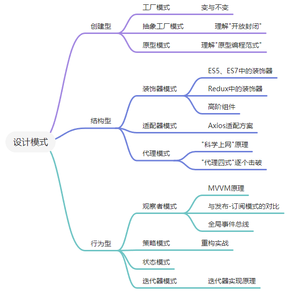

# JavaScript中的设计模式

## SOLID原则

设计原则是设计模式的指导理论，SOLID指代的五个基本原则分别是:

- 单一功能原则
- 开放封闭原则
- 里式替换原则
- 接口隔离原则
- 依赖反转原则

## 设计模式的封装思想——封装变化

在实际开发中，不发生变化的代码可以说是不存在的。我们能做的只有将这个变化造成的影响最小化 —— 将变与不变分离，确保变化的部分灵活、不变的部分稳定。

这个过程，就叫“封装变化”；这样的代码，就是我们所谓的“健壮”的代码，它可以经得起变化的考验。而设计模式出现的意义，就是帮我们写出这样的代码。
